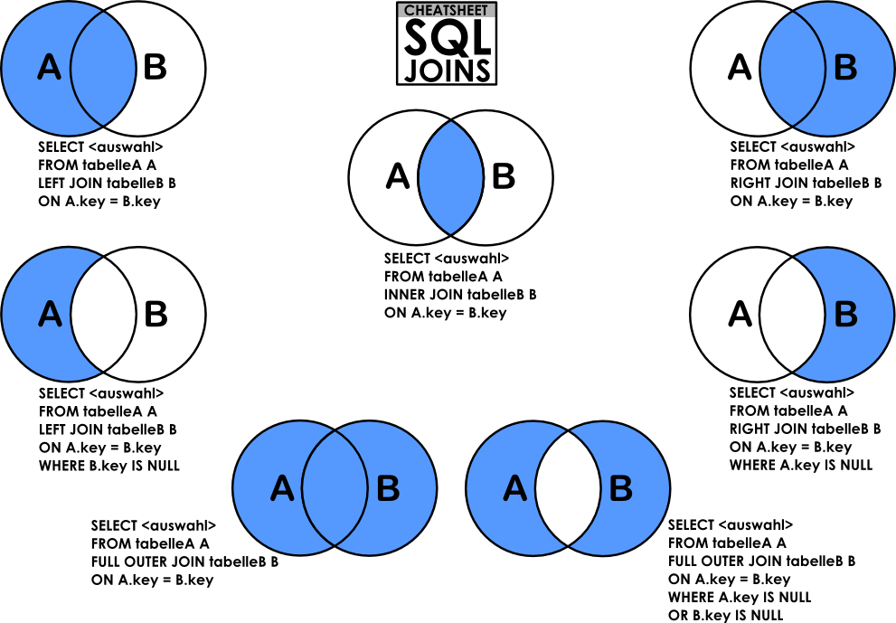

# Database

# Statement와 PreparedStatement이란

### JDBC API Interface
Statement와 PreparedStatement 둘다 SQL 쿼리를 실행하는데 쓰이는 인터페이스다. 

```
SQL 문 실행 절차
1. 구문 오류 체크 (parse)
2. 공유 영역에서 해당 구문 검색 (parse)
3. 권한 체크 (parse)
4. 실행 계획 수립 (parse)
5. 실행 계획 공유 영역에 저장 (parse)
6. 쿼리 실행 (Excute)
7. 데이터 인출 (patch)
```
```
1~7 모두 실행 : Hard Parsing
```
```
1, 2, 6, 7 만 실행 : Soft Parsing
```
Statement를 사용하여 SELECT 쿼리를 입력했을 때에는 매번 parse부터 fetch까지 모든 과정을 수행한다. (HARD Parsing)

Prepared Statement를 사용하는 경우 parse과정을 최초 1번만 수행하고 이후는 생략할 수 있다. (Soft Parsing)
<hr>

## Statement
Statement는 문자열 기반 SQL 쿼리를 실행할 때 쓰인다.

### 1. 연쇄적인 문자열로 코드를 읽기 어렵다.
```
public void insert(PersonEntity personEntity) {
    String query = "INSERT INTO persons(id, name) VALUES(" + personEntity.getId() + ", '"
    + personEntity.getName() + "')";

    Statement statement = connection.createStatement();
    statement.executeUpdate(query);
}
```
### 2. SQL Injection에 취약하다. 
```
--는 SQL문에서 주석으로 해서되므로 update문이 무시된다.
dao.update(new PersonEntity(1, "hacker' --")); 

insert문은 실패된다.
dao.insert(new PersonEntity(1, "O'Brien"))
```

### 3. 캐시를 활용하지 않는다.
SQL 실행절차 1번 처리구간을 매 요청마다 수행한다. 

### 4. DDL 쿼리에 적합하다.
```
public void createTables() {
    String query = "create table if not exists PERSONS (ID INT, NAME VARCHAR(45))";
    connection.createStatement().executeUpdate(query);
}
```

### 5. 파일이나 배열을 저장/조회 할 수 없다.
 
<hr>

## PreparedStatement
PreparedStatement는 Statement를 상속받은 인터페이스다. 매개 변수화된 SQL 쿼리를 실행할 때 쓰인다. 

### 1. 바인딩 메서드 (setXxx)
다양한 객체 유형을 바인딩하는 메서드가 있습니다. (파일과 배열을 포함해서)
```
public void insert(PersonEntity personEntity) {
    String query = "INSERT INTO persons(id, name) VALUES( ?, ?)";

    PreparedStatement preparedStatement = connection.prepareStatement(query);
    preparedStatement.setInt(1, personEntity.getId());
    preparedStatement.setString(2, personEntity.getName());
    preparedStatement.executeUpdate();
}
```

### 2. SQL Injection을 예방한다. 
Prepared Statement에서 바인딩 변수를 사용하였을 때 쿼리의 문법 처리과정이 미리 선 수행되기 때문에 
바인딩 데이터는 문법적인 의미를 가질 수 없다. 

### 3. 미리 컴파일
Soft Parsing 사용 

### 4. batch 실행을 제공한다.
```
public void insert(List<PersonEntity> personEntities) throws SQLException {
    String query = "INSERT INTO persons(id, name) VALUES( ?, ?)";
    PreparedStatement preparedStatement = connection.prepareStatement(query);
    for (PersonEntity personEntity: personEntities) {
        preparedStatement.setInt(1, personEntity.getId());
        preparedStatement.setString(2, personEntity.getName());
        preparedStatement.addBatch();
    }
    preparedStatement.executeBatch();
}
```
### 5. 파일, 배열 저장/조회

파일: BLOB과 CLOB 데이터 타입 사용

배열: java.sql.Array <-> SQL Array

### 6. getMetadata() 메서드
결과값에 대한 정보를 포함하고 있는 메서드

## 결론
Statement는 DDL(CREATE, ALTER, DROP) 구문을 처리할 때 적합하다.
매 실행시 Query를 다시 파싱하기 때문에 속도가 느리며, SQL Injection공격에 취약하다.
-> 필터나 방어 로직을 추가하는 것이 좋다.

Prepared Statement는 DML(SELECT, INSERT, UPDATE, DELETE)구문 처리에 적합하다.
그리고 캐시에 저장된 Query를 활용하기 때문에 실행이 빠르며 SQL Injection을 막기 위한 방법으로 활용된다.

<hr>

출처
- [Difference Between Statement and PreparedStatement](https://www.baeldung.com/java-statement-preparedstatement)
- [SQL injection 대응 : Prepared Statement](https://velog.io/@seaworld0125/SQL-injection-%EB%8C%80%EC%9D%91%EB%B0%A9%EB%B2%95-Prepared-Statement)
  
<hr>

# Database에서 slow query가 발생했을 경우 어떻게 대처하는지?
## slow query란
DBMS에서 Client로 요청받은 query를 실행할 때 일정 시간 이상 수행되지 못한 query

### slow query를 잡아내는 3가지 방법
- slow query 로그 남기기
- 쿼리 실행계획 로그에 남기기
- 쿼리 실행 통계 보기

PostgreSQL의 경우로 설명
### 1. slow query 로그 남기기
```
slow query 로그는 에러가 발생한 쿼리는 기록하지 않는다. 
general 로그에서는 에러가 발생한 쿼리를 포함해서 모든 쿼리를 기록하므로 두 개의 로그를 모두 활성화하면 프로파일링에 도움이 된다.
```
postgresql.conf에 `log_min_duration_statement = 1000` 를 설정한다. 
- 밀리세컨드 단위로 설정
- 설정값보다 오래 걸리는 쿼리를 로그 파일에 기록
- 0으로 설정하면 모든 로그 기록
- 수정 후 reload 하여 적용 (restart 필요 없음)

부하를 유발하는 단일 쿼리를 파악하기 쉽다. 그러나 처리 시간은 빠르지만, 여러번 호출되서 부하를 발생시키는 쿼리 실행을 인지하기는 어렵다는 단점이 있다. 


### 2. 쿼리 실행계획 로그에 남기기
PostgreSQL의 경우 postgresql.conf에 auto_explain 라이브러리를 추가한다. 
`session_preload_libraries = 'auto_explain';`

실행계획을 로그에 남기면, 당시의 쿼리 실행 계획을 볼 수 있단 장점이 있다.

롱쿼리가 발생한 이후 데이터가 더 쌓이거나 삭제되면, 문제가 된 순간의 실행계획을 알 수 없다. 때문에 이를 확인할 수 있단 장점이 있다. 그런데 EXPLAIN ANALYZE 명령문을 기반으로 로그를 남기기 때문에, 롱쿼리를 다시 실행시킨단 리스크가 있다. 

그리고 단일 롱쿼리만 파악할 수 있기 때문에, 짧지만 여러번 호출되서 문제를 일으키는 쿼리를 알 수 없는 단점이 있다.


### 3. 쿼리 실행 통계 보기
쿼리 실행 통계 라이브러리는 shared memory를 사용하기 때문에, 해당 모듈을 추가 / 삭제할 때는 항상 서버를 restart해줘야한다. `shared_preload_libraries = 'pg_stat_statements'`

이 방식을 사용하면, 빨리 실행되지만 부하를 일으키는 쿼리를 파악하기 좋단 장점이 있다. 

<hr>

출처
- [PostgreSQL 슬로우쿼리를 잡아내는 3가지 방법](https://americanopeople.tistory.com/288)
- [MySQL 성능 개선을 위한 프로파일링 1편: 슬로우 쿼리 로그](https://velogio@breadkingdomMySQL-%EC%84%B1%EB%8A%A5-%EA%B0%9C%EC%84%A0%EC%9D%84-%EC%9C%84%ED%95%9C-%ED%94%84%EB%A1%9C%ED%8C%8C%EC%9D%BC%EB%A7%81-1)
- [PostgreSQL Slow Query 검출](https://brufen97.tistory.com/5)

<hr>

# Redo와 Undo
트랜잭션이 수행되는 동안 시스템에 알 수 없는 오류 또는 물리적으로 문제가 발생했을 때, 트랜잭션의 수행을 되돌려야 합니다. <strong>rollback</strong> 이란 트랜잭션 내의 질의를 수행하면서 문제가 발생했을 경우 수행되는 것이지만, 시스템의 오류 또는 물리적인 문제의 경우 <strong>시스템 상의 문제이므로 트랜잭션이 다시 수행되어야 합니다. </strong>

이를 <strong>시스템 회복(recovery)</strong>이라 합니다.
회복은 데이터의 신뢰성을 보장하며, 트랜잭션의 영속성과 원자성을 보장합니다. 

Checkpoint 이후 Log 기록을 보면서 완료되지 않은 트랜잭션에 대해 수행
- Redo: 이전 상태로 되돌아간 후, 실패가 발생하기 전까지의 과정을 그대로 따라가는 것을 의미합니다.
- Undo: 트래잭션을 이전 상태로 되돌리는 것을 의미

## Redo
DB 장애 시 Buffer Pool에 저장되어 있던 데이터의 유실을 방지(데이터 복구)하기 위해 사용된다.
   
### InnoDB Buffer Pool?
Buffer Pool은 InnoDB 엔진이 Table Caching 및 Index Data Caching을 위해 이용하는 메모리 공간이다. 
다시 말해, Buffer Pool의 크기가 클수록 상대적으로 캐싱되는 데이터의 양이 늘어나기 때문에 Disk에 접근하는 횟수가 줄어들고, 이것은 DB의 성능 향상으로 이어진다.
하지만, Buffer Pool은 메모리 공간이기 때문에 <strong>데이터베이스 장애 시 Buffer Pool에 있는 내용은 휘발된다. </strong> 이것은 ACID를 보장할수 없게 되고, 다시 해석하면 장애를 복구하더라도 데이터는 복구될 수 없다는 것을 의미한다. 

실제 DB에서 Commit이 발생하면 바로 디스크 영역(Table Space)으로 들어가는 것이 아닌 메모리 영역(Buffer Poll & Log Buffer)에 들어가는 것을 확인할 수 있다. (DISK I/O 절약)

### Redo Log
Redo를 하기 위해서는 정상적으로 실행 되기까지의 과정을 기록해야 하는데, 이를 <strong>Redo Log</strong> 라고 한다. DML(SELECT 제외), DDL, TCL 등 데이터 변경이 일어나는 모든 것을 Redo Log 에 기록한다.

- DML (Data Manipulation Language)
  - SELECT, INSERT, UPDATE, DELETE

- DDL (Data Definition Language)
  - CREATE, ALTER, DROP, TRUNCATE

- TCL (Transactioin Control Language)
  - COMMIT, ROLLBACK

### Redo Log File
Log Buffer는 메모리 영역이기에 용량이 제한적이다. 용량이 제한적이기 때문에 Checkpoint 이벤트 발생시점에 Redo Log Buffer에 있던 데이터들을 Disk에 File로 저장하게 된다. 이 파일을 <strong>Redo Log File</strong> 라고 한다.
```
Checkpoint란 메모리상의 수정된 데이터 블럭과 디스크의 데이터 파일을 동기화시키는 데이터베이스 이벤트

다음을 목적으로 한다.
1. 데이터의 일관성 보장
2. 데이터베이스의 빠른 복구
```
Redo Log File은 두 개의 파일로 구성된다. 하나의 파일이 가득차면 Log switch가 발생하며 다른 파일에 쓰게 된다. Log switch가 발생할 때 마다 Checkpoint 이벤트도 발생되는데, 이때 InnoDB Buffer Pool Cache에 있던 데이터들이 백그라운드 스레드에 의해 Disk에 기록된다.

```
Checkpoint 이벤트가 발생하기 전에 장애가 발생한다면 Buffer Pool에 있던 데이터들은 휘발되지만, 
마지막 Checkpoint가 수행된 시점까지의 데이터가 Redo Log File로 남아있기 때문에 이 파일을 사용하여 데이터를 복구할 수 있다. 
```

### 과정
1. 실제 데이터 변경 전에 Redo Log Buffer에 데이터 변경에 대한 내용을 먼저 저장한다. (선 로그 기법: Log Ahead)
2. DB Cache에도 데이터 변경에 대한 내용을 기록한다.
3. LGWR 백그라운드 프로세스에 의해 Redo Log Buffer에 있는 내용을 Redo Log File에 저장한다.
4. Commit이 발생하게 되면 Control File에 트랜잭션의 고유한 번호(SCN)를 기록한다.
5. Log Switch가 발생하게 되면 Checkpoint 발생. 이 때 Checkpoint 프로세스가 DBWR 프로세스에게 Checkpoint 신호를 전달하면서 DBWR은 DB Cache 블록을 Data File로 저장한다.
6. Checkpoint가 DBWR에게 Checkpoint 신호를 전달하면서 Checkpoint SCN, 꽉 찬 로그파일 안의 제일 마지막 번호를 알려준다. 그 번호는 Data File과 Control File에 저장된다.

LGWR 자세히 
: [4장. 로그 기록자 백그라운드 프로세스(Log Writer, LGWR)](https://1duffy.tistory.com/24)

<hr>

## Undo
실행 취소 로그 레코드의 집합으로 트랜잭션 실행 후 <strong>Rollback</strong> 시 <strong>Undo Log를 참조해 이전 데이터로 복구</strong>할 수 있도록 로깅 해놓은 영역이다.

### Undo Log가 필요한 이유 
작업 수행 중에 수정된 페이지들이 버퍼 관리자의 버퍼 교체 알고리즘에 따라서 디스크에 출력될 수 있다.

버퍼 교체는 전적으로 버퍼의 상태에 따라 결정되며, 일관성 관점에서 봤을 때는 임의의 방식으로 일어나게 된다. 즉 아직 완료되지 않은 트랜잭션이 수정한 페이지들도 디스크에 출력될 수 있으므로, 만약 해당 트랜잭션이 어떤 이유든 정상적으로 종료될 수 없으면 트랜잭션이 변경한 페이지들은 원상 복구되어야 한다. 이러한 복구를 UNDO라고 한다.

### 어떻게 파일로 저장되는가?
Undo Log도 Redo Log와 마찬가지로 Log Buffer에 기록된다. Undo Records영역에 기록되는 것이다.
저장되는 데이터는 PK 값과 변경되기 전의 데이터 값이다. 

Redo Log가 트랜잭션 Commit과 CheckPoint 시 디스크에 기록되지만, Undo Log는 CheckPoint 시 디스크에 기록된다.

<strong>데이터를 수정함과 동시에 Rollback을 대비하기 위해, 업데이트 전의 데이터를 Undo Records로 기록하는 것이다. </strong>

<hr>

출처
- [Mysql Redo / Undo Log](https://velog.io/@pk3669/Mysql-Redo-Undo-Log)
- [🙈[DB이론] 신뢰성과 회복(Recovery)🐵](https://victorydntmd.tistory.com/130)

<hr>

# DELETE, TRUNCATE, DROP 차이
## DELETE
```
DELETE [LOW_PRIORITY] [QUICK] [IGNORE] FROM tbl_name [[AS] tbl_alias]
    [PARTITION (partition_name [, partition_name] ...)]
    [WHERE where_condition]
    [ORDER BY ...]
    [LIMIT row_count]
```
- WHERE 절을 사용하여 데이터를 하나하나 선택해서 제거하는 방식
  - `DELETE FROM dbtable WHERE {조건};`
- WHERE 절을 사용하지 않고 테이블의 모든 데이터를 삭제하더라도, 내부적으로는 한 줄씩 제거된다.
  - `DELETE FROM dbtable;` 
- 원하는 데이터만 골라서 삭제할 때는 DELETE 사용 / 전체 데이터를 삭제할 때는 TRUNCATE 사용
- 데이터를 삭제하더라도 데이터가 담겨있던 Storage는 Release 되지 않는다.
- DELETE된 데이터는 COMMIT 명령어를 사용하기 전이라면 ROLLBACK 명령어를 통해 되돌릴 수 있다.
- 모든 작업을 로그에 남긴다.

## TRUNCATE
```
TRUNCATE [TABLE] tbl_name
```
- 테이블을 완전히 비운다. `DROP` 권한이 필요하다.
- 논리적으로 모든 행을 삭제하는 `DELETE` 문 또는 연속의 `DROP TABLE` 과 `CRATE TABLE` 문과 유사하다.
- 고성능을 위해 데이터 삭제의 DML을 bypass(우회)한다. 따라서 `ON DELETE` 트리거가 발생하지 않으며 부모-자녀 외부 키 관겨가 있는 InnoDB 테이블에 대해 수행할 수 없으며 DML 처럼 롤백할 수 없다. 그러나 automic DDL을 지원하는 스토리지 엔진을 사용하는 테이블의 `TRUNCATE TABLE` 작업은 서버가 작업 중에 중지되면 완전히 커밋되거나 롤백된다.
- `DELETE` 문과 유사하지만 DML문이 아닌 DDL문으로 분류된다. 다음과 같은 점에서 DELETE와 다르다.

### TRUNCATE가 DELETE와 다른 점 
- 행을 하나씩 삭제하는 `DELETE`보다 테이블을 drop 후 re-create하는 `TRUNCATE`가 속도가 더 빠르다.
- `TRUNCATE`는 암시적 커밋을 실행하므로 롤백할 수 없다.
- 이진 로깅과 replication(복제)를 위해 DDL로 처리되며 항상 로깅된다.


## DROP
```
DROP [TEMPORARY] TABLE [IF EXISTS]
    tbl_name [, tbl_name] ...
    [RESTRICT | CASCADE]
```
- 하나 이상의 테이블을 제거한다.
- 테이블이 파티셔닝 된 경우, 테이블의 정의, 테이블의 모든 파티션, 해당 파티션에 저장된 모든 데이터 및 삭제된 테이블과 관련된 모든 파티션 정의가 제거된다.
- 테이블을 삭제하면 테이블에 대한 트리거도 삭제된다.
- `TEMPORY` 키워드와 함께 사용되는 경우를 제외하고 암시적 커밋을 실행한다.
- 테이블이 삭제되어도 테이블에 대해 특별히 부여된 권한은 자동으로 삭제되지 않는다. 수동으로 삭제해야 한다. 

<hr>

출처
- [Delete vs truncate vs drop 차이점](https://itblacksmith.tistory.com/72)
- [13.1.37 TRUNCATE TABLE Statement](https://dev.mysql.com/doc/refman/8.0/en/truncate-table.html)
- [13.1.32 DROP TABLE Statement](https://dev.mysql.com/doc/refman/8.0/en/drop-table.html)

<hr>

# ORM 
## Object-Relational-Mapping
- 객체-관계 매핑
- 프로그래밍 언어의 객체 지향 패러다임을 사용하여 SQL 쿼리를 작성할 수 있는 아이디어
- 즉, SQL 대신 우리가 선택한 언어를 사용하여 데이터베이스와 상호작용 하려고 한다.
- 여기서 Object-relational-mapper가 등장한다. 대부분의 사람들이 "ORM"이라고 말하면 이 기술을 구현하는 라이브러리를 나타낸다.
- 대부분의 경우 객체 지향 프로그램과 관계형 데이터베이스 사이의 다리를 만드는 데 사용되는 기술이다. 즉, ORM은 객체 지향 프로그래밍(OOP)을 관계형 데이터베이스에 연결하는 계층으로 볼 수 있다. 
- 웹 애플리케이션과 데이터베이스 사이에 위치하는  미들웨어 어플리케이션 또는 도구이다.
- Model 클래스가 데이터베이스의 테이블이 되고 각 인스턴스가 테이블의 행이 되는 방식으로 매핑을 수행한다.

## 장점과 단점
장점
- 객체 지향적인 코드로 인해 더 직관적이다. 비즈니스 로직에 집중할 수 있게 도와준다.
  - SQL의 절차적이고 순차적인 접근이 아닌 객체 지향적인 접근으로 인해 생산성이 증가한다.
- 복잡한 과정을 숨김으로써 고수준의 구현만 신경쓰면 된다. 
- 데이터베이스 시스템을 추상화하여 데이터베이스를 변경해도 코드를 변경할 필요가 없다.

단점
- ORM이 복잡한 세부 정보를 추상화하는 데 도움이 되더라도 각 명령의 결과를 알고 있어야 한다.
- ORM을 사용하여 복잡한 쿼리를 코딩하는 데 성능 문제가 발생할 수 있다.

<hr>

출처
- [What is an ORM – The Meaning of Object Relational Mapping Database Tools](https://www.freecodecamp.org/news/what-is-an-orm-the-meaning-of-object-relational-mapping-database-tools/)
- [ORM Tools in Java](https://www.javatpoint.com/orm-tools-in-java)
- [ORM이란](https://gmlwjd9405.github.io/2019/02/01/orm.html)
- [What is an ORM and Why You Should Use it](https://blog.bitsrc.io/what-is-an-orm-and-why-you-should-use-it-b2b6f75f5e2a)

<hr>

# 데이터베이스 튜닝 (Database tuning)
## 개념
- 데이터베이스 어플리케이션, 데이터베이스 시스템, 운영체제의 이해를 바탕으로, 불합리한 요소를 찾아 제거/수정하여 성능을 개선하기 위한 일련의 작업
- 특히 데이터베이스 어플리케이션이 높은 작업 처리량과 짧은 응답시간을 갖도록 하는 것이 중요하다.
## 목적 
- 데이터베이스 설계 및 활용에 존재하는 문제점을 파악하여 분석하고, 이렇게 분석된 문제점들을 해결함으로써 데이터베이스의 활용 성능을 최적화시킨다.
- 데이터베이스 튜닝을 수행함으로써 데이터베이스를 활용하는 시스템을 안정시키고, 또한 사용자의 만족과 관리자의 관리 능력을 향상시킬 수 있다. 

## 튜닝 3단계 
### 1. DB 설계 튜닝 (모델링 관점)
- <strong>데이터베이스 설계 단계</strong>에서 성능을 고려하여 설계
- 데이터 모델링, 인덱스 설계
- 데이터파일, 테이블 스페이스 설계
- 데이터베이스 용량 산정
- Ex. 반정규화, 분산파일, 배치

### 2. DBMS 튜닝 (환경 관점)
- 성능을 고려하여 메모리나 블록 크기 지정
- CPU, 메모리 I/O에 대한 관점
- Ex. Buffer 크기, Cache 크기

### 3. SQL 튜닝 (APP 관점)
- SQL 작성 시 성능 고려
- Join, Indexing, SQL Execution Plan
- Ex. Hash, Join

<hr>

출처
- [데이터베이스 튜닝 (DB Tuning)](http://blog.skby.net/%EB%8D%B0%EC%9D%B4%ED%84%B0%EB%B2%A0%EC%9D%B4%EC%8A%A4-%ED%8A%9C%EB%8B%9D-db-tuning/)
- [데이터베이스 튜닝](https://dataonair.or.kr/db-tech-reference/d-lounge/report/?mod=document&uid=239679)
- [데이터베이스 튜닝이란?](http://wiki.gurubee.net/pages/viewpage.action?pageId=14024765)

<hr>

# 함수 종속성 (Functional Dependency)
- 함수 종속성은 데이터베이스와 관련된 두 속성 집합 사이의 제약 조건이다.
- 일반적으로 테이블 내의 기본 키 속성과 키가 아닌 속성 사이에 존재한다.
- 함수 종속성은 화살표(→)로 표시된다.
- 속성 A가 B를 함수적으로 결정하면, `A → B` 로 표시된다.
  - 예를 들어, `employee_id → employee_name` 은 `employee_id`가 함수적으로 `employee_name`을 결정함을 의미한다. `employee_name`은 함수적으로 `employee_id`에 의존한다.
- A는 결정 인자(determinant set), B는 종속 인자(dependent set)
- `A → B`는 A의 특정 값의 모든 인스턴스에 B의 동일한 값이 있음을 의미한다.
  - 아래 표는 `A → B`는 참이지만 `B → A`는 참이 아니다. `B = 3` 에 대한 A 값이 다르기 때문이다.
    ```
    A   B
    ------
    1   3
    2   3
    4   0
    1   3
    4   0
    ```
## 완전 함수 종속성 (Fully Functional Dependency)
- 만약 X와 Y가 관계의 속성 집합이라면, Y는 X에 의존한다. 그리고 X의 어떤 적절한 부분 집합에도 의존하지 않는다면, Y는 X에 <strong>완전히</strong> 의존한다.
- Ex. `ABC → D`의 관계에서, 속성 D는 ABC의 어떤 부분 집합에도 의존하지 않고 ABC에 완전히 의존한다. 다시 말해, AB, BC, A, B 등과 같은 ABC의 부분 집합은 D를 결정할 수 없다.

## 부분 함수 종속성 (Partial Functional Dependency)
- `X → Y` 는 Y가 X에 함수적으로 종속되어 있고, Y가 X의 부분 집합에 의해 결정되어 있으면 부분 함수 종속성이다.
- Ex. `AC → B`, `A → D`, `D → B` 의 관계가 있다. 이제 `A → D → B` 로 A는 단독으로 B를 결정할 수 있다. 이는 B가 부분적으로 AC에 의존한다는 것을 의미한다.

## Trivial Functional Dependency
- 만약 B가 A의 부분 집합인 경우 `A → B`는 trivial 함수 종속성을 갖는다.
  - Ex. 
    ```
    {Employee_id, Employee_Name} → Employee_Id
    ```
- `A → A`, `B → B` 의 경우도 trivial 함수 종속성을 갖는다.


## Non-trivial Functional Dependency
- 만약 B가 A의 부분 집합이 아닌 경우 `A → B`는 non-trivial 함수 종속성을 갖는다.
  - Ex. 
    ```
    ID   →    Name
    Name →    DOB  
    ```
<hr>

출처
- [Introduction of Database Normalization](https://www.geeksforgeeks.org/introduction-of-database-normalization/)
- [Differentiate between Partial Dependency and Fully Functional Dependency](https://www.geeksforgeeks.org/differentiate-between-partial-dependency-and-fully-functional-dependency/)
- [Functional Dependency](https://www.javatpoint.com/dbms-functional-dependency)

<hr>

# 정규화 (Normalization)
- 데이터 중복성을 줄이거나 없애기 위해 데이터베이스의 속성을 구성하는 과정이다. 
- 데이터 중복은 동일한 데이터가 여러 곳에서 반복되기 때문에 데이터베이스의 크기를 불필요하게 증가시킨다. 
- 삽입, 삭제, 업데이트 작업 중에도 불일치(Inconsistency) 문제가 발생한다.

## 장점과 단점
장점
- 데이터베이스를 표준화해 데이터베이스 크기가 줄어들고 데이터 중복을 방지한다. 
- 여러 위치에서 중복되는 데이터가 없으므로 삽입과 업데이트가 빠르게 실행된다.
- 정규화된 테이블은 정규화되지 않은 테이블보다 작다. 이는 일반적으로 테이블이 버퍼에 들어갈 수 있으므로 더 빠른 성능을 제공한다. 
- 데이터 무결성과 일관성이 유지된다. 
- 데이터베이스 변경 시 이상 현상(Anomaly)이 제거된다. 

단점
- 데이터가 중복되지 않으므로 테이블 조인이 필요하다. 쿼리가 더 복잡해지고 읽기 시간이 느려진다. 
- 조인이 필요하기 때문에 인덱싱이 효율적으로 작동하지 않는다. 읽기 시간이 느려진다. 

<hr>

출처
- [Pros and Cons of Database Normalization](https://dzone.com/articles/pros-and-cons-of-database-normalization)

<hr>

# 정규화 레벨 
## 제 1 정규화 (First Normal Form, 1NF)
- 각 칼럼은 원자 값을 갖어야 한다.
  - 원자 값 = 더 이상 논리적으로 분해될 수 없는 값
- 하나의 컬럼은 같은 종류나 타입(type)을 가져야 한다.
- 각 컬럼이 유일한(unique) 이름을 가져야 한다.
- 칼럼의 순서가 상관없어야 한다.

## 제 2 정규화 (Second Normal Form, 2NF)
- 1NF를 만족해야 한다.
- 모든 칼럼이 부분적 함수 종속(Partial Functional Dependency)이 없어야 한다. = 모든 칼럼이 완전 함수 종속(Fully Functional Dependency)을 만족해야 한다.

## 제 3 정규화 (Third Normal Form, 3NF)
- 2NF를 만족해야 한다.
- 이행적 함수 종속성(Transitive Functional Dependency)가 존재하지 않아야 한다.
  - `A → D`, `D → B` 이면 `A → B`를 만족하게 되는 것을 의미한다.
  
## Boyce-Codd Normal Form (BCNF)
- 3NF를 만족해야 한다.
- 다음 한목 중 적어도 하나를 만족해야 한다.
  - (1) 모든 Functional Dependency는 Trivial 해야 한다.
  - (2) 모든 Functional Dependency의 Determinant Set은 Superkey여야 한다.

<hr>

출처
- [Database Normalization & Functional Dependency](https://ju-hy.tistory.com/104)
- [정규형 (1NF, 2NF, 3NF, BCNF)](https://rebro.kr/160)

<hr>

# 역정규화 (Denormalization)
- 하나 이상의 테이블에 중복 데이터를 추가하는 데이터베이스 최적화 기술이다.
- 이것은 우리가 관계형 데이터베이스에서 비용이 높은 조인을 피하는데 도움이 될 수 있다.
- denormalization은 'reversing normalization' 또는 'not to normalization'을 의미하지 않는다.
- 역정규화는 정규화 후 적용되는 최적화 기법이다. 
  - 기본적으로 정규화 된 스키마를 가져 와서 정규화되지 않게 만드는 프로세스를 비정규화라고 한다.
- 기존의 정규화된 데이터베이스에서는 데이터를 별도의 논리 테이블에 저장하고 중복 데이터를 최소화하려고 시도한다. 정규화는 데이터 수정 면에서 장점이 있지만, 테이블이 크면 조인을 수행하는데 불필요하게 오랜 시간을 소비할 수 있다는 단점이 있다. 

## 장점과 단점
장점
- 더 적은 조인을 수행하기 때문에 데이터 검색이 더 빠르다.

단점
- 데이터 update와 insert는 비용이 비싸다.
- 역정규화는 update와 insert 코드 작성을 더 어렵게 만들 수 있다.
- 데이터 불일치 문제
- 데이터 중복으로 더 많은 스토리지가 쓰인다.

## 역정규화 기법
자세히는 [여기](https://dataonair.or.kr/db-tech-reference/d-guide/sql/?mod=document&uid=333) 참고

<hr>

출처
- [반정규화와 성능](https://dataonair.or.kr/db-tech-reference/d-guide/sql/?mod=document&uid=333)
- [Denormalization in Databases](https://www.geeksforgeeks.org/denormalization-in-databases/)

<hr>

# MySQL에서 대량의 데이터(500만개 이상)를 Insert해야하는 경우엔 어떻게 해야할까요?
삽입 속도를 최적화하려면 많은 small 작업을 하나의 large 작업으로 결합하라.
### 1. multiple VALUES
```
INSERT INTO yourtable VALUES (1,2), (5,5), ...;
```
- 동일한 클라이언트에 여러 행을 동시에 삽입하는 경우 여러 `VALUES` 목록이 있는 `INSERT` 문을 사용하여 한 번에 여러 행을 삽입한다. 
- 단일 행 INSERT 문 여러 개를 사용하는 것보다 상당히 빠르다.
- 비어있지 않은 테이블에 데이터를 추가하는 경우 `bulk_insert_buffer_size` 변수를 조정해 데이터 삽입 속도를 빠르게 할 수 있다. 
- `INSERT ... VALUES` 문으로 하드코딩하는 경우 클라이언트가 데이터베이스 서버로 보내는 SQL 문의 길이를 제한하는 `max_allowed_packet` 변수의 값을 조절해야 한다.

### 2. LOAD DATA
```
LOAD DATA INFILE 'data.txt' INTO TABLE db2.my_table;
```
- 텍스트 파일을 이용해 데이터를 삽입한다. 
- 보통 `INSERT` 문을 사용하는 것보다 20배 더 빠르다. 

<hr>

출처
- [MySQL 8.0 Reference Manual - 8.2.5.1 Optimizing INSERT Statements](https://dev.mysql.com/doc/refman/8.0/en/insert-optimization.html)
- [MySQL - how many rows can I insert in one single INSERT statement?](https://stackoverflow.com/questions/3536103/mysql-how-many-rows-can-i-insert-in-one-single-insert-statement)
- [MySQL 에서의 Bulk Inserting 성능 향상](https://jins-dev.tistory.com/entry/MySQL-%EC%97%90%EC%84%9C%EC%9D%98-Bulk-Inserting-%EC%84%B1%EB%8A%A5-%ED%96%A5%EC%83%81)

<hr>

# 데이터베이스 파티셔닝(Database Partitioning)
## 배경
- 서비스의 크기가 점점 커지고 데이터베이스에 저장하는 데이터의 규모도 대용량화 → 기존에 사용하던 데이터베이스 시스템의 용량(storage) 한계와 성능(performance)의 저하
- VLDB(Very Large DBMS)와 같이 전체 데이터베이스가 하나의 DBMS에 다 들어가기 힘들어지는 DBMS가 자연스럽게 등장했고 하나의 DBMS가 많은 Table을 관리하다 보니 느려지는 이슈가 발생하게 되었다. 
- 이러한 이슈를 해결하기 위한 하나의 방법이 파티셔닝(Partitioning)이다.

## 파티셔닝(Partitioning)이란
- 큰 테이블이나 인덱스를 관리하기 쉬운 단위로 분리하는 방법이다.
- 단위는 파티션(partition)
- 파티션 테이블: 논리적으로는 하나의 테이블이지만 물리적으로는 여러 개의 파티션으로 나뉘어 데이터들이 각각의 세그먼트에 저장되는 테이블

## 장점과 단점
### 장점
#### 가용성(availability)
- 물리적인 파티셔닝으로 인해 전체 데이터의 훼손 가능성이 줄어들고 데이터 가용성이 향상된다.
#### 관리용이성(manageability)
- 큰 테이블들을 제거해 관리를 쉽게 해준다.
#### 성능
- 특정 DML이나 Query의 성능을 향상시킨다. 주로 대용량 Data Write 환경에서 효율적이다.
- 많은 Insert가 있는 OLTP 시스템에서 Insert 작업들을 분리된 파티션들로 분산시켜 경합을 줄인다. 
### 단점
- 테이블 간의 JOIN에 대한 비용이 증가한다.
- 테이블과 인덱스를 별도로 파티셔닝 할 수 없다. 같이 파티셔닝해야 한다.

## 파티셔닝 종류
### 수평 분할
- 하나의 테이블의 각 행을 여러 테이블에 분산시킨다.
- 샤딩(Sharding)과 동일한 개념이다.
  - 스키마를 복제한 후 샤드키를 기준으로 데이터를 나눈다.
  - 즉 샤딩은 스키마가 같은 데이터를 두 개 이상의 테이블에 나누어 저장하는 것을 말한다.
- 성능, 가용성을 위해 KEY를 기반으로 분산 저장한다.
- 데이터 조회 과정이 복잡해지기 때문에 지연 시간(latency)이 증가한다.
- 일반적으로 분산 저장 기술에서 말하는 파티셔닝은 수평 분할을 의미한다.

### 수직 분할 
- 모든 칼럼들 중 특정 칼럼들을 쪼개서 따로 저장한다. 테이블의 일부 열을 빼내는 형태로 분할한다. 스키마를 나누고 데이터가 따라 옮겨지는 것을 말한다.
- 하나의 엔터티를 2개 이상으로 분리하는 작업이다.
- 자주 사용되는 칼럼 등을 분리시켜 성능을 향상시킬 수 있다.
  - 한 테이블을 SELECT 하면 모든 컬럼을 메모리에 올리게 된다. 수직 분할을 하면 필요한 칼럼만 올려져 훨씬 많은 수의 ROW를 메모리에 올릴 수 있으니 성능상의 이점이 있다.
  - 같은 타입의 데이터가 저장되기 때문에 저장 시 데이터 압축률을 높일 수 있다.
## 파티셔닝 분할 기준
- 데이터베이스 관리 시스템은 각종 기준(분할 기법)을 제공하고 있다. 분할을 '분할 키(partitioning key)'를 사용한다.

### Range partitioning
- 분할 키 값이 범위 내에 있는지 여부로 구분한다. 연속적인 숫자나 날짜 기준으로 파티셔닝한다.
- Ex. 우편번호, 일별, 월별, 분기별 

### List partitioning
- 특정 파티션에 저장 될 데이터에 대한 명시적 제어가 가능하다.
- 분포도가 비슷하며 해당 컬럼에 대한 조건이 많이 들어오는 경우 유용하다.
- Multi-Column Partition Key 제공하기 힘들다.
- Ex. [한국, 일본, 중국 -> 아시아] [노르웨이, 스웨덴, 핀란드 -> 북유럽]

### Composite partitioning
- 파티션의 서브 파티셔닝(Sub-Partitioning)을 말한다.
- 큰 파티션에 대한 I/O 요청을 여러 파티션으로 분산할 수 있다.
- Range Partitioning 할 수 있는 컬럼이 있지만, 파티셔닝 결과 생성된 파티션이 너무 커서 효과적으로 관리할 수 없을 때 유용하다.
- Range-list, Range-hash

### Hash partitioning
- 파티션 키의 해시 값에 의한 파티셔닝이다. 균등한 데이터 분할이 가능하다.
- 특정 데이터가 어느 해시 파티션에 있는 판단이 불가능하다.
- 파티션을 위한 범위가 없는 데이터에 적합하다.

<hr>

출처
- [Database의 파티셔닝(Partitioning)이란?](https://nesoy.github.io/articles/2018-02/Database-Partitioning)
- [DB 파티셔닝(Partitioning)이란](https://gmlwjd9405.github.io/2018/09/24/db-partitioning.html)
- [파티션 테이블(Partition Table)이란 무엇인가?](https://coding-factory.tistory.com/840)

<hr>

# `WHERE` 과 `HAVING` 의 차이  
## `WHERE`
```
SELECT * From db_table [WHERE where_condition]
```
- 집계(그룹) 함수를 제외하고 MySQL이 지원하는 모든 함수 및 연산자를 사용할 수 있다.

## `HAVING`
```
SELECT * From db_table [GROUP BY {col_name | expr | position}, ... [WITH ROLLUP]] [HAVING where_condition]
```
- `WHERE` 절과 마찬가지로 선택 조건을 지정한다.
- 일반적으로 `GROUP BY` 절에 의해 형성되는 그룹의 조건을 지정한다. 쿼리 결과에는 `HAVING` 조건을 만족하는 그룹만 포함된다. `GROUP BY` 가 없는 경우 모든 행이 암시적으로 단일 집계 그룹을 형성한다. 
- `HAVING` 절은 최적화없이 항목이 전송되기 직전에 거의 마지막에 적용된다.

<hr>

출처
- [MySQL 8.0 Reference Manual - 13.2.13 SELECT Statement](https://dev.mysql.com/doc/refman/8.0/en/select.html)

<hr>

# JOIN
## JOIN이란
- 데이터베이스에서 데이터는 다수의 테이블에 나뉘어 저장되어 있다. 데이터의 중복을 제거하고 무결성을 보장하기 위해서이다. 
    ```
    데이터 무결성은 컴퓨팅 분야에서 완전한 수명 주기를 거치며 데이터의 정확성과 일관성을 유지하고 보증하는 것을 가리키며 데이터베이스나 RDBMS 시스템의 중요한 기능이다.
    ```
- 테이블별로 분리되어 있는 데이터를 연결하여 마치 하나의 테이블인 것처럼 활용하는 것이다.
- 테이블을 연결하려면 적어도 하나의 칼럼은 서로 공유되고 있어야 한다. 조인 키 칼럼이라고 한다. 보통 Primary Key나 Foreign Key로 테이블을 연결한다. 

## JOIN 종류

데이터 집합 A, B의 집합 연산에 따른 JOIN 종류


### 1. INNER JOIN


```SQL
SELECT *
   FROM TABLE_1 A
        INNER JOIN TABLE_2 B
     ON (A.COL1     = B.COL1
         AND A.COL2 = B.COL2)    
```

```SQL
SELECT * 
  FROM Orders 
      INNER JOIN Customers 
    ON Orders.CustomerID = Customers CustomerID;
```

- `INNER JOIN`은 교집합( A ∩ B ) 연산과 같다.
- JOIN KEY 칼럼의 값이 테이블 A, B에 <strong>모두 공통적으로 존재</strong>하는 경우에만 데이터 조인 
- `INNER` 키워드는 생략이 가능하다.

### 2. LEFT OUTER JOIN


```SQL
SELECT *
   FROM TABLE_1 A
        LEFT OUTER JOIN TABLE_2 B
     ON (A.COL1     = B.COL1
         AND A.COL2 = B.COL2)    
```

```SQL
SELECT * 
  FROM Orders 
      LEFT JOIN Customers 
    ON Orders.CustomerID = Customers.CustomerID;
```

- `LEFT OUTER JOIN`은 교집합 연산 결과와 차집합 연산 결과를 합친 것 ( (A ∩ B) ∪ (A - B) )와 같다.
- JOIN KEY 칼럼의 값이 테이블 A, B에 모두 공통적으로 존재하는 데이터와 + 기준 테이블(그림에서는 A)의 데이터를 조인한다. 
- `OUTER` 키워드는 생략 가능하다.

### 3. RIGHT OUTER JOIN


```SQL
SELECT *
   FROM TABLE_1 A
        RIGHT OUTER JOIN TABLE_2 B
     ON (A.COL1     = B.COL1
         AND A.COL2 = B.COL2)    
```

```SQL
SELECT * 
  FROM Orders 
      RIGHT JOIN Customers 
    ON Orders.CustomerID = Customers.CustomerID;
```

- `RIGHT OUTER JOIN`은 `LEFT OUTER JOIN` 와 유사하다. 기준 테이블이 반대일 뿐이다.
- JOIN KEY 칼럼의 값이 테이블 A, B에 모두 공통적으로 존재하는 데이터와 + 기준 테이블(그림에서는 B)의 데이터를 조인한다. 
- `OUTER` 키워드는 생략 가능하다.

### 4. FULL OUTER JOIN


```SQL
SELECT *
   FROM TABLE_1 A
        FULL OUTER JOIN TABLE_2 B
     ON (A.COL1     = B.COL1
         AND A.COL2 = B.COL2)
```

```SQL
SELECT * 
  FROM Orders 
      FULL JOIN Customers 
    ON Orders.CustomerID = Customers.CustomerID;
```

- `FULL OUTER JOIN`은 합집합 연산 결과와 같다.
- JOIN KEY 칼럼의 값이 테이블 A, B에 모두 공통적으로 존재하는 데이터 + 한쪽 테이블에 존재하는 데이터를 조인한다.

<hr>

출처
- [테이블 조인 종류(Table Join Type)](https://sparkdia.tistory.com/17)
- [SQL - JOIN문, JOIN 종류 (Inner Join,Natural Join,Outer Join,Cross Join)](https://doh-an.tistory.com/30)
- [JOIN 종류와 사용법](https://theplace.tistory.com/m/24)

<hr>

# Scale Out & Scale Up
## DB 확장
- 수평적으로 부하를 분산하는 **스케일아웃**(Scale Out)
- 해당 서버의 용량 자체를 올리는 **스케일업**(Scale Up)

## 1) Scale Out
- 기존 서버만으로 용량이나 성능의 한계에 도달했을 때, 비슷한 사양의 서버를 추가로 연결한다.
- 기대효과
  - 처리할 수 있는 데이터 용량이 증가한다.
  - 기존 서버의 부하를 분담해 성능이 향상한다.
- '수평 스케일링(horizontal scaling)'로 불리기도 한다.
- 서버가 여러 대가 되기 때문에 각 서버에 걸리는 부하를 균등하게 해주는 '**로드밸런싱**'이 필수적으로 동반되어야 한다.
- Ex. **OLAP(Online Analytical Processing)** 환경
  - 빅데이터의 데이터 마이닝이나 검색엔진 데이터 분석 처리를 위해 대량의 데이터 처리와 복잡한 쿼리가 이루어지기 때문이다.

### 장점
- 확장성
  - 하나의 장비에서 처리하던 일을 여러 장비에 나눠서 처리함.
  - 수평 확장이며, 지속적 확장 가능.
- 장애
  - 서버 한 대가 장애로 다운되더라도 다른 서버로 서비스 제공이 가능.
- 비용
  - 저렴한 서버를 사용하므로 일반적으로 **비용부담이 적음.**

### 단점
- 관리
  - 여러 노드를 연결해 병렬 컴퓨터 환경을 구성하고 유지하려면 아키텍처에 대한 높은 이해도가 요구.
  - 서버의 수가 늘어날수록 관리가 힘들어짐.
- 로드밸런싱
  - 여러 노드에 부하를 균등하게 분산시키기 위해 로드 밸런싱(load balancing)이 필요.

## 2) Scale Up
- 기존의 서버를 보다 높은 사양으로 업그레이드하는 것.
- 하드웨어적인 예를 들면, 성능이나 용량 증강을 목적으로 하나의 서버에 디스크를 추가하거나 CPU나 메모리를 업그레이드시키는 것이다.
- '수직 스케일링(vertical scaling)'로 불리기도 한다.
- 소프트웨어적인 예로는 AWS의 EC2 인스턴스 사양을 micro에서 small, small에서 medium 등으로 높이는 것을 생각하면 된다.
- Ex. **OLTP(Online Transaction Processing)** 환경
  - 온라인 금융거래와 같이 워크플로우 기반의 빠르고 정확한 단순한 처리가 필요하다.

### 장점
- 관리
  - 추가적인 네트워크 연결 없이 용량을 증강할 수 있어서 관리 비용이나 운영 이슈가 적음.
  - 사양만 올리면 되는 것이기 때문에 비교적 쉬움.

### 단점
- 확장성
  - CPU 변경, RAM 추가 등으로 하드웨어 장비의 성능을 높임.
  - 수직 확장이며, 성능 확장에 한계가 있음.
- 비용
  - 성능 증가에 따른 비용 증가폭이 큼.
- 장애
  - 한 대의 서버에 부하가 집중되어 장애 영향도가 큼.

<hr>

출처
- [Scale-up과 Scale-out에 대해 알아보자!](https://tecoble.techcourse.co.kr/post/2021-10-12-scale-up-scale-out/)

<hr>

# 트래픽이 높아질 때, DB는 어떻게 관리를 할 수 있을까요?
- 우선 DB Replication & Cache을 고려해볼 수 있다. 
- 그래도 느리다면, DB 파티셔닝 또는 샤딩을 고려해본다. 

## DB Replication & Cache
### DB Replication
- 쓰기용 DB와 읽기용 DB로 나누는 것이다.
- 데이터 일관성을 위해 쓰기용 DB는 한개만 두고, 읽기용 DB `Read Replica`를 만들어준다. `Read Replica`는 쓰기용 DB를 빠르게 복사하여 데이터 동기화를 하는 특징이 있다.
  - AWS Aurora 서비스를 이용하면 손쉽게 다룰 수 있다.
- 만약 쓰기용 DB의 서버가 죽는다면 자동으로 읽기용 DB가 쓰기용 DB로 승격되는 Master/Slave 구조로도 사용된다. master DB는 Insert, Update, Delete 기능을 수행하고, Slave DB는 Select 기능을 수행한다.
- 하지만 DB 커넥션은 비싸기 때문에, 자주 바뀌지 않는 데이터라면 DB에 접근하는 대신 메모리 캐시를 이용해서 빠르게 가져올 수 있다. 

### Cache
- 먼저 메모리 캐시에 데이터가 있는지 확인 후 데이터가 없다면 DB를 참고하는 방식으로 쿼리를 줄일 수 있다.
- 기존 데이터가 수정되거나 새롭게 쓸 경우 Redis에 업데이트하여 데이터의 일관성을 지킬 수 있다.

## DB 파티셔닝
- 큰 테이블이나 인덱스를 관리하기 쉬운 크기로 분리하는 방법이다.
### 장점
- **가용성(Avaliability)**
  - 물리적인 노드 분리에 따라 전체 DB 내의 데이터 손상 가능성이 줄어들고, 데이터 가용성이 향상된다.
- **관리용이성(Manageability)**
  - 큰 테이블을 제거하여 관리를 쉽게 할 수 있다.
- **성능(Performance)**
  - 특정 DML과 Query 성능을 향상시키며 대용량 데이터 write 환경에서 효율적이다.
  - insert가 많은 OLTP 환경 시스템에서 insert 작업들을 로드 밸런싱을 통해 분산시켜 성능 상의 이점이 있다.

### 단점
- **테이블 간 join 비용 증가**
- **파티션 제약**
  - 테이블과 인덱스를 별도로 파티션 할 수 없다.

## DB 샤딩 
- DBMS 한 개로 처리할 수 있는 데는 한계가 있으므로 데이터베이스 여러 개를 사용하는 방식으로 데이터 조회 한계를 극복해야 한다. 
- 같은 테이블 스키마를 가진 데이터들을 다수의 DB에 분산하여 저장하는 '수평 파티셔닝(horizontal partitioning)' 방법으로 해당 테이블의 인덱스 크기를 줄이고, 작업 동시성을 늘리는 방법이다.
- 한 샤드에 데이터가 몰리지 않도록 기준을 잘 삼아야 한다. 기준을 삼을 때는 두 가지 고려야 할 것이 있다.
  - (1) 각 샤드의 데이터 용량이 비슷하고 각 사드에서 비슷한 속도로 데이터가 증가해야 한다.
  - (2) 각 샤드에 대한 초당 연결 수가 거의 동일하도록 노력해야한다. 
- 잘 쪼개진 DB는 데이터가 분산되었기 때문에 쿼리 퍼포먼스가 증가한다. 
- 하지만 코드가 복잡해지거나 테이블 join 등 여러 데이터를 동시에 다루기 어렵다는 단점이 있다. 필요한 경우에만 잘 사용해야 한다.

<hr>

출처
- [파티셔닝(Partitioning)과 샤딩(Sharding)](https://seokbeomkim.github.io/posts/partition-and-sharding/#fn:2)
- [높은 트래픽 유저를 수용하는 확장 가능한 시스템 설계 with AWS](https://pypy.dev/web/%EB%86%92%EC%9D%80-%ED%8A%B8%EB%9E%98%ED%94%BD-%EC%9C%A0%EC%A0%80%EB%A5%BC-%EC%88%98%EC%9A%A9%ED%95%98%EB%8A%94-%ED%99%95%EC%9E%A5-%EA%B0%80%EB%8A%A5%ED%95%9C-%EC%8B%9C%EC%8A%A4%ED%85%9C-%EC%84%A4%EA%B3%84-with-aws/)

<hr>

# 스키마(Schema)
## 정의
- 한마디로 정의하면 '데이터의 구조' 또는 '데이터베이스의 설계'를 의미한다.
- 데이터베이스(DB)의 구조와 제약조건에 관한 전반적인 명세를 기술한 메타데이터의 집합이다.
- 스키마는 객체의 특성을 나타내는 **속성(Attribute)**, 속성들의 집합으로 이루어진 **개체(Entity)**, 개체 사이에 존재하는 **관계(Relation)** 에 대한 정의와 이들이 유지해야 할 **제약조건** 을 기술한 것.


## 특징
- **데이터 사전(Data Dictionary)** 에 저장된다.
  > 데이터 사전(Data Dictionary): 데이터베이스 자원을 효율적으로 관리하기 위한 다양한 정보를 저장하는 시스템 테이블이다. 데이터 딕셔너리의 내용은 데이터베이스 안의 모든 객체에 대한 정의로서 객체들에 할당된 공간과 사용된 공간, 무결성 제약 조건, 사용자 정보, 사용자에게 부여된 권한과 역할(ROLE) 정보, 감사 정보 등 다양한 정보를 알려준다.
- 현실세계의 특정한 한 부분의 표현으로써 **특정 데이터 모델**을 이용하여 만들어진다.
- 시간에 따라 불변인 특성을 갖는다.
- 데이터의 구조적 특성을 의미하며, 인스턴스에 의해 규정된다.

## 스키마의 3계층


스키마는 하나의 데이터베이스를 ***사용자의 관점에 따라*** 세 개의 단계로 나누는데 이를 '스키마의 3계층'이라고 한다.
- 외부 스키마
- 개념 스키마
- 내부 스키마 

<HR>

### 1. 외부 스키마 (External Schema) = 사용자 뷰(View)
- 개별 사용자들의 입장에서 필요한 **데이터베이스의 논리적 구조**를 정의한 것이다.
- '**서브 스키마**' 또는 '**사용자 뷰(view)**' 라고도 부른다.
- **동일한 데이터에 대해, 서로 다른 관점을 정의할 수 있도록 허용한다.**
- 하나의 데이터베이스 시스템에는 여러개의 외부 스키마가 존재 가능하며, 하나의 외부 스키마를 여러개의 응용 프로그램이나 사용자가 공용할 수도 있다.
- 일반 사용자는 SQL를 이용하여 DB를 쉽게 사용할 수 있다.
- 응용 프로그래머는 C, JAVA 등의 언어를 사용하여 DB에 접근한다.


### 2. 개념 스키마 (Conceptual Schema) = 전체적인 뷰(View)
- 데이터베이스의 전체 조직에 대한 논리적인 구조로, 물리적인 구현은 고려하지 않는다.
- **모든 응용시스템과 사용자가 필요로 하는 데이터를 통합한 조직 전체의 데이터베이스로 하나만 존재한다.**
- **개체 간의 관계(Relation)** 및 **무결성 제약 조건**에 대한 **명세**를 정의한다.
  > 무결성 제약 조건: 데이터베이스의 정확성, 일관성을 보장하기 위해 저장, 삭제, 수정 등을 제약하기 위한 조건
- 일반적으로 이야기하는 '스키마'가 개념스키마다.


### 3. 내부 스키마 (Internal Schema) = 저장 스키마(Storage Schema)
- 물리적 저장장치의 입장에서 본 데이터베이스 구조이다.
- 구체적으로 개념 스키마를 디스크 기억장치에 물리적으로 구현하기 위한 방법을 기술한 것이다. 주된 내용은 실제로 저장될 내부 레코드 형식, 내부 레코드의 물리적 순서, 인덱스의 유/무 등에 관한 것.
  - 즉 **기계적 처리를 하는 일련의 과정**을 의미한다.
- 물리적 설계이기 때문에 사용자들이 함부로 접근할 수 없고 DBA가 직접 관리한다.


<HR>

출처
- [스키마(Schema)란?](https://www.hedleyonline.com/ko/blog/%EC%8A%A4%ED%82%A4%EB%A7%88%EC%97%90-%EB%8C%80%ED%95%9C-%EB%AA%A8%EB%93%A0%EA%B2%83-2022/)
- [스키마(Schema)란?](https://iingang.github.io/posts/DB-schema/)

<HR>

# DBCP (Database Connection Pool)
## DBCP 등장 배경
### 웹 어플리케이션을 지탱하는 WAS에서 DB 서버에 접근을 시작하고 데이터를 가져오기까지의 단계에서 가장 비용이 많이 드는 부분이 어디일까?

```java
String driverPath = "net.sourceforge.jtds.jdbc.Driver";
String address = "jdbc:jtds:sqlserver://IP/DB";
String userName = "user";
String password = "password";
String query = "SELECT ... where id = ?";
try {
  Class.forName(driverPath);
  Connection connection = DriverManager.getConnection(address, userName, password);
  PreparedStatement ps = con.prepareStatement(query);
  ps.setString(1, id);
  ResultSet rs = get.executeQuery();
  // ....
} catch (Exception e) { }
} finally {
  rs.close();
  ps.close();
}
```
1. DB 서버 접속을 위해 JDBC 드라이버를 로드한다.
2. DB 접속 정보와 `DriverManager.getConnection()`을 통해 `DB Connection` 객체를 얻는다.
3. `Connection` 객체로부터 쿼리를 수행하기 위한 `PreparedStatement` 객체를 받는다.
4. `executeQuery` 를수행하여 그 결과로 `ResultSet` 객체를 받아서 데이터를 처리한다.
5. 처리가 완료되면 처리에 사용된 리소스들을 `close` 하여 반환한다.

위의 예제를 통해서 Database에서 원하는 데이터를 얻어 오기 까지의 과정에서 처리 시간이 0.1초가 소요된다면, 어느 과정에서 비용이 가장 많이 발생할까?

### A. 가장 느린 부분은 웹 서버에서 물리적으로 DB 서버에 최초로 연결되어 `Connection` 객체를 생성하는 부분이다.

## DBCP 목적 


웹 어플리케이션은 HTTP 요청에 따라 Thread를 생성하게 되고 대부분의 비즈니스 로직은 DB 서버로부터 데이터를 얻게 된다. 만약 위와 같이 모든 요청에 대해 `DB 접속을 위한 Driver를 로드하고 Connection 객체를 생성하여 연결한다면` 물리적으로 DB 서버에 지속적으로 접속해야 될 것이다.

이러한 상황에서 DB Connection 객체를 생성하는 부분에 대한 비용과 대기시간을 줄이고, 네트워크 연결에 대한 부담을 줄일 수 있는 방법이 있는데, 바로 DBCP (Database Connection Pool)이다.

## DBCP 란
DBCP는 HTTP 요청에 매번 위의 `1-5 단계`를 거치지 않기 위한 방법이다. Connection Pool을 이용하면 다수의 HTTP 요청에 대한 Thread를 효율적으로 처리할 수 있다.
> WAS가 실행될 때 애플리케이션에서는 Connection Pool 라이브러리를 통해 Connection Pool 구현체를 사용할 수 있는데, Apache의 Commons DBCP가 오픈소스 라이브러리로 제공되고 있다.
> 
> http://commons.apache.org/

### Connection Pool 구현체의 역할
1. WAS가 실행되면서 미리 일정량의 DB Connection 객체를 생성하고 ***Pool*** 이라는 공간에 저장해 둔다.
2. HTTP 요청에 따라 필요할 때 Pool에서 Connection 객체를 가져다 쓰고 반환한다.
3. 이와 같은 방식으로 HTTP 요청 마다 DB Driver를 로드하고 물리적인 연결에 의한 Connection 객체를 생성하는 비용이 줄어들게 된다.
   

<hr>

출처
- [DB Connection Pool에 대한 이야기](https://www.holaxprogramming.com/2013/01/10/devops-how-to-manage-dbcp/)

<hr>

# 테이블의 데이터를 읽는 방식: Table Full Scan, Index Range Scan
테이블의 데이터를 읽는 방식으로는 크게 Table Full Scan, Index Range Scan으로 나뉜다.
## Table FUll Scan
테이블 풀 스캔은 테이블에 존재하는 모든 데이터를 읽어 가면서 조건에 맞으면 결과로서 추출하고 조건에 맞지 않으면 버리는 방식이다. Oracle의 경우, 테이블의 고수위 마크(HWM, High Water Mark)아래의 모든 블록을 읽는다.
> 고수위 마크(HWM, High Water Mark): 테이블에 데이터가 쓰여졌던 블록 상의 최상위 위치 (현재는 지워져서 데이터가 존재하지 않음을 의미한다.)

일반적으로 블록들은 서로 인접되어 있기 때문에, 테이블 풀 스캔은 한 번의 I/O에 여러 블록을 옮겨온다. 즉 한 번의 I/O에 데이터를 다중 블록 단위로 메모리에 가져오기 때문에, Row 당 소요되는 입출력 비용이 인덱스 스캔에 비해 적다. 메모리에 옮겨진 블록들은 순차적으로 읽힌다.

결과를 찾기 위해 모든 블록을 읽은 것이다. 그래서 풀 테이블 스캔으로 읽은 블록들은 메모리에서 곧 제거될 수 있도록 관리된다. 

테이블 풀 스캔이 발생하는 경우는 다음과 같다.
- 적용 가능한 인덱스가 없는 경우
  - (1) 결합 인덱스의 선두 칼럼이 존재하지 않을 때
  - (2) 적용할 인덱스가 있지만 칼럼 가공 or 연산하여 그 인덱스를 사용할 수 없을 때
- 넓은 범위의 데이터 액세스
  - 인덱스 처리 범위가 넓어 풀 테이블 스캔이 더 적은 비용이 들 경우
- 소량의 테이블 액세스
  - 고수위 마크(HWM) 내에 있는 블록이 `DB_FILE_MULTIBLCOK_READ_COUNT` 이내에 있는 경우 테이블 풀 스캔을 할 수도 있다.
  > DB_FILE_MULTIBLCOK_READ_COUNT: 한번에 I/O 작업으로 읽어들이는 최대 블럭 수
- 병럴처리 액세스
  - 병렬처리는 풀 테이블 스캔을 더욱 효과적으로 수행하게 되므로 병렬처리로 수행되는 실행계획을 수립할 때는 항상 풀 테이블 스캔을 사용한다.
- 힌트를 적용한 경우
  - Full 힌트를 사용했을 때. 단, Full 힌트가 적절하지 않다면 옵티마이저는 이를 무시할 수 있다.


## Index Range Scan란
쿼리 예제
```SQL
SELECT * FROM employees WHERE first_name BETWEEN 'Ebbe' AND 'Gad';
```

인덱스 레인지 스캔은 **검색해야 할 인덱스의 범위**가 결정됐을 떄 사용하는 방식이다.

루트 노드에서부터 비교를 시작해 브랜치 노드를 거치고 최종적으로 리프노드까지 찾아들어가야만 비로소 필요한 레코드의 시작 지점을 찾을 수 있다. 일단 시작해야 할 위치를 찾으면 그때부터는 **리프 노드의 레코드만 순서대로 읽으면 된다.** 이처럼 차례대로 쭉 읽는 것을 스캔이라고 표현한다.

만약 스캔하다가 리프 노드의 끝까지 읽으면 **리프 노드 간의 링크를 이용해 다음 리프 노드를 찾아서 다시 스캔한다.** 그리고 최종적으로 스캔을 멈춰야 할 위치에 다다르면 **지금까지 읽은 레코드를 사용자에게 반환하고 쿼리를 끝낸다.**


중요한 것은 어떤 방식으로 스캔하든 관계없이, 해당 인덱스를 구성하는 **칼럼의 정순 또는 역순으로 정렬된 상태로 레코드를 가져온다**는 것이다. 이는 별도의 정렬 과정이 수반되는 것이 아니라 **인덱스 자체의 정렬 특성** 때문에 자동으로 그렇게 된다.

또 한 가지 중요한 것은 인덱스의 리프 노드에서 검색 조건에 일치하는 건들은 데이터 파일에서 레코드를 읽어오는 과정이 필요하다는 것이다. 이때 리프 노드에 저장된 레코드 주소로 데이터 파일의 레코드를 읽어오는데, **레코드 한 건 한 건 단위로 랜덤 I/O가 한 번씩 일어난다.** 그래서 인덱스를 통해 데이터 레코드를 읽는 작업은 비용이 많이 드는 작업으로 분류된다. 그리고 인덱스를 통해 읽어야 할 데이터 레코드가 **20~25%** 를 넘으면 **인덱스를 통한 읽기보다 테이블의 데이터를 직접 읽는 것이 더 효율적**인 처리 방식이 된다.

### 3단게 과정
1. 인덱스에서 조건을 만족하는 값이 저장된 위치를 찾는다. 이 과정을 인덱스 탐색(Index seek)이라고 한다.
2. 1번에서 탐색된 위치부터 필요한 만큼 인덱스를 차례대로 쭉 읽는다. 이 과정을 인덱스 스캔(Index scan)이라고 한다. (1번과 2번을 합쳐서 인덱스 스캔으로 통칭하기도 한다.)
3. 2번에서 읽어 들인 키와 레코드 주소를 이용해 레코드가 저장된 페이지를 가져오고, 최종 레코드를 읽어온다.

쿼리가 필요로 하는 데이터에 따라 3번 과정은 필요하지 않을 수도 있는데, 이를 커버링 인덱스라고 한다. 커버링 인덱스로 처리되는 쿼리는 디스크의 레코드를 읽지 않아도 되기 때문에 랜덤 읽기가 상당히 줄어들고 성능은 그만큼 빨라진다. 

<HR>

출처
- [Full Table Scan 이해하기](https://yunhyeonglee.tistory.com/17)
- [인덱스 스캔과 전체 테이블 스캔](https://hoon93.tistory.com/53)

<hr>

# Clustering & Replication
## 일반적인 데이터베이스 구조
- 일반적인 데이터베이스 구조는 데이터베이스 서버 1개, 스토리지 1개로 구성된다.
- 이렇게 구성된 데이터베이스는 서버가 제대로 동작하지 않으면 먹통이 될 것이다.
- 이러한 문제점을 해결하기 위해 가장 먼저 떠오르는 방법은 서버를 하나 더 늘리는 것이다.
- 이렇게 서버를 하나가 아닌 여러개로 구성하는 것을 Clustering이라 한다.
## Clustering란
- 목적: 데이터베이스 서버가 동작하지 않게 되면 전체 서비스가 동작할 수 없는 점을 해결하기 위함
- Clustering은 DB 서버를 2대 이상, DB 스토리지를 1대로 구성하는 형태이다. 
  - 이때 DB 서버는 서로 다른 인스턴스에서 작동한다.

> 모든 NoSQL이 그런 건 아니지만 MongoDB나 Redis 처럼 많이 쓰이고 성숙한 NoSQL 제품들은 클러스터링 기능이 자체 탑재되어 있고 여러 클러스터링 전략 중 하나를 간단한 설정만으로 사용할 수 있다. 

### Active & Active
- DB 서버 2대를 모두 `Active`한 상태로 운영하면, DB 서버 1대가 죽더라도 DB 서버 1대는 살아있어 서비스는 정상적으로 작동한다. 
- 장점
  - DB 서버를 여러 대로 두면, 트래픽을 분산하여 감당해 CPU와 Memory에 대한 부하가 적어지는 장점이 있다.
- 단점
  - 그러나 DB 서버들이 DB 스토리지를 공유하기 때문에 DB 스토리지에 병목이 생기는 단점이 있다.

### Active & Stand-By
-  그래서 DB 서버 2대 중 1대를 `Stand-by` 상태로 두어 단점을 보완할 수 있다. 
-  `Stand-By `상태의 서버는 `Active` 상태의 서버에 문제가 생겼을 때, Failover를 통해 상호 전환되어 장애에 대응할 수 있다. 
-  장점
   -  이와 같이 구성하면, DB 스토리지에 대한 병목 현상도 해결된다.  
- 단점
  - 그렇지만, Failover가 발생하는 시간 동안은 영업 손실이 필연적으로 발생한다.
  -  또한 DB 서버 비용은 Active & Active과 동일하나, 가용률은 이전에 비해 대략 1/2로 줄어드는 단점이 있다.

Clustering은 DB 스토리지를 1대만 사용하기 때문에 DB 스토리지 단일 장애점이 될 수 있다. DB 스토리지에 문제가 발생하면, 데이터를 복구할 수 없는 치명타가 생긴다.  그래서 이번에는 스토리지도 여러개 가지는 Replication에 대하여 알아보자.


## Replication란
- Replication은 각 DB 서버가 각자 DB 스토리지를 갖고 있는 형태이다.
- 서버와 스토리지를 단순히 확장한 것이 아니라 메인으로 사용할 **Master** 서버와 이를 복제한 **Slave** 서버로 구성하게 된다.
- 노드가 다른 노드가 정상적으로 작동하고 있음을 확인하는 신호를 hearbeat라고 한다.

### Master & Slave
-  장점
     -  Master DB에 Insert/Update/Delete를 하고, Slave DB에 Select를 하는 방식으로 각각 DB에 트래픽을 분산할 수 있다.
- 단점
  -  각각의 서로 다른 서버로 운영하다보니 버전을 관리해야한다. 이때 Master와 Slave의 데이터베이스 버전을 동일하게 맞춰주는 것이 좋다. 버전이 다를 경우 적어도 Slave 서버가 상위 버전이어야 한다.
  -  Master에서 Slave로 비동기 방식으로 데이터를 동기화하기 때문에 일관성 있는 데이터를 얻지 못할 수도 있다. 동기화 방식으로 Replication 할 수 있지만 이럴 경우 속도가 느려진다는 문제점이 있다. 
  - 마지막으로 Master 서버가 다운이 될 경우 복구 및 대처가 까다롭다는 단점이 있다.


## Clustering vs Replication
- Clustering은 데이터베이스 서버만을 늘려 처리하는 것이고,
- Replication은 서버와 스토리지 모두 복제하여 구성하는 방법이다.

<HR>

출처
- [Replication과 Clustering](https://tecoble.techcourse.co.kr/post/2021-09-18-replication_clustering/)
- [DB Replication을 구성한 이유](https://2021-pick-git.github.io/why-db-replication-is-set-up/)

<HR>
