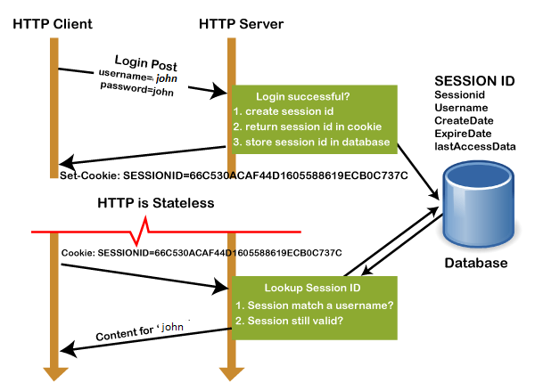
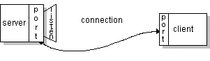

# Network

# ISN(Initial Sequence Number)가 난수인 이유
## 1. 보안
모든 TCP 연결이 0부터 시작한다면, 번호 예측이 쉬워 TCP Connection Hijacking이 빈번할 것이다.

## 2. 같은 IP 연결에서 번호 중복
Sender가 ISN을 0으로 설정된 100B 세그먼트를 ISN을 보냈다. 시퀀스 번호가 100인 세그먼트(응답으로 와야 할)가 지연되거나 손실된 후 TCP 연결이 닫혔다고 가정한다. 

이전 연결과 동일한 IP 포트를 사용하는 새 연결이 설정되고 ISN이 0으로 초기화된다. 만약 시퀀스 번호가 100인 세그먼트가 도착한다면, 이전 연결으로부터 오는 것으로 인식할 수도 있다. 

<hr>

출처
- [In TCP connection, the initial sequence number is not '0' (zero). Why?](https://www.quora.com/In-TCP-connection-the-initial-sequence-number-is-not-0-zero-Why)
- [Wrap Around Concept and TCP Sequence Number](https://www.geeksforgeeks.org/wrap-around-concept-and-tcp-sequence-number/)

<hr>

# 세션(Session) vs 쿠키(Cookie)
## 세션(Session)
### 세션(Session)이란
- 세션은 웹사이트의 여러 페이지에 걸쳐 사용될 정보를 서버에 임시적으로 저장하는데 사용된다. 사용자가 특정 네트워크 응용 프로그램에 로그인할 때 시작되고, 로그아웃하거나 시스템을 종료할 때 종료된다. 
- 사용자가 인터넷을 통해 응용 프로그램에서 작업 할 때, 웹 서버는 HTTP 프로토콜이 상태를 유지하지 않기 때문에 사용자를 알지 못한다. 응용 프로그램의 한 페이지에서 사용자가 제공한 정보는 다른 페이지로 전송되지 않는다. 이러한 제한을 제거하기 위해 세션이 사용되는데, 사용자가 웹사이트에 처음 진입할 때마다 세션이 시작된다.
- 사용자 정보가 세션 변수에 저장되며, 이러한 변수는 객체의 모든 유형의 값 또는 데이터 유형을 저장할 수 있다.
- 세션 값은 이진 형식이나 암호화된 형식으로 저장되며 서버에서만 암호를 해독할 수 있기 때문에 매우 안전하다. 세션 값은 사용자가 시스템을 종료하거나 응용 프로그램에서 로그아웃할 때 자동으로 제거된다. 값을 영구적으로 저장하려면 데이터베이스에 값을 저장해야 한다.
- 각 세션은 각 사용자마다 고유하며 응용 프로그램에서 세션의 수를 제한하지 않는다.
- 사용자는 서버 내부에 저장된 고유 번호인 sessionID로 식별된다. 쿠키, form 필드, URL로 저장된다.

### 세션(Session) 동작 과정



1. 클라이언트가 GET/POST 메서드를 통해 서버에 요청을 보낸다.
2. 서버에서 sessionID를 생성하고 데이터베이스에 저장한다. 클라이언트에 대한 응답으로 쿠키와 함께 sessionID를 반환한다.
3. 브라우저에 저장된 sessionID가 포함된 쿠키는 서버로 다시 전송된다. 서버는 sessionID가 데이터베이스에 저장된 sessionID와 일치하면 응답으로 HTTP 상태코드 200을 전송한다.

### 세션(Session) 사용 이유
- 세션은 서버를 통해 UserID와 같은 정보를 안전하게 저장하는 데 사용된다. 
- 한 웹페이지에서 다른 웹 페이지로 정보를 전송하는 데 사용된다.
- 쿠키를 지원하지 않는 브라우저에서 쿠키 대신 사용하며, 쿠키보다 안전한 방식으로 변수를 저장할 수 있다.

## 쿠키(Cookie)
### 쿠키(Cookie)란
- 쿠키는 사용자의 컴퓨터에 저장된 작은 텍스트 파일이다. 쿠키의 최대 크기는 4KB이다. HTTP 쿠키, 웹 쿠키, 인터넷 쿠키라고도 한다. 사용자가 웹 사이트를 처음 방문할 때마다 사이트는 쿠키 형태의 데이터 패킷을 사용자의 컴퓨터로 보낸다.
- 쿠키는 웹 사이트가 사이트를 방문할 때 사용자의 검색 기록 또는 장바구니 정보를 추적하는 데 도움이 된다.
- 문자열 데이터 유형만 저장한다.
- 쿠키에 저장된 정보는 클라이언트 측에서 텍스트 형식으로 저장되어 누구나 읽을 수 있기 때문에 안전하지 않다.
- 요구 사항에 따라 쿠키를 활성화하거나 비활성화할 수 있다.
- 사용자가 생성한 쿠키는 사용자에게만 표시되며 다른 사용자는 해당 쿠키를 볼 수 없다.
- 쿠키는 HTTP 헤더를 사용하며 서버와 브라우저간에 만들어지고 공유된다.
- 쿠키가 저장되는 경로는 브라우저에 의해 결정된다. 인터넷 탐색기는 일반적으로 임시 인터넷 파일 폴더에 쿠키를 저장하기 때문이다.
- YouTube 채널을 방문하여 노래를 검색할 때 다음에 YouTube를 방문할 때마다 쿠키가 검색 기록을 읽고 유사한 노래 또는 마지막으로 재생된 노래를 표시합니다.

### 쿠키(Cookie) 만들기

```
setcookie(name, value, expire, path, domain, secure, httponly);  
```
name 인수만 필수이며 다른 인수는 선택 사항이다.
```
Example:

setcookie("Userid", "1005", "time()+3600");
```

### 쿠키(Cookie) 사용 이유
HTTP는 stateless 프로토콜이므로 사용자 정보를 저장하지 않는다. 이를 위해 쿠키를 사용할 수 있다. 쿠키는 사용자의 컴퓨터에 정보를 저장하고 응용 프로그램의 상태를 추적할 수 있게 도와준다.

## 세션(Session)과 쿠키(Cookie) 주요 차이점
- 세션은 사용자 정보를 저장하는 server-side(서버 측) 파일인 반면 쿠키는 로컬 컴퓨터의 사용자 정보를 저장하는 client-side(클라이언트 측) 파일이다.
- 세션은 쿠키에 종속되지만 쿠키는 세션에 종속되지 않는다.
- 사용자가 브라우저를 닫거나 응용프로그램에서 로그아웃하면 세션이 종료되는 반면 쿠키는 설정된 시간에 만료된다.
- 쿠키의 크기는 4KB로 제한되어 있는 반면 세션은 사용자가 원하는 만큼 데이터를 저장할 수 있다.
  - 그러나 스크립트가 한 번에 사용할 수 있는 최대 메모리 제한이 있으며 128MB다.

## 결론
세션은 사용자 정보를 서버 측에 일시적으로 저장하는 반면 쿠키는 만료 될 때까지 사용자 컴퓨터에 정보를 저장하는 방법이다.

<hr>

출처
- [Session vs. Cookies| Difference between Session and Cookies](https://www.javatpoint.com/session-vs-cookies)

<hr>

# REST? RESTful?
Representational State Transfer(REST)는 API 작동 방식에 대한 조건을 부과하는 소프트웨어 아키텍처이다. REST는 처음에 인터넷과 같은 복잡한 네트워크에서 통신을 관리하기 위한 지침으로 만들어졌다. REST 기반 아키텍처를 사용하여 대규모의 고성능 통신을 안정적으로 지원할 수 있다. 쉽게 구현하고 수정할 수 있어 모든 API 시스템을 파악하고 여러 플랫폼에서 사용할 수 있다. 

API 개발자는 여러 아키텍처를 사용하여 API를 설계할 수 있다. REST 아키텍처 스타일을 따르는 API를 REST API라고 한다. REST 아키텍처를 구현하는 웹 서비스를 RESTful 웹 서비스라고 한다. RESTful API라는 용어는 일반적으로 RESTful 웹 API를 나타낸다. 하지만 REST API와 RESTful API라는 용어는 같은 의미로 사용할 수 있다.

## REST의 아키텍처 제약
### 1. Client-Server
클라이언트-서버 스타일은 사용자 인터페이스에 대한 관심(concern)을 데이터 저장에 대한 관심으로부터 분리함으로써 클라이언트의 이식성과 서버의 규모확장성을 개선한다.

### 2. Stateless
클라이언트와 서버의 통신에는 상태가 없어야한다. 모든 요청은 필요한 모든 정보를 담고 있어야한다. 요청 하나만 봐도 바로 뭔지 알 수 있으므로 가시성이 개선되고, task 실패시 복원이 쉬우므로 신뢰성이 개선되며, 상태를 저장할 필요가 없으므로 규모확장성이 개선된다.

### 3. Cacheable
캐시가 가능해야한다. 즉 모든 서버 응답은 캐시 가능한지 그렇지 아닌지 알 수 있어야한다. 호율, 규모확장성, 사용자 입장에서의 성능이 개선된다.

### 4. Uniform interface
구성요소(클라이언트, 서버 등) 사이의 인터페이스는 균일(uniform)해야한다. 인터페이스를 일반화함으로써, 전체 시스템 아키텍처가 단순해지고, 상호작용의 가시성이 개선되며, 구현과 서비스가 분리되므로 독립적인 진화가 가능해진다.

### 5. Layered system
계층(hierarchical layers)으로 구성이 가능해야하며, 각 레이어에 속한 구성요소는 인접하지 않은 레이어의 구성요소를 볼 수 없어야한다. 따라서 load-balancer나 proxy를 쉽게 추가하여 보안이나 성능을 향상시킬 수 있다. 

<hr>

출처
- [바쁜 개발자들을 위한 REST 논문 요약](https://blog.npcode.com/2017/03/02/%EB%B0%94%EC%81%9C-%EA%B0%9C%EB%B0%9C%EC%9E%90%EB%93%A4%EC%9D%84-%EC%9C%84%ED%95%9C-rest-%EB%85%BC%EB%AC%B8-%EC%9A%94%EC%95%BD/)
- [RESTful API란 무엇입니까?](https://aws.amazon.com/ko/what-is/restful-api/)
- [What Are RESTful Web Services?](https://docs.oracle.com/javaee/6/tutorial/doc/gijqy.html)
- [REST API (RESTful API)](https://www.techtarget.com/searchapparchitecture/definition/RESTful-API)

<hr>

# 소켓
## 개요 
TCP는 인터넷의 client-server 응용 프로그램이 서로 통신하는 데 사용하는 신뢰할 수 있는 point-to-point 통신 채널을 제공한다. TCP를 통해 통신하기 위해 클라이언트 프로그램과 서버 프로그램은 서로 연결을 설정한다. 각 프로그램은 소켓을 연결 끝에 바인딩한다. 통신을 위해 클라이언트와 서버는 각각 연결에 바인딩된 소켓에서 읽고 쓴다.

소켓은 네트워크에서 실행되는 두 프로그램 사이의 양방향 통신 링크의 한 엔드 포인트이다. Socket 클래스는 클라이언트 프로그램과 클라이언트 프로그램 간의 연결을 나타내는 데 사용된다. java.net 패키지는 Socket 클래스와 ServerSocket 클래스를 제공한다. Socket은 연결의 클라이언트 측을, ServerSocket은 연결의 서버 측을 구현한다. 

웹에 연결하는 경우 Socket 클래스보다 URL 클래스와 관련된 클래스(URLConnection, URLNcoder)가 더 적합할 수 있다. 실제로 URL은 웹에 대한 비교적 높은 수준의 연결이며 기본 구현의 일부로 소켓을 사용한다. 

## 소켓이란


서버: 일반적으로 서버는 특정 컴퓨터에서 실행되며 특정 포트 번호에 바인딩된 소켓이 있다. 서버는 클라이언트가 연결 요청을 할 때까지 소켓을 대기한다. 

클라이언트: 클라이언트는 서버가 실행 중인 컴퓨터의 호스트 이름과 서버가 수신 중인 포트 번호를 알고 있다. 연결 요청을 위해 클라이언트는 서버의 컴퓨터 및 포트에 있는 서버와 만남을 시도한다. 또한 클라이언트는 서버에 대해 자신을 식별하여 이 연결 중에 사용할 로컬 포트 번호를 바인딩해야 한다. 일반적으로 시스템에서 할당한다. 



모든 것이 잘 되면, 서버는 연결을 승인한다. 승인 시 서버는 동일한 로컬 포트에 바인딩된 새 소켓을 가져오고, 원격 엔드포인트를 클라이언트의 주소와 포트로 설정한다. 연결된 클라이언트의 요구를 처리하면서 연결 요청을 위해 원래 소켓을 계속 listen 할 수 있도록 새로운 소켓이 필요하다.

클라이언트 측에서는 연결이 허용되면 소켓이 성공적으로 생성되고 클라이언트는 소켓을 사용하여 서버와 통신할 수 있다. 

클라이언트와 서버는 이제 소켓에 write 하거나 read 함으로써 통신할 수 있다.

```
Definition:

소켓은 네트워크에서 실행되는 두 프로그램 사이의 양방향 통신 링크의 한 끝점이다. 소켓은 포트 번호에 바인딩되어 TCP 계층이 데이터를 전송할 응용 프로그램을 식별할 수 있다.
```

엔드포인트는 IP 주소와 포트 번호의 조합이다. 모든 TCP 연결은 두 개의 엔드포인트에 의해 고유하게 식별될 수 있다. 일허게 하면 호스트와 서버 간에 여러 연결을 가질 수 있다. 

<hr>

출처
- [All About Sockets](https://docs.oracle.com/javase/tutorial/networking/sockets/index.html)

<hr>