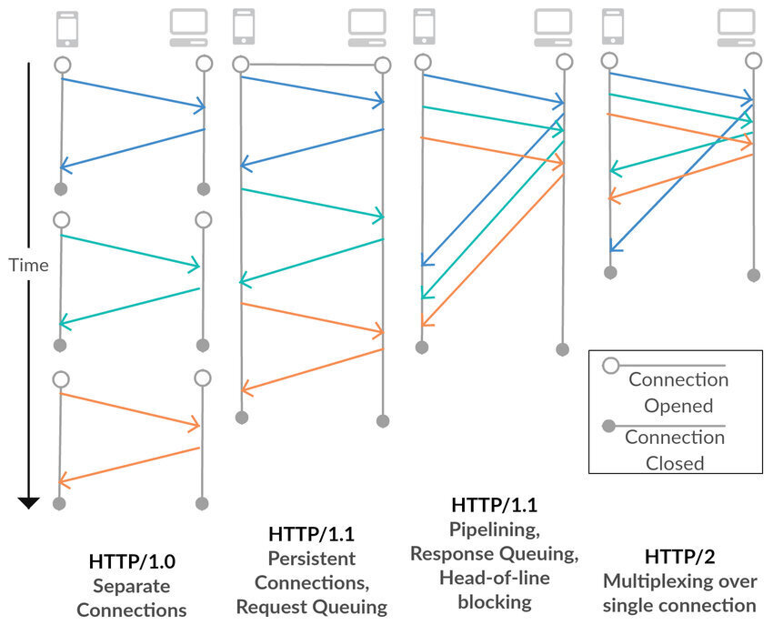
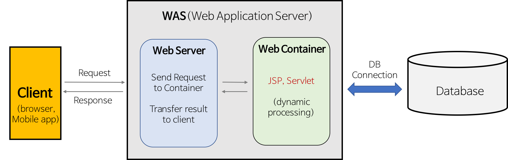
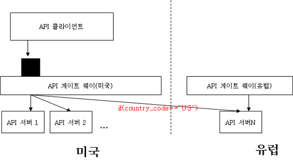

# Network

# ISN(Initial Sequence Number)가 난수인 이유
## 1. 보안
모든 TCP 연결이 0부터 시작한다면, 번호 예측이 쉬워 TCP Connection Hijacking이 빈번할 것이다.

## 2. 같은 IP 연결에서 번호 중복
Sender가 ISN을 0으로 설정된 100B 세그먼트를 ISN을 보냈다. 시퀀스 번호가 100인 세그먼트(응답으로 와야 할)가 지연되거나 손실된 후 TCP 연결이 닫혔다고 가정한다. 

이전 연결과 동일한 IP 포트를 사용하는 새 연결이 설정되고 ISN이 0으로 초기화된다. 만약 시퀀스 번호가 100인 세그먼트가 도착한다면, 이전 연결으로부터 오는 것으로 인식할 수도 있다. 

<hr>

출처
- [In TCP connection, the initial sequence number is not '0' (zero). Why?](https://www.quora.com/In-TCP-connection-the-initial-sequence-number-is-not-0-zero-Why)
- [Wrap Around Concept and TCP Sequence Number](https://www.geeksforgeeks.org/wrap-around-concept-and-tcp-sequence-number/)

<hr>

# 세션(Session) vs 쿠키(Cookie)
## 세션(Session)
### 세션(Session)이란
- 세션은 웹사이트의 여러 페이지에 걸쳐 사용될 정보를 서버에 임시적으로 저장하는데 사용된다. 사용자가 특정 네트워크 응용 프로그램에 로그인할 때 시작되고, 로그아웃하거나 시스템을 종료할 때 종료된다. 
- 사용자가 인터넷을 통해 응용 프로그램에서 작업 할 때, 웹 서버는 HTTP 프로토콜이 상태를 유지하지 않기 때문에 사용자를 알지 못한다. 응용 프로그램의 한 페이지에서 사용자가 제공한 정보는 다른 페이지로 전송되지 않는다. 이러한 제한을 제거하기 위해 세션이 사용되는데, 사용자가 웹사이트에 처음 진입할 때마다 세션이 시작된다.
- 사용자 정보가 세션 변수에 저장되며, 이러한 변수는 객체의 모든 유형의 값 또는 데이터 유형을 저장할 수 있다.
- 세션 값은 이진 형식이나 암호화된 형식으로 저장되며 서버에서만 암호를 해독할 수 있기 때문에 매우 안전하다. 세션 값은 사용자가 시스템을 종료하거나 응용 프로그램에서 로그아웃할 때 자동으로 제거된다. 값을 영구적으로 저장하려면 데이터베이스에 값을 저장해야 한다.
- 각 세션은 각 사용자마다 고유하며 응용 프로그램에서 세션의 수를 제한하지 않는다.
- 사용자는 서버 내부에 저장된 고유 번호인 sessionID로 식별된다. 쿠키, form 필드, URL로 저장된다.

### 세션(Session) 동작 과정


1. 클라이언트가 GET/POST 메서드를 통해 서버에 요청을 보낸다.
2. 서버에서 sessionID를 생성하고 데이터베이스에 저장한다. 클라이언트에 대한 응답으로 쿠키와 함께 sessionID를 반환한다.
3. 브라우저에 저장된 sessionID가 포함된 쿠키는 서버로 다시 전송된다. 서버는 sessionID가 데이터베이스에 저장된 sessionID와 일치하면 응답으로 HTTP 상태코드 200을 전송한다.

### 세션(Session) 사용 이유
- 세션은 서버를 통해 UserID와 같은 정보를 안전하게 저장하는 데 사용된다. 
- 한 웹페이지에서 다른 웹 페이지로 정보를 전송하는 데 사용된다.
- 쿠키를 지원하지 않는 브라우저에서 쿠키 대신 사용하며, 쿠키보다 안전한 방식으로 변수를 저장할 수 있다.

## 쿠키(Cookie)
### 쿠키(Cookie)란
- 쿠키는 사용자의 컴퓨터에 저장된 작은 텍스트 파일이다. 쿠키의 최대 크기는 4KB이다. HTTP 쿠키, 웹 쿠키, 인터넷 쿠키라고도 한다. 사용자가 웹 사이트를 처음 방문할 때마다 사이트는 쿠키 형태의 데이터 패킷을 사용자의 컴퓨터로 보낸다.
- 쿠키는 웹 사이트가 사이트를 방문할 때 사용자의 검색 기록 또는 장바구니 정보를 추적하는 데 도움이 된다.
- 문자열 데이터 유형만 저장한다.
- 쿠키에 저장된 정보는 클라이언트 측에서 텍스트 형식으로 저장되어 누구나 읽을 수 있기 때문에 안전하지 않다.
- 요구 사항에 따라 쿠키를 활성화하거나 비활성화할 수 있다.
- 사용자가 생성한 쿠키는 사용자에게만 표시되며 다른 사용자는 해당 쿠키를 볼 수 없다.
- 쿠키는 HTTP 헤더를 사용하며 서버와 브라우저간에 만들어지고 공유된다.
- 쿠키가 저장되는 경로는 브라우저에 의해 결정된다. 인터넷 탐색기는 일반적으로 임시 인터넷 파일 폴더에 쿠키를 저장하기 때문이다.
- YouTube 채널을 방문하여 노래를 검색할 때 다음에 YouTube를 방문할 때마다 쿠키가 검색 기록을 읽고 유사한 노래 또는 마지막으로 재생된 노래를 표시합니다.

### 쿠키(Cookie) 만들기

```
setcookie(name, value, expire, path, domain, secure, httponly);  
```
name 인수만 필수이며 다른 인수는 선택 사항이다.
```
Example:

setcookie("Userid", "1005", "time()+3600");
```

### 쿠키(Cookie) 사용 이유
HTTP는 stateless 프로토콜이므로 사용자 정보를 저장하지 않는다. 이를 위해 쿠키를 사용할 수 있다. 쿠키는 사용자의 컴퓨터에 정보를 저장하고 응용 프로그램의 상태를 추적할 수 있게 도와준다.

## 세션(Session)과 쿠키(Cookie) 주요 차이점
- 세션은 사용자 정보를 저장하는 server-side(서버 측) 파일인 반면 쿠키는 로컬 컴퓨터의 사용자 정보를 저장하는 client-side(클라이언트 측) 파일이다.
- 세션은 쿠키에 종속되지만 쿠키는 세션에 종속되지 않는다.
- 사용자가 브라우저를 닫거나 응용프로그램에서 로그아웃하면 세션이 종료되는 반면 쿠키는 설정된 시간에 만료된다.
- 쿠키의 크기는 4KB로 제한되어 있는 반면 세션은 사용자가 원하는 만큼 데이터를 저장할 수 있다.
  - 그러나 스크립트가 한 번에 사용할 수 있는 최대 메모리 제한이 있으며 128MB다.

## 결론
세션은 사용자 정보를 서버 측에 일시적으로 저장하는 반면 쿠키는 만료 될 때까지 사용자 컴퓨터에 정보를 저장하는 방법이다.

<hr>

출처
- [Session vs. Cookies| Difference between Session and Cookies](https://www.javatpoint.com/session-vs-cookies)

<hr>

# REST? RESTful?
Representational State Transfer(REST)는 API 작동 방식에 대한 조건을 부과하는 소프트웨어 아키텍처이다. REST는 처음에 인터넷과 같은 복잡한 네트워크에서 통신을 관리하기 위한 지침으로 만들어졌다. REST 기반 아키텍처를 사용하여 대규모의 고성능 통신을 안정적으로 지원할 수 있다. 쉽게 구현하고 수정할 수 있어 모든 API 시스템을 파악하고 여러 플랫폼에서 사용할 수 있다. 

API 개발자는 여러 아키텍처를 사용하여 API를 설계할 수 있다. REST 아키텍처 스타일을 따르는 API를 REST API라고 한다. REST 아키텍처를 구현하는 웹 서비스를 RESTful 웹 서비스라고 한다. RESTful API라는 용어는 일반적으로 RESTful 웹 API를 나타낸다. 하지만 REST API와 RESTful API라는 용어는 같은 의미로 사용할 수 있다.

## REST의 아키텍처 제약
### 1. Client-Server
클라이언트-서버 스타일은 사용자 인터페이스에 대한 관심(concern)을 데이터 저장에 대한 관심으로부터 분리함으로써 클라이언트의 이식성과 서버의 규모확장성을 개선한다.

### 2. Stateless
클라이언트와 서버의 통신에는 상태가 없어야한다. 모든 요청은 필요한 모든 정보를 담고 있어야한다. 요청 하나만 봐도 바로 뭔지 알 수 있으므로 가시성이 개선되고, task 실패시 복원이 쉬우므로 신뢰성이 개선되며, 상태를 저장할 필요가 없으므로 규모확장성이 개선된다.

### 3. Cacheable
캐시가 가능해야한다. 즉 모든 서버 응답은 캐시 가능한지 그렇지 아닌지 알 수 있어야한다. 호율, 규모확장성, 사용자 입장에서의 성능이 개선된다.

### 4. Uniform interface
구성요소(클라이언트, 서버 등) 사이의 인터페이스는 균일(uniform)해야한다. 인터페이스를 일반화함으로써, 전체 시스템 아키텍처가 단순해지고, 상호작용의 가시성이 개선되며, 구현과 서비스가 분리되므로 독립적인 진화가 가능해진다.

### 5. Layered system
계층(hierarchical layers)으로 구성이 가능해야하며, 각 레이어에 속한 구성요소는 인접하지 않은 레이어의 구성요소를 볼 수 없어야한다. 따라서 load-balancer나 proxy를 쉽게 추가하여 보안이나 성능을 향상시킬 수 있다. 

<hr>

출처
- [바쁜 개발자들을 위한 REST 논문 요약](https://blog.npcode.com/2017/03/02/%EB%B0%94%EC%81%9C-%EA%B0%9C%EB%B0%9C%EC%9E%90%EB%93%A4%EC%9D%84-%EC%9C%84%ED%95%9C-rest-%EB%85%BC%EB%AC%B8-%EC%9A%94%EC%95%BD/)
- [RESTful API란 무엇입니까?](https://aws.amazon.com/ko/what-is/restful-api/)
- [What Are RESTful Web Services?](https://docs.oracle.com/javaee/6/tutorial/doc/gijqy.html)
- [REST API (RESTful API)](https://www.techtarget.com/searchapparchitecture/definition/RESTful-API)

<hr>

# 소켓
## 개요 
TCP는 인터넷의 client-server 응용 프로그램이 서로 통신하는 데 사용하는 신뢰할 수 있는 point-to-point 통신 채널을 제공한다. TCP를 통해 통신하기 위해 클라이언트 프로그램과 서버 프로그램은 서로 연결을 설정한다. 각 프로그램은 소켓을 연결 끝에 바인딩한다. 통신을 위해 클라이언트와 서버는 각각 연결에 바인딩된 소켓에서 읽고 쓴다.

소켓은 네트워크에서 실행되는 두 프로그램 사이의 양방향 통신 링크의 한 엔드 포인트이다. Socket 클래스는 클라이언트 프로그램과 클라이언트 프로그램 간의 연결을 나타내는 데 사용된다. java.net 패키지는 Socket 클래스와 ServerSocket 클래스를 제공한다. Socket은 연결의 클라이언트 측을, ServerSocket은 연결의 서버 측을 구현한다. 

웹에 연결하는 경우 Socket 클래스보다 URL 클래스와 관련된 클래스(URLConnection, URLNcoder)가 더 적합할 수 있다. 실제로 URL은 웹에 대한 비교적 높은 수준의 연결이며 기본 구현의 일부로 소켓을 사용한다. 

## 소켓이란


서버: 일반적으로 서버는 특정 컴퓨터에서 실행되며 특정 포트 번호에 바인딩된 소켓이 있다. 서버는 클라이언트가 연결 요청을 할 때까지 소켓을 대기한다. 

클라이언트: 클라이언트는 서버가 실행 중인 컴퓨터의 호스트 이름과 서버가 수신 중인 포트 번호를 알고 있다. 연결 요청을 위해 클라이언트는 서버의 컴퓨터 및 포트에 있는 서버와 만남을 시도한다. 또한 클라이언트는 서버에 대해 자신을 식별하여 이 연결 중에 사용할 로컬 포트 번호를 바인딩해야 한다. 일반적으로 시스템에서 할당한다. 


모든 것이 잘 되면, 서버는 연결을 승인한다. 승인 시 서버는 동일한 로컬 포트에 바인딩된 새 소켓을 가져오고, 원격 엔드포인트를 클라이언트의 주소와 포트로 설정한다. 연결된 클라이언트의 요구를 처리하면서 연결 요청을 위해 원래 소켓을 계속 listen 할 수 있도록 새로운 소켓이 필요하다.

클라이언트 측에서는 연결이 허용되면 소켓이 성공적으로 생성되고 클라이언트는 소켓을 사용하여 서버와 통신할 수 있다. 

클라이언트와 서버는 이제 소켓에 write 하거나 read 함으로써 통신할 수 있다.

```
Definition:

소켓은 네트워크에서 실행되는 두 프로그램 사이의 양방향 통신 링크의 한 끝점이다. 소켓은 포트 번호에 바인딩되어 TCP 계층이 데이터를 전송할 응용 프로그램을 식별할 수 있다.
```

엔드포인트는 IP 주소와 포트 번호의 조합이다. 모든 TCP 연결은 두 개의 엔드포인트에 의해 고유하게 식별될 수 있다. 일허게 하면 호스트와 서버 간에 여러 연결을 가질 수 있다. 

<hr>

출처
- [All About Sockets](https://docs.oracle.com/javase/tutorial/networking/sockets/index.html)

<hr>

# WebSocket vs Socket.io
## WebSocket
### 배경 - HTTP의 한계
초기 웹의 목적은 단순한 문서전달이었다. HTTP는 요청한대로 응답을 보내주기만 하는 단순한 프로토콜이다. 하지만 인터넷이 발전하면서 게임, 채팅 등 요청-응답 이상의 실시간 통신이 필요했다. HTTP 프로토콜은 매 요청과 응답마다 연결을 수립하고 끊는 과정을 반복해야 했기 때문에 유사한 통신을 계속 반복해야 한다는 비효율성 문제가 있었다. 

### 웹소켓의 탄생
HTTP를 이용한 실시간 통신의 문제를 해결하기 위해 HTML5부터 웹소켓이 등장했다. 웹소켓은 실시간 양방향 통신을 지원하며 한 번 연결이 수립되면 클라이언트와 서버 모두 자유롭게 데이터를 보낼 수 있다. 

### 웹소켓 프로토콜
웹소켓은 HTTP와 같은 OSI 모델의 7계층에 위치하는 프로토콜이며, 4계층의 TCP에 의존한다.

HTTP 프로토콜을 이용할 때 "http"를 이용하는 것처럼, 웹소켓을 이용할 때 "ws"를 이용한다. 또한 보완을 강화한 "https"를 사용하는 것처럼, "ws"에 비해 보완을 강화한 "wss"를 사용할 수 있다. 

HTTP 프로토콜을 이용해서 연결을 수립하며 연결된 이후에도 연결을 할 때 사용했던 80 포트와 443 포트를 이용한다. 연결 수립은 핸드쉐이크를 통해 이루어지며 핸드쉐이크 시 HTTP를 이용한다.

### 웹소켓 핸드쉐이크
핸드쉐이크는 한 번의 HTTP 요청과 HTTP 응답으로 이루어진다. 핸드쉐이크가 끝나면 HTTP 프로토콜을 웹소켓 프로토콜로 변환하여 통신을 하는 구조다.

## Socket.IO
Socket.IO는 클라이언트와 서버 간의 낮은 지연 시간, 양방향 및 이벤트 기반 통신을 가능하게 하는 라이브러리다. 웹소켓 프로토콜 위에 구축되었으며 HTTP long-polling 또는 자동 재연결에 대한 fallback과 같은 추가적인 보장을 제공한다. 

Socket.IO는 Websocket을 사용하지만, 각 패킷에 추가적인 메타데이터를 추가한다. 그것이 Websocket Client가 Socket.IO Server에 성공적인 연결을 할 수 없는 이유다. Socket.IO Client도 Websocket Server에 연결할 수 없다.

### Socket.IO 기능
- HTTP long-polling fallback
- Automatic reconnection
- Packet buffering
- Acknowledgements
- Broadcasting
- Multiplexing


<hr>

출처
- [웹소켓에 대해 알아보자](https://tecoble.techcourse.co.kr/post/2020-09-20-websocket/)
- [What Socket.IO is](https://socket.io/docs/v4/#is-socketio-still-needed-today)
- [웹소켓과 socket.io](https://www.peterkimzz.com/websocket-vs-socket-io/)
- [WebSocket과 Socket.io](https://d2.naver.com/helloworld/1336)

<hr>

# IPv4 vs IPv6
## IPv6 개요
많은 사람들이 휴대 전화 및 휴대용 컴퓨터 등과 같은 모바일 컴퓨터를 사용하게 됨에 따라, 무선 사용자의 증가하는 요구가 IPv4 주소 고갈의 원인이 되고 있다. 따라서 인터넷 프로토콜 버전 4(IPv4)를 대체하는 인터넷 프로토콜 버전 6(IPv6)가 나왔다. 

### 주소
- IPv4는 32비트 길이(4바이트). `nnn.nnn.nnn.nnn` 의 형태. (0<=nnn<=255). 주소 클래스에 따라 다른 네트워크 및 호스트 부분으로 구성됩니다.
- IPv6는 128비트 길이(16바이트). `xxxx:xxxx:xxxx:xxxx:xxxx:xxxx:xxxx:xxxx` 의 형태. 기본 구조는 네트워크 번호용 64비트와 호스트 번호용 64비트. 종종 IPv6 주소의 호스트 부분(또는 그 일부)은 MAC 주소나 인터페이스 ID에서 파생.

### IP 헤더
- IPv4는 현재 IP 옵션에 따라 20-60 바이트의 가변 길이
- IPv6는 40바이트의 고정 길이. IP 헤더 옵션이 없다. 

### 주소 유형
- IPv4 주소는 유니캐스트 주소, 멀티캐스트 주소 및 브로드캐스트 주소의 세 가지 기본 유형으로 분류
- IPv6 주소는 유니캐스트 주소, 멀티캐스트 주소 및 애니캐스트 주소의 세 가지 기본 유형으로 분류

### ARP(주소 해석 프로토콜)
- IPv4는 ARP(주소 해석 프로토콜)를 사용하여 IPv4 주소와 연관된 MAC 또는 링크 주소와 같은 물리적 주소를 찾는다.
- IPv6은 ICMPv6(Internet Control Message Protocol version 6)을 사용하여 스테이트리스 자동 구성 및 인접 노드 발견을 위한 알고리즘의 일부로서 IP 자체 내에 이러한 기능을 내장시킨다. 따라서 ARP6과 같은 것은 없다.

<hr>

출처
- [IPv4와 IPv6의 비교](https://www.ibm.com/docs/ko/i/7.3?topic=6-comparison-ipv4-ipv6)

<hr>

# Mac Address
## Mac Address란
- Mac 주소는 지정된 네트워크의 각 장치를 고유하게 식별하는 물리적 주소이다. 두 개의 네트워크 장치 간에 통신하려면 IP 주소와 MAC 주소 두 개가 필요하다. 인터넷에 연결할 수 있는 각 장치의 NIC(Network Interface card)에 할당된다.
- Media Access Control의 약자로 물리적 주소, 하드웨어 주소, BIA(Burned In Address)라고도 한다.
- 글로벌적으로 고유하다. 00 : 0a : 95 : 9d : 67 : 16과 같이 각 장치의 16 진수 형식으로 표시된다.
- 길이는 12. 48비트(6바이트). 이 중 처음 24비트는 OUI(Organization Unique Identifier)에 사용되며 24비트는 NIC/벤더별로 사용된다.
- OSI 7모델 중 데이터 링크 계층에서 작동한다.
- 제조 시 장비 공급업체에서 제공하며 NIC에 내장되어 변경할 수 없다.
- ARP 프로토콜은 논리 주소를 MAC 주소(물리적 주소)와 연결하는데 사용된다.

## Mac Address vs IP Address
- MAC는 Media Access Control, IP는 Internet Protocol
- MAC 주소는 제조업체에서 제공하는 고유 주소, IP 주소는 ISP(Internet Service Provider)에서 제공하는 논리적 주소
- MAC 주소는 네트워크 내에서 디바이스를 식별하는 데 사용되는 디바이스 NIC의 물리적 주소, IP 주소는 인터넷에서 네트워크나 디바이스를 식별하는 논리적 주소
- MAC 주소는 데이터 링크 계층에서 작동하고, IP 주소는 네트워크 계층에서 작동한다.
- MAC 주소는 6 바이트 16진수 주소, IPv4의 경우 4바이트, IPv6의 경우 8바이트다.
  
<hr>

출처
- [What is MAC Address?](https://www.javatpoint.com/what-is-mac-address)

# SOP (Same-origin policy)
## SOP(Same-origin policy)란
- 한 Origin에서 로드된 문서 또는 스크립트가 다른 Origin의 리소스와 상호작용할 수 있는 방법을 제한하는 중요한 보안 메커니즘이다. 보안을 위협하는 문서를 격리하여, 보안 위협으로부터 보호할 수 있다.
  - Origin은 출처(URL)을 말한다.
- 악의적인 웹 사이트가 타 웹 메일 서비스나 회사 인트라넷에 접근해 데이터를 읽고 해커에게 데이터를 전달하는 것을 막는다.

## Origin(출처)의 정의
- 두 개의 URL이 동일한 `protocol`, `port`, `host` 를 가지고 있으면 같은 Origin이다.
- `http://store.company.com/dir/page.html` 에 대한 예시다. 
  

## Cross-origin network access
- SOP 정책은 `XMLHttpRequest` 또는 `` 요소를 사용할 때와 같이 두 개의 Origins 간의 상호작용을 제어한다. 이러한 상호작용들은 일반적으로 세 가지 범주로 분류된다.
- `Cross-origin writes`는 일반적으로 허용된다. 예를 들어 links, redirects, form submissions가 있다. 일부 HTTP 요청에는 preflight가 필요하다.
- `Cross-origin embedding`은 일반적으로 허용된다. 
- `Cross-origin reads`는 일반적으로 허용되지 않지만, 읽기 접근은 embedding에 의해 유출되는 경우가 많다. 예를 들어 embedded 이미지의 치수, embedded 스크립트의 작업, embedded 리소스의 가용성을 읽을 수 있다.
  

### `Cross-origin embedding`의 예시
- `<script src="…"></script>`이 포함된 JavaScript. syntax error에 대한 내용은 Same-origin 스크립트에서만 사용할 수 있다.
- `<link rel="stylesheet" href=..">`와 함께 적용된 CSS. 올바른 Content-Type 헤더가 필요하다. 브라우저는 MIME 타입이 올바르지 않고 유효한 CSS 구성으로 시작하지 않는 cross-origin은 style sheet 로드를 block한다. 
- ``에 의해 로드된 이미지.
- `<video>`와 `<audio>`로 로드된 미디어.

### Cross-origin access 허용하는 방법
- [CORS](https://developer.mozilla.org/en-US/docs/Web/HTTP/CORS)를 사용해서 허용한다. CORS는 서버가 브라우저가 컨텐츠 로드를 허용해야 하는 host드들을 지정할 수 있게 해주는 HTTP의 한 부분이다.

<hr>

출처
- [Same-origin policy](https://developer.mozilla.org/en-US/docs/Web/Security/Same-origin_policy#cross-origin_script_api_access)

<hr>

# Stateless와 Connectionless
## Stateless(무상태)
- stateful은 서버가 클라이언트의 이전 상태를 보존한다는 의미다. 반대로 Stateless는 서버가 클라이언트의 이전 상태를 보존하지 않다는 의미다. 
- stateful의 경우 항상 같은 서버가 유지되어야 하지만 stateless는 상태를 보관하지 않기 때문에 클라이언트의 요청에 어느 서버가 응답해도 상관이 없다. 따라서 클라이언트의 요청이 대폭 증가해도 서버를 증설해 해결할 수 있다.
- 하지만 모든 것을 stateless로 설계할 수 없다. 단순히 로그인만 보더라도 사용자가 로그인한 상태를 서버가 유지시켜 주어야 한다. 이를 브라우저 쿠키나 서버 세션 등을 사용해 상태를 유지한다.

## Connectionless(비연결성)
- connectionless는 클라이언트가 서버에 요청을 하고 응답을 받으면 바로 TCP/IP connection을 끊어 연결을 유지하지 않는 것이다. 
- 서버의 자원을 효율적으로 관리하고, 수많은 클라이언트의 요청에 대응할 수 있게 해준다.
- HTTP는 connectionless 모델을 기본으로 한다. 

### Connectionless의 한계
- 연결이 끊어지고 새로 연결될 때 마다 TCP/IP 연결을 위한 3-way handshake의 시간 비용이 추가된다. 
- HTML 뿐만 아니라 JavaScript, CSS, 이미지 등 수많은 자원이 함께 다운로드된다. 이는 HTML을 받기 위해 연결하고 종류, JavaScript 파일을 받기 위해 연결 및 종료가 이어진다. 

### 해결
- HTTP 1.X 시대에는 HTTP 지속 연결(HTTP Persistent Connection)으로 문제를 해결했다. 
- 지속 연결은 요청에 따라 연결된 이후 일정 시간 연결을 유지하거나 여러 개의 요청(HTML, JavaScript, 이미지 등)에 대한 응답이 다 올 때까지 기다린 후 연결을 종료하는 것이다. 
- HTTP/2 버전은 멀티플렉싱(Multiplexing) 기능으로 단일 TCP 연결을 통해 (Persistent Connection in HTTP1.X), 다수의 HTTP 요청과 응답(HTTP Pipelining in HTTP1.1)이 클라이언트와 서버 사이에 응답 지연(HOL, Header of Line Blocking) 없이 Stream 형태로 주고 받을 수 있는 기술적 토대를 만들게 되었다. 따라서 HTTP/2 버전을 사용한다면 Persisten Connection에 대해 더 이상 고민할 필요가 없어졌다. 

<hr>

출처
- [HTTP, Stateless, Connectionless, HTTP 메시지 개념](https://velog.io/@duarufp06/HTTP-Stateless-Connectionless-HTTP-%EB%A9%94%EC%8B%9C%EC%A7%80-%EA%B0%9C%EB%85%90)
- [HTTP Persistent Connection](https://brunch.co.kr/@sangjinkang/4)
- [(번역) HTTP/3 - 차세대 웹 프로토콜에 대해 알아야하는 모든 것](https://velog.io/@sehyunny/everthing-you-need-to-know-about-http3)

<hr>

# 로드밸런서(Load Balancer)
## 로드밸런서(Load Balancer)란
- 서버에 가해지는 부하(=로드)를 분산(=밸런싱)해주는 장치 또는 기술을 통칭한다.
- 클라이언트의 서버풀(Server Pool, 분산 네트워크를 구성하는 서버들의 그룹) 사이에 존재하며, 한 대의 서버로 부하가 집중되지 않도록 트래픽을 관리해 각각의 서버가 최적의 성능을 보일 수 있도록 한다.

## 로드밸런싱은 모든 경우에 항상 필요한지?
- 로드밸런싱은 여러 대의 서버를 두고 서비스를 제공하는 분산 처리 시스템에서 필요한 기술이다.
- 서비스의 제공 초기 단계라면 적은 수의 클라이언트로 인해 서버 한 대로 요청에 응답하는 것이 가능하다. 하지만 사업의 규모가 확장되고, 클라이언트의 수가 늘어나게 되면 기존 서버만으로 정상적인 서비스가 불가능하다. 이처럼 증가한 트래픽에 대처할 수 있는 방법은 크게 두 가지다.
### Scale-up 그리고 Scale-out
- Scale-up은 서버 자체의 성능을 확장하는 것을 의미한다. 비유하자면 CPU가 i3인 컴퓨터를 i7로 업그레이드하는 것과 같다. 
- Scale-out은 기존 서버와 동일하거나 낮은 성능의 서버를 두 대 이상 증설하여 운영하는 것을 의미한다. CPU가 i3인 컴퓨터를 여러 대 추가 구입해 운영하는 것과 같다.
- Scale-out의 방식으로 서버를 증설하기로 결정했다면 여러 대의 서버로 트래픽을 균등하게 분산해주는 로드밸런싱이 반드시 필요하다.
- 클라이언트의 요청을 특정 서버에 분배하는 로드밸런싱 기법은 여러 가지가 있다. 

## 로드 밸런싱 알고리즘
### 라운드로빈 방식 (Round Robin Method)
- 서버에 들어온 요청을 순서대로 돌아가며 배정하는 방식이다.
- 클라이언트의 요청을 순서대로 분배하기 때문에 여러 대의 서버가 동일한 스펙을 갖고 있고, 서버와의 연결(세션)이 오래 지속되지 않는 경우에 활용하기에 적합하다.
  
### 가중 라운드로빈 방식 (Weighted Round Robin Method)
- 각각의 서버마다 가중치를 매기고 가중치가 높은 서버에 클라이언트 요청을 우선적으로 배분한다.
- 주로 서버의 트래픽 처리 능력이 상이한 경우 사용되는 부하 분산 방식이다.
- 예를 들어 A라는 서버가 5라는 가중치를 갖고 B라는 서버가 2라는 가중치를 갖는다면, 로드밸런서는 라운드로빈 방식으로 A 서버에 5개 B 서버에 2개의 요청을 전달한다.

### IP 해시 방식 (IP Hash Method)
- 클라이언트의 IP 주소를 특정 서버로 매핑하여 요청을 처리하는 방식이다.
- 사용자의 IP를 해싱해, 로드를 분배하기 때문에 사용자가 항상 동일한 서버로 연결되는 것을 보장한다.
  - 해싱(Hashing): 임의의 길이를 가진 데이터를 고정된 길이의 데이터로 매핑하는 것, 또는 그러한 함수

### 최소 연결 방식 (Least Connection Method)
- 요청이 들어온 시점에 가장 적은 연결상태를 보이는 서버에 우선적으로 트래픽을 배분한다. 자주 세션이 길어지거나, 서버에 분배된 트래픽들이 일정하지 않은 경우에 적합한 방식이다.

### 최소 리스폰 타임 (Least Response Time Method)
- 서버의 현재 연결 상태와 응답시간을 모두 고려하여 트래픽을 배분한다. 가장 적은 연결 상태와 가장 짧은 응답시간을 보이는 서버에 우선적으로 로드를 배분하는 방식이다.

<hr>

출처
- [로드밸런서(Load Balancer)의 개념과 특징](https://m.post.naver.com/viewer/postView.naver?volumeNo=27046347&memberNo=2521903)

<hr>

# 라우터 내의 패킷 포워딩 (Packet Forwarding in Router)
## 포워딩 (Forwarding)이란
- 라우팅 테이블(경로표에 적힌 목적지 주소에 대응된 출력 포트로 패킷을 전송하는 작업 

## 포워딩 과정 
- IP 담당 부분이 패킷을 보낼 때와 같다. 즉 패킷의 맨 앞부분에 MAC 헤더를 부가하고, 여기에 값을 설정하여 패킷을 완성시킨 후 전기 신호로 변환해 보낸다.
- 먼저 MAC 헤더의 맨 앞에 있는 MAC 주소 필드에 값을 설정하기 위해 경로표의 '게이트웨이' 항목에서 패킷을 건네줄 상대를 판단한다. '게이트웨이'항목에 IP 주소가 쓰여있으면 이 IP가 건네줄 상대이고, 이곳이 비어있으면 IP 헤더의 수신처 IP 주소가 건네줄 상대가 된다.
- 이를 통해 상대의 IP 주소가 결정되면 ARP로 IP 주소에서 MAC 주소를 조사하고, 결과를 수신처 MAC 두소로 설정한다. 라우터에도 ARP 캐시가 있으므로 먼저 ARP 캐시를 찾아보고, 해당하는 것이 없으면 ARP로 조회를 보내 MAC 주소를 조회한다.
- 그 다음은 송신처 MAC 주소 필드인데, 이것은 출력측의 포트에 할당된 MAC주소를 설정한다. 그리고 타입필드에 0800(16)진수을 설정한다.
- 이렇게 해서 송신 패킷이 만들어졌으므로 이것을 전기 신호로 변환하여 포트에서 송신한다.

<hr>

# 서브넷 마스크(Subnet Mask)
## 서브넷 마스크란
- 32비트의 숫자. 
- '0'의 비트는 호스트 부분을 나타내고 '1'의 비트는 네트워크 부분을 나타낸다.
- 기본적으로 자체 32비트 숫자를 이용하여 IP 주소를 마스킹하기 때문에 '마스크'라는 단어가 이용된다. 

## 서브넷이란
- 네트워크가 작은 조각으로 쪼개져 있는 경우 이러한 조각을 서브넷이라고 부른다. 즉 서브넷은 작은 네트워크라고 할 수 있다.
- 이 때 네트워크 성능 개선을 위해 네트워크 관리자가 효율적으로 자원을 분배하는 것을 서브네팅(Subnetting)이라고 한다.

## 서브넷 마스크 설명 
- IP 주소는 네트워크 주소와 호스트 주소 두 부분으로 구성되어 있다.
  - 네트워크 주소는 호스트들을 모은 네트워크를 지칭하는 주소를 뜻한다. 네트워크 주소가 동일한 네트워크를 로컬 네트워크라고 한다.
  - 호스트 주소는 하나의 네트워크 내에 존재하는 호스트를 구분하기 위한 주소다.
- 예를 들어 `192.168.123.132` 주소에 서브넷 마스크가 `255.255.255.0` 이면
  - `192.168.123.`은 네트워크를 나타내며 `132`는 네트워크에 연결된 기기를 나타낸다. 
  - 여기서 `2192.168.123.0`이 서브넷이며 `192.168.123.132`는 대상 주소(서브넷 내 내 기기)이다.


<hr>

출처
- [서브넷 마스크란 무엇인가요?](https://nordvpn.com/ko/blog/what-is-subnet-mask/)

<hr>

# 게이트웨이 (Gateway)
## 게이트웨이란
- 서로 다른 전송 프로토콜을 가진 두 네트워크를 연결하는 통신에 사용되는 네트워크 노드다.
- 모든 데이터가 라우팅되기 전에 게이트웨이를 통과하거나 게이트웨이와 통신해야 한다. 즉 네트워크의 입구 및 출구 지점 역할을 한다.
- 대부분의 IP 기반 네트워크에서 적어도 하나의 게이트웨이를 거치지 않는 유일한 트래픽은 동일한 LAN(Local Area Network) 세그먼트의 노드간에 흐르는 트래픽이다.
- 게이트웨이는 네트워크의 가장자리(edge)에 구현되며 해당 네트워크의 내부/외부로 전송되는 모든 데이터를 관리한다.
- 한 네트워크가 다른 네트워크와 통신하기를 원할 때, 데이터 패킷은 게이트웨이로 전달된 다음 가장 효율적인 경로를 통해 목적지로 라우팅된다. 
- 게이트웨이는 기본적으로 프로토콜 변환기로, 두 프로토콜의 호환성을 돕고, OSI 모델의 어떤 계층에서도 모두 작동한다.

## 게이트웨이 주소
- LAN(Local Area Network) 구역에서는 IP 주소와 서브넷마스크(subnet mask)만 있으면 주변 컴퓨터와 통신이 가능하다. 다른 네트워크 구역으로 나갈 필요가 없기 때문이다. 
- 하지만 인터넷 등의 이기종 네트워크로 나가기 위해서는 게이트웨이가 있어야 하고, IP 주소, 서브넷마스크와 함께 게이트웨이 주소까지 정확하게 설정해야 한다.
- 일반적으로 게이트웨이의 IP 주소는 해당 네트워크 내 컴퓨터에 할당된 IP 주소 중 끝자리만 다른 형태다. 대개 1을 지정한다.
  - Ex. 컴퓨터 IP 주소가 `123.123.123.123`라면 게이트웨이 주소는 `123.123.123.1`이 된다.

## 게이트웨이와 라우터의 차이점
- 게이트웨이와 라우터는 둘 이상의 개별 네트워크 간의 트래픽을 조절하는 데 사용될 수 있다는 점에서 유사하다.
- 그러나 라우터는 두 개의 유사한 유형의 네트워크를 결합하는 데 사용되고 게이트웨이는 두 개의 상이한 네트워크를 결합하는 데 사용된다.
- 이러한 논리로 라우터는 게이트웨이로 간주될 수 있으나 게이트웨이가 항상 라우터로 간주되는 것은 아니다.
  

<hr>

출처
- [gateway](https://www.techtarget.com/iotagenda/definition/gateway)
- [네트워크 항해의 첫 관문 - 게이트웨이(Gateway)](https://it.donga.com/6744/)

<hr>

# 다중화(Multiplexing, MUX)과 역다중화(Demultiplexing, DeMUX)
- 컴퓨터 네트워크에서 대부분 모든 프로토콜 아키텍처는 다중화와 역다중화를 사용한다. 
- 전송 계층 프로토콜에서의 다중화 및 역다중화, 즉 TCP 및 UDP는 출발지 포트 번호 필드와 도착지 포트 번호 필드를 헤더에 추가해 수행된다.
## 다중화(MUX, Multiplexing)란
- 다중화의 주요 목적은 `n`개의 입력 라인 중 하나를 출력 라인으로 전송하는 것이다. 
- 즉 송신자의 여러 개의 서로 다른 애플리케이션의 프로세스로부터 데이터를 수집하고, 그 데이터를 헤더로 감싸서, 수신자에게 전체를 전송하는 것을 다중화라고 한다.
  - 헤더: 송신자 IP 주소, 수신자 IP 주소, 송신자 Port 번호, 수신자 Port 번호
- 애플리케이션 계층에서 패킷이 소켓에 의해 전송 계층으로 전달될 때, 전송 계층에서는 여러 개의 소켓의 패킷을 수집하여 하나의 세그먼트에 캡슐화하여 네트워크 계층으로 전달된다. 
- 송신자 측의 애플리케이션에서 수신자 측의 애플리케이션으로 데이터를 보내려면, 송신자가 수신자의 IP 주소와 애플리케이션의 Port 번호를 알아야 데이터를 전송할 수 있다.

## 역다중화(Demultiplexing, DeMUX)
- 수신자 측에서 수신된 세그먼트를 올바른 애플리케이션 계층의 프로세스로 전달하는 것을 말한다. 

### Connectionless DeMUX
- Ex. UDP
- 송신자 IP 주소나 송신자 Port 번호가 달라도 수신자 IP 주소와 수신자 Port 번호만 같으면 같이 전달된다.

### Connection-oriented DeMUX
- Ex. TCP
- 웹 서버는 많은 TCP 소켓을 동시에 지원한다. 각 연결된 클라이언트는 서로 다른 소켓을 갖는다.
- TCP 소켓은 4개의 요소로 구성된 집합에 의해 식별된다.
  - 송신자 IP 주소
  - 수신자 IP 주소
  - 송신자 Port 번호
  - 수신자 Port 번호로

<hr>

출처
- [Multiplexing and Demultiplexing in Transport Layer](https://www.geeksforgeeks.org/multiplexing-and-demultiplexing-in-transport-layer/)
- [Transport Layer 서비스 개요, 다중화와 역다중화, UDP](https://m.blog.naver.com/PostView.naver?isHttpsRedirect=true&blogId=kostry&logNo=220903948846)

<hr>

# 크로스 사이트 스크립팅(Cross Site Scripting, XSS)
## XSS란
- XSS 공격은 웹 응용프로그램에 존재하는 취약점을 기반으로 웹 서버와 클라이언트 간 통신 방식인 HTTP 프로토콜 동작과정 중에 발생한다. XSS 공격은 웹사이트 관리자가 아닌 이가 웹페이지에 악성 스크립트를 삽입할 수 있는 취약점이다. 주로 여러 사용자가 보는 게시판에 악성 스크립트가 담긴 글을 올리는 형태로 이루어진다.
- 이 취약점은 웹 응용프로그램이 사용자로부터 입력받은 값을 제대로 검사하지 않고 사용할 경우 나타나며, 사용자의 정보인 ‘쿠키’, ‘세션’ 등을 탈취하거나, 자동으로 비정상적인 기능을 수행하게 할 수 있다. 주로 다른 웹사이트와 정보를 교환하는 식으로 작동하므로 사이트 간 스크립팅이라고도 한다.

## 공격
### 저장 XSS 공격
저장 XSS 공격은 웹 어플리케이션 취약점이 있는 웹 서버에 악성 스크립트를 영구적으로 저장해 놓는 방법이다. 이때 웹 사이트의 게시판, 사용자 프로필 및 코멘트 필드에 악성 스크립트를 삽입해 놓으면, 사용자가 사이트를 방문하여 저장되어 있는 페이지에 정보를 요청할 때, 서버는 악성 스크립트를 사용자에게 전달하여 사용자 브라우저에서 스크립트가 실행되면서 공격한다.
### 반사 XSS 공격
반사 XSS 공격은 웹 어플리케이션의 지정된 변수를 이용할 때 발생하는 취약점을 이용하는 것으로, 검색 결과, 에러 메시지 등 서버가 외부에서 입력받은 값을 받아 브라우저에게 응답할 때 전송하는 과정에서 입력되는 변수의 위험한 문자를 사용자에게 그대로 돌려주면서 발생한다.
### DOM 기반 XSS 공격
DOM 기반 XSS 공격은 피해자의 브라우저가 HTML 페이지를 구분 분석할 때마다 공격 스크립트가 DOM 생성의 일부로 실행되면서 공격한다. 페이지 자체는 변하지 않으나, 페이지에 포함되어 있는 브라우저측 코드가 DOM 환경에서 악성코드로 실행된다. 

<hr>

출처
- [innerHTML의 위험성, XSS에 대해 알아보자](https://tecoble.techcourse.co.kr/post/2021-04-26-cross-site-scripting/)
- [XSS 대응방안](http://blog.plura.io/?p=7614)

<hr>

# DHCP (Dynamic Host Configuration Protocol)
## DHCP란
- 호스트 IP 구성 관리를 단순화하는 IP 표준이다. 
- DHCP 서버를 사용하여 IP 주소 및 관련된 기타 구성 세부 정보를 네트워크의 DHCP 사용 클라이언트에 동적으로 할당하는 방법을 제공한다. 
쉽게 말해서 DHCP 서버가 클라이언트의 IP주소, 서브넷 마스크, DNS 서버 IP주소, 임대 기간 등 다양한 네트워크 정보를 자동으로 할당해주는 프로토콜이라고 생각하면 된다.
- DHCP를 사용하면 이용자가 네트워크 정보를 직접 설정할 필요 없이 자동으로 그 설정이 가능하기 때문에 네트워크 관리가 용이해진다. 하지만 단점으로는 이용자가 DHCP 서버에 의존하게 되므로 DHCP 서버가 다운되면 IP 할당이 제대로 이루어지지 않을 수 있다.

## DHCP 과정
- DHCP를 통한 IP 주소 할당은 "임대" 개념이다. DHCP 서버는 임대 기간(IP Lease Time)을 지정하고 클라이언트는 그 기간 동안만 해당 IP 주소를 사용할 수 있다.

## DHCP 동작 원리
DHCP 동작 원리는 크게 네 단계로 단말과 서버 간에 통신이 이루어진다.
### 1) DHCP Discover
- 메시지 방향: 단말 → DHCP 서버
- 브로드캐스트 메시지를 통해서 단말장비가 DHCP 서버에게 IP 주소 할당을 요청한다.
### 2) DHCP Offer
- 메시지 방향: DHCP 서버 → 단말
- 브로드캐스트 메시지나 유니캐스트를 통해서 이루어진다.
- 단말에서 요청한 IP 주소 를 포함한 네트워크 정보의 할당 요청을, DHCP 서버가 받아서 이에 응답한다.
- IP 주소와 단말의 MAC 주소 등을 네트워크 정보와 함께 전송한다.
### 3) DHCP Request
- 메시지 방향: DHCP 서버 → 단말
- 브로드캐스트 메시지를 통해 단말이 받은 IP 주소를 사용하겠다는 것을 DHCP 서버로 보내서 확정을 받기 위한 메시지다.
### 4) DHCP Ack
- 메시지 방향: DHCP 서버 → 단말
- 브로드캐스트 또는 유니캐스트를 통해서 이루어진다.
- 단말에서 보낸 DHCP Request 메시지 내의 `Broadcast Flag = 1`이면 DHCP 서버는 DHCP Ack 메시지를 Broadcast로, `Broadcast Flag = 0`이면 유니캐스트로 보내준다.
- 단말의 MAC 주소에 매칭되는 IP 주소와 게이트웨이 주소를 확정지어 주는 것이다.

<hr>

출처
- [동적 호스트 구성 프로토콜](https://ko.wikipedia.org/wiki/%EB%8F%99%EC%A0%81_%ED%98%B8%EC%8A%A4%ED%8A%B8_%EA%B5%AC%EC%84%B1_%ED%94%84%EB%A1%9C%ED%86%A0%EC%BD%9C)

<hr>

# HTTP (Hyper Text Transfer Protocol)
## HTTP란
- HTTP는 **서버/클라이언트 모델을 따라 데이터를 주고 받기 위한 프로토콜**이다.
- 즉 인터넷에서 하이퍼텍스트를 교환하기 위한 통신 규약으로 80번 포트를 사용하고 있다. 따라서 HTTP 서버가 80번 포트에서 요청을 기다리고 있으며, 클라이언트는 80번 포트로 요청을 보내게 된다.
- HTTP는 1989년 팀 버너스 리(Tim Berners Lee)에 의해 처음 설계되었으며, WWW(World Wide Web) 기반에서 세계적인 정보를 공유하는데 큰 역할을 했다.

> HyperText Transfer Protocol의 약자로, HyperText(링크를 통해 다른 문서로 연결될 수 있는 문서)를 Transfer(전송하는) Protocol(규격이 정해진 규칙 체계)

### HTTP 구조


- HTTP는 **애플리케이션 레벨의 프로토콜로 TCP/IP위에서 작동한다.** 
- HTTP는 상태를 가지고 있지 않는 **Stateless 프로토콜**이며 *Method, Path, Version, Body* 등으로 구성된다.
- HTTP는 암호화가 되지 않은 평문 데이터를 전송하는 프로토콜였기 때문에, HTTP로 비밀번호나 주민등록번호 등을 주고 받으면 제3자가 정보를 조회할 수 있었다. 이러한 문제를 해결하기 위해 *HTTPS* 가 등장하게 되었다.


# SSL, TLS, HTTPS
## SSL
- SSL은 보안 소켓 계층(Secure Sockets Layer)의 약자다. 
- 1990년대 중반 당시 가장 널리 사용되던 웹 브라우저를 만든 넷스케이프(Netscape)에서 개발한 프로토콜의 원래 이름이었다. 
- SSL 1.0은 일반에 공개된 적이 없고 SSL 2.0에는 심각한 결함이 있었다. 1996년에 공개된 SSL 3.0은 전면적으로 수정돼 다음 버전이 나올 수 있는 기반을 마련했다.

## TLS
- 1999년 공개된 차기 버전 프로토콜은 국제 인터넷 표준화 기구(IETF)에 의해 표준화되고 전송 계층 보안(Transport Layer Sercurity)의 약자인 TLS라는 새로운 이름을 얻었다. TLS 사양서에 명시된 것처럼 TSL과 SSL 3.0 사이의 차이점은 그다지 크지 않다. 따라서 TLS와 SSL은 별개의 비교 대상으로 취급되지 않는다. 지속적으로 업데이트 되는 일련의 프로토콜을 형성해 'SSL/TLS'로 뭉뚱그리는 경우가 많다.
- TLS 프로토콜은 모든 종류의 인터넷 트래픽을 암호화한다. 
- Ex. HTTP, TELNET, POP3, FTP, NNTP 

## SSL/TLS의 역할
- **서버인증**(Server Authentication), **클라이언트 인증**(Client Authentication) 그리고 **데이터 암호화**(Data Encryption) 기능을 제공한다.
- SSL/TLS는 안전한 보안 채널을 형성해주는 역할을 수행하는 보안용 프로토콜이다.
- **어플리케이션 계층(HTTP)과 전송계층(TCP) 사이**에 위치해있다.
  - 세션계층 프로토콜이라는 건 아니다.

## HTTPS (Hyper Text Transfer Protocol Secure)
- *HyperText Transfer Protocol over Secure Socket Layer, HTTP over TLS, HTTP over SSL, HTTP Secure* 등으로 불리는 HTTPS는 **HTTP에 데이터 암호화가 추가된 프로토콜**이다. 
- HTTPS는 HTTP와 다르게 **443** 포트를 사용하며, 네트워크 상에서 중간에 제3자가 정보를 볼 수 없도록 암호화를 지원하고 있다.

## SSL/TSL 대칭키와 공개키
### 대칭키 암호화
- 클라이언트와 서버가 동일한 키를 사용해 암호화/복호화
- 키가 노출되면 매우 위험하지만 연산 속도가 빠름

### 비대칭키(공개키) 암호화
- 1개의 쌍으로 구성된 공개키와 개인키를 암호화/복호화 하는데 사용함
- 키가 노출되어도 비교적 안전하지만 연산 속도가 느림 


비대칭키 암호화는 공개키/개인키 암호화 방식을 이용해 데이터를 암호화하고 있다. 공개키와 개인키는 서로를 위한 1쌍의 키이다.
- 공개키: 모두에게 공개가능한 키
- 개인키: 나만 가지고 알고 있어야 하는 키

암호화를 공개키로 하느냐 개인키로 하느냐에 따라 얻는 효과가 다르다.
- 공개키 암호화: 공개키로 암호화를 하면 개인키로만 복호화할 수 있다. → 개인키는 나만 가지고 있으므로, 나만 볼 수 있다.
- 개인키 암호화: 개인키로 암호화하면 공개키로만 복호화할 수 있다. → 공개키는 모두에게 공개되어 있으므로, 내가 인증한 정보임을 알려 신뢰성을 보장할 수 있다.

## HTTPS 동작 과정 (웹 트래픽에서의 SSL/TSL 동작 과정)
- 대칭키로 암호화/복호화를 하려면 보안 문제가 있고, 공개키로 암호화/복호화를 하려니 성능 문제가 있다. 
- 그래서 **대칭키 암호화와 비대칭키 암호화를 모두 사용**하여 빠른 연산 속도와 안정성을 모두 얻고 있다.
  - 대칭키(세션키): 대칭키 암호화 알고리즘으로 웹 문서를 암호화할 때 사용한다.
    > 세션키(session key)는 하나의 통신 세션에서 모든 메시지를 암호화하기 위해 사용되는 1회용 대칭키이다.
  - 공개키: 대칭키를 공개키로 암호화하여 전송한다.
- 즉 **처음 연결을 성립하여 안전하게 대칭키를 교환하는 과정**에서 ***공개키*** 가 사용되는 것이고, 이후에 **데이터를 교환하는 과정에서 빠른 연산 속도를 위해** ***대칭키*** 가 사용되는 것이다. 


서버는 클라이언트와 세션키를 공유하기 위한 공개키를 생성해야 하는데, 일반적으로 인증된 기관(Cretificate Authority, CA)에 공개키를 전송하여 인증서를 발급받는다.


1. A 사이트는 자신의 정보와 공개키를 인증된 기관(CA)에 제출합니다.
2. 인증기관은 검증을 거친 후 A 사이트 정보와 공개키를 인증기관의 개인키로 암호화합니다. 이것이 A 사이트 인증서입니다. 
3. 인증기관은 웹브라우저에게 자신의 공개키를, A 사이트에게는 암호화된 인증서를 제공한다.
4. 사용자가 웹브라우저로 A 사이트에 접속하면, A 사이트는 자신의 인증서를 웹 브라우저에게 보낸다. 
5. 웹 브라우저는 인증기관의 공개키로 서버 인증서를 복호화하여 검증합니다.
6. 이렇게 얻은 A 사이트의 공개키를 대칭키로 암호화해서 보냅니다.
7. A 사이트는 자신의 개인키로 복호화해 대칭키를 얻습니다. 이제 클라이언트와 서버는 동일한 세션키를 공유하므로 데이터를 전달할 때 대칭키로 암호화/복호화를 진행합니다.


인증서는 CA의 개인키로 암호화되었기 때문에, 신뢰성을 확보할 수 있고, 클라이언트는 A 기업의 공개키로 데이터를 암호화했기 때문에 A기업만 복호화하여 원본의 데이터를 얻을 수 있다. 여기서 인증서에는 A기업의 공개키가 포함되어있으므로, A기업의 공개키라고 봐도 무방하다. 또한 브라우저에는 인증된 CA 기관의 정보들이 사전에 등록되어 있어 인증된 CA 기관의 인증서가 아닐 경우에는 다음과 같은 형태로 브라우저에게 보여지게 된다.


<hr>

출처
- [HTTP와 HTTPS의 개념 및 차이점](https://mangkyu.tistory.com/98)
- [HTTPS와 SSL/TLS의 뜻과 차이](https://m.blog.naver.com/PostView.naver?isHttpsRedirect=true&blogId=hai0416&logNo=221623579719)
- [SSL (TLS)](http://wiki.gurubee.net/display/SWDEV/SSL+%28TLS%29)

<hr>

# HTTP/1.1
### HTTP/1.1 특징
- TCP 연결 기반 → handshake 
- 비연결성 프로토콜 → 한 번 연결로 한 번의 요청과 응답을 하고 응답이 끝나면 연결을 끊어 버림. 연결을 맺고 끊을 때마다 handshake
- 요즘 웹서비스들은 하이퍼 텍스트라기보다는 많은 정적 데이터로 이루어진 **하이퍼 미디어로 발전** → 오버헤드가 클 수 있음.
- 그래서 HTTP/1.1에서 **Keep-alive** 기능이 추가 → 한 번 맺어졌던 연결을 끊지 않고 지속적으로 유지하여 불필요한 handshake를 줄여 성능을 개선

### HTTP/1.1 단점
- **파이프라이닝**: 하나의 커넥션에서 한 번에 순차적인 여러 요청을 연속적으로 하고 그 순서에 맞춰 응답을 받는 방식으로 지연 시간을 줄이는 방법이다. 
  
  
- **HOL(Head Of Line) Blocking** : 순차적으로 응답을 받다보니 이전에 받은 응답이 길어지면 그 이후의 응답들은 지연된다.
  - 그래서 모던 브라우저들은 대부분은 파이프라이닝을 사용하지 못하도록 막아 놓았습니다. 그래서 H1으로 통신할 때 클라이언트(브라우저)가 요청을 병렬로 하기 위해서 6-8개(브라우저마다 다름)의 커넥션을 이용해 데이터를 가져오는 방식으로 성능을 개선하고 있다.
- **RTT(Round Trip Time) 증가**: 매번 요청 별로 Connection을 만들고 TCP 상에서 동작하는 HTTP의 특성상 3-Way Handshake가 반복적으로 일어나며, 불필요한 RTT증가와 네트워크 지연을 초래하여 성능을 지연시킬 수 있다. 
  > RTT: 요청(SYN)을 보낼 때부터 요청에 대한 응답(SYN+ACK)을 받을 때까지의 왕복 시간
  
- **무거운 Header 구조**: 미디어들이 추가되고 상태(쿠키, 세션 등)를 유지하려는 기술들이 요구되었고 이를 헤더에 포함시켜 전송

<HR>

# HTTP/2
HTTP/2(이하 H2)와 HTTP/1.x(이하 H1)와의 가장 큰 변화는 속도 향상입니다. H1의 성능 저하 부분과 비효율적인 것들을 개선되어 탄생한 것이 H2라고 생각하면 쉽습니다. 그렇다면 HTTP/2의 특징에는 어떤 것들이 있는지 확인해보도록 하겠습니다.
## Multiplexed Streams
HTTP/2는 하나의 TCP 연결을 통해 여러 데이터 요청을 **병렬**로 전송할 수 있다.


- **HTTP/2는 Multiplexed Streams를 이용하여 Connection 한 개로 동시에 여러 개의 메시지를 주고 받을 수 있으며 응답은 순서에 상관없이 Stream으로 주고 받습니다.**
- RTT 시간이 줄어들어 별도의 최적화 과정이나 도메인 샤딩없이 웹 사이트 로드 속도가 빨라집니다. 
- HTTP/1.1의 Connection Keep-Alive, Pipelining의 개선된 것을 알 수 있습니다.



## Header Compression
HTTP/2는 중복 헤더 프레임을 압축해서 전송한다.


- HPACK 규격을 사용. HPACK은 서버로 전송되기 전에 각 헤더의 개별 값을 압축한 다음, 이전에 전송된 헤더 값 목록에서 인코딩된 정보를 조회하여 전체 헤더 정보를 재구성합니다.
- 클라이언트와 서버에서 모두 이전 요청에 사용된 헤더 목록을 유지관리합니다.
- 모바일과 같이 업로드 대역폭이 상대적으로 작은 경우에는 이런 HTTP 헤더 압축 방법이 특히 유용한데, 오늘날의 HTTP 헤더는 평균 2KB 가량이고, 점점 더 커지는 추세이기 때문에 HTTP 헤더 압축의 가치는 앞으로는 더 커질 것이라고 합니다.

## Binary protocol
텍스트 프로토콜에서 바이너리 프로토콜로 변화했다. 기존 HTTP/1에서 사용된 frame의 복잡성을 편리하게 해주고, 텍스트와 공백들이 섞여 혼동이 발생하던 명령들보다 명령어를 단순하게 구현할 수 있다. HTTP/2 구현을 사용하는 브라우저는 네트워크를 통해 전송하기 전에 동일한 텍스트 명령을 바이너리로 변환합니다.

바이너리 프로토콜의 장점 
- 데이터의 파싱이 빠르고, 오류 발생 가능성이 낮음
- 네트워크 리소스의 효과적 사용
  - 네트워크 지연 시간을 줄이고 처리량을 개선
- 텍스트 특성과 관련된 보안 문제를 해결할 수 있음 
  - Ex. Response Splitting Attacks
- HTTP/2의 다른 기능을 활성화
  - 압축, 멀티플렉싱, 우선 순위 지정, 흐름 제어 및 TLS의 효과적인 처리 등 


## Server Push
서버는 요청되지 않았지만 향후 요청에서 예상되는 추가 정보를 클라이언트에 전송할 수 있다. 예를 들어, 클라이언트가 리소스 X에 대해 요청하고 리소스 Y가 요청된 X 파일에서 참조되는 경우, 서버는 클라이언트 요청을 기다리는 대신 X와 함께 Y를 푸시하도록 선택할 수 있다.


Server Push의 유용한 사용법
- 클라이언트는 푸시된 리소스를 캐시에 저장
  - 캐시된 리소스는 여러 페이지에 걸쳐 재사용할 수 있음
- 서버는 멀티플렉싱으로 요청한 정보와 함께 푸시된 리소스를 전송가능
- 서버는 푸시되는 리소스의 우선순위를 지정할 수 있음
- 클라이언트의 선택적 리소스 관리
  - 푸시된 리소스를 거부하거나 서버 푸시를 비활성화할 수 있음
- 클라이언트가 멀티플렉싱되는 푸시 스트림 수 제한 가능 

> Stream Prioritization
> 클라이언트가 선호하는 응답 수신 방식을 지정해서 응답을 받을 수 있다. 문서 내에 CSS 파일 1개와 이미지 파일 2개가 존재하고 이를 클라이언트가 요청한다고 가정해보자. 이미지 파일보다 CSS 파일의 수신이 늦어진다면 브라우저 렌더링에 문제가 생기게 될 수 있는데, HTTP/2에서는 이러한 상황을 고려하여 리소스 간의 의존관계에 따른 우선순위를 설정하여 리소스 로드 문제를 해결할 수 있다.

<HR>

출처
- [HTTP/2 알아보기 - 1편](https://www.whatap.io/ko/blog/38/index.html)
- [HTTP/2, 제대로 이해하기](https://gngsn.tistory.com/99)


<HR>

# Web Server와 WAS의 차이점



## Web Server
- Web Server의 개념은 소프트웨어/하드웨어로 구분된다.
  - 하드웨어: Web 서버가 설치되어 있는 컴퓨터
  - 소프트웨어: **웹 브라우저 클라이언트로부터 HTTP 요청을 받아 정적인 컨텐츠를 제공하는 컴퓨터 프로그램**
- Web Server는 HTTP 프로토콜을 기반으로 하여 클라이언트의 요청을 서비스하는 기능을 담당한다.
- 요청에 따라 두 가지 기능 중 적절하게 선택하여 수행한다.
- 1. 정적인 컨텐츠 제공 - WAS를 거치지 않고 바로 자원을 제공한다.
- 2. 동적인 컨텐츠 제공을 위한 요청 전달 - 클라이언트의 요청(Request)을 WAS에 보내고, WAS가 처리한 결과를 클라이언트에게 전달(응답, Response)한다.
- Ex. Apache Server, Nginx 등


## WAS (Web Application Server)
- WAS의 개념은 **DB 조회나 다양한 로직 처리를 요구하는 동적인 컨텐츠를 제공하기 위해 만들어진 Application Server**다.
- HTTP를 통해 컴퓨터나 장치에 애플리케이션을 수행해주는 미들웨어(소프트웨어 엔진)이다.
- '웹 컨테이너(Web Container)' 혹은 '서블릿 컨테이너(Servlet Container)'라고도 불린다.
  - Container란 JSP, Servlet을 실행시킬 수 있는 소프트웨어를 말한다.
  - 즉 WAS는 JSP, Servlet 구동 환경을 제공한다.
- **WAS = Web Server + Web Container**
  - Web Server 기능들을 구조적으로 분리하여 처리하고자하는 목적
  - *분산 트랜잭션, 보안, 메시징, 쓰레드 처리* 등의 기능을 처리하는 분산환경에서 사용된다. 주로 *DB 서버* 와 같이 수행된다.
- 현재 WAS가 가지고 있는 Web Server도 정적인 컨텐츠를 처리하는 데 있어서 성능상 큰 차이가 없다.
- WAS의 주요 기능
- 1. 프로그램 실행 환경과 DB 접속 기능 제공
- 2. 여러 개의 트랜잭션(논리적인 작업 단위) 관리 가능
- 3. 업무를 처리하는 비즈니스 로직 수행
- Ex. Tomcat, JBoss, Jeus 등 

## Web Server와 WAS를 구분하는 이유


### Web Server가 필요한 이유
- 클라이언트(브라우저)에 이미지 파일(정적 컨텐츠)를 보내는 과정을 생각해보자.
- 이미지 파일과 같은 정적인 파일들은 웹 문서(HTML 문서)가 클라이언트에 보내질 때 함께 가는 것이 아니다. 클라이언트는 HTML 문서을 먼저 받고 그에 맞게 필요한 이미지 파일들을 다시 서버로 요청하면 그때서야 이미지 파일을 받아온다. Web Server를 통해 정적인 파일들을 Application Server까지 가지 않고 앞단에서 빠르게 보내줄 수 있다.
- 따라서 Web Server에서는 정적 컨텐츠만 처리하도록 기능을 분배하여 서버의 부담을 줄일 수 있다.

### WAS가 필요한 이유
- 웹 페이지는 정적 컨텐츠와 동적 컨텐츠가 모두 존재한다. 사용자의 요청에 맞게 적절한 동적 컨텐츨를 만들어서 제공해야 한다. 이때, Web Server만 이용한다면 사용자가 원하는 요청에 대한 결과값을 모두 미리 만들어놓고 서비스를 해야한다. 하지만 이렇게 수행하기엔 자원이 절대적으로 부족하다.
- 따라서 WAS를 통해 요처에 맞는 데이터를 DB에서 가져와서 비즈니스 로직에 맞게 그때 그때 결과를 만들어서 제공함으로써 자원을 효율적으로 사용할 수 있다.

### 그렇다면 WAS가 Web Server의 기능도 모두 수행하면 되지 않을까?
1. **기능을 분리해서 서버 부하 방지**
   - WAS는 DB 조회나 다양한 로직을 처리하니라 바쁘다. 만약 WAS가 정적 콘텐츠 요청까지 처리한다면 부하가 커지게 되고, 동적 컨텐츠의 처리가 지연됨에 따라 수행 속도가 느려진다.
2. **물리적으로 분리하여 보안 강화**
   - SSL에 대한 암복호화 처리에 Web Server를 사용
3. **여러 대의 WAS를 연결 가능**
   - Load Balancing을 위해서 Web Server를 사용한다. 
   - fail over(장애 극복), fail back 처리에 유리
   - 특히 대용량 웹 어플리케이션인 경우(여러 개의 서버 사용) Web Server와 WAS를 분리하여 무중단 운영을 위한 장애 극복에 쉽게 대응할 수 있다.
   - 예를 들어, 앞 단의 Web Server에 오류가 발생한 WAS를 이용하지 못하도록 한 후 WAS를 재시작함으로써 사용자는 오류를 느끼지 못하고 이용할 수 있다.
4. **여러 웹 어플리케이션 서비스 가능**
   - 예를 들어, 하나의 서버에서 PHP Application과 Java Application을 함께 사용하는 경우
5. 기타
   - **접근 허용 IP 관리, 2대 이상의 서버에서의 세션 관리** 등도 Web Server에서 처리하면 효율적이다.

**즉, 자원 이용의 효율성 및 장애 극복, 배포 및 유지보수의 편의성을 위해 Web Server와 WAS를 분리한다. Web Server를 WAS 앞에 두고 필요한 WAS들을 Web Server에 플러그인 형태로 설정하면 더욱 효율적인 분산 처리가 가능하다.**

<hr>

# Web Service Architecture
웹 서비스 아키텍처는 다양한 구조를 가질 수 있다.
1. Client → Web Server → DB
2. Client → WAS → DB
3. Client → Web Server → WAS → DB


### *Client → Web Server → WAS → DB* 구조의 동작 과정 
1. **Web Server는 웹 브라우저 클라이언트로부터 HTTP 요청을 받는다.**
2. **Web Server는 클라이언트의 요청(Request)을 WAS에 보낸다.**
3. **WAS는 관련된 Servlet을 메모리에 올린다.**
4. **WAS는 `web.xml`을 참조하여 해당 Servlet에 대한 Thread를 생성한다. (Thread Pool 이용)**
5. **`HttpServletReqeust`와 `HttpServletResponse` 객체를 생성하여 Servlet에 전달한다.**
   - 5-1. Thread는 Servlet의 service() 메서드를 호출한다.
   - 5-2. service() 메서드는 요청에 맞게 doGet() 또는 doPost() 메서드를 호출한다.
6. **doGet() 또는 doPost() 메서드는 인자에 맞게 생성된 적절한 동적 페이지를 `Response` 객체에 담아 WAS에 전달한다.**
   - `protected doGet(HttpServletRequest request, HttpServletResponse response)`
7. **WAS는 `Response` 객체를 `HttpResponse` 형태로 바꾸어 Web Server에 전달한다.**
8. **생성된 Thread를 종료하고, `HttpServletRequest`와 `HttpServletResponse` 객체를 제거한다.**

<hr>

출처
- [Web Server와 WAS의 차이와 웹 서비스 구조](https://gmlwjd9405.github.io/2018/10/27/webserver-vs-was.html)

<hr>

# API Gateway
## 개념
API Gateway란 규모에 상관없이 API 생성, 유지 관리, 모니터링, 보호를 할 수 있게 해주는 서비스이다. 말 그대로 Client에서 Server로 통신할 때 사용하는 많은 api들의 대문(게이트웨이)이다. 즉 API가 지나가는 통로다.

API Gateway의 시작은 ESB(Enterprise Service Bus)에서부터 시작되었다. ESB의 실패와 단점을 보완해서 만들어진 사상이 API Gateway이다. ESB가 SOAP/XML 웹서비스 기반의 많은 기능을 가지는 구조였다면, **API Gateway는 *JSON/REST* 기반에 최소한의 기능을 처리하는 경량화 서비스다.**

## API Gateway의 기능 
- 인증/인가에 대한 기능
  - 인증은 api 요청을 보내는 클라이언트의 identity(신분)을 확인, 인가는 클라이언트가 api를 호출할 수 있는 권한이 있는지 확인
- 라우팅
  - 로드밸런싱, 서비스 및 클라이언트 별 엔드포인트 제공, 메세지 또는 헤더기반 라우팅
- 공통 로직 처리
  - API 로깅 이나 인증은 전체 시스템에 대한 공통된 기능으로, API Gateway에서 처리함으로써 API 서버는 비즈니스 로직 자체 구현에만 집중할 수 있음
- Mediation(메디에이션, 중재)
  - API 서버에서 제공되는 API가 클라이언트가 원하는 API 형태와 다를 때 이를 변경해줌 
- 로깅 및 미터링&차징(Metering & Charing)
- Qos 조정 (Quality of Service)

<details>
<summary>자세한 내용은 너무 길어서 토글 안에</summary>
<div markdown="1">

# 인증/인가에 관련된 기능
- **인증: API를 호출하는 클라이언트에 대한 identity(신분)을 확인 해주는 기능**
- **인가: 클라이언트가 API를 호출할 수 있는 권한이 있는지 확인 해주는 기능**

쉽게 이야기하면 내가 페이스북 계정을 가지고 있는 사용자가 맞는지(인증), API 호출 시 어느 권한(일반 사용자, 관리자)까지 호출할 수 있느지(인가)를 판단하여 API 호출 기능을 허가하는 기능이라고 볼 수 있다.

## API 토큰 발급
매번 인증/인가 절차를 거치기는 불편하다. 사용자로부터 매번 사용자 ID와 비밀번호를 받기는 번거롭고, 그렇다고 사용자 ID와 비밀번호를 저장해놓는 것은 해킹의 빌미를 제공한다. 그래서 보통 **토큰**을 사용한다. **사용자 인가가 끝나면, 사용자가 API를 호출할 수 있는 토큰을 발급해준다. API 서버는 이 토큰으로 사용자의 identity와 권한을 확인한 후, API 호출을 허가해준다.**

즉 API Gateway는 클라이언트를 인증한 후, 이러한 API 토큰을 생성 및 발급해주는 역할을 한다.


### 다양한 클라이언트 인증 서버 
토큰을 발급받기 위해서는 먼저 클라이언트를 인증해야 한다. 

클라이언트를 인증하는 방법은 가장 간단하게 사용자의 ID와 Password 이용 방법부터 공인 인증서를 이용하는 방법, 지문이나 OTP 등을 이용하는 방법 등 다양하다.

이때, **클라이언트에 대한 인증은 API Gateway가 직접하지 않고 뒷단에 있는 인증 서버가 이를 수행한다.** 간단하게는 내부 계정 관리를 위한 Active Directory, LDAP 또는 RDBMS 등이 될 수도 있으며, 외부 인증 서버로는 예를 들어 온라인 게임 서비스에 가입할 때, 페이스북 계정을 이용하는 경우 온라인 게임 서버가 페이스북에 이 사용자의 인증을 요청하고 페이스북이 인증을 해주면 온라인 게임서버가 토큰을 발급해주는 흐름 등을 들 수 있다.

그래서 API Gateway의 중요한 기능 중 하나는 **다양한 인증 서버와 연계가 가능하다는 것**이다. 

## 권한 정보 저장은 어디에? 
발급된 토큰은 API를 호출할 수 있는 권한 정보와 연관되어있는데, 이 **권한 정보를 토큰 자체에 저장하느냐 또는 서버에 저장해놓느냐에 따라서 두 가지 종류로 나눌 수 있다.**

### 1. 클레임 기반 토큰
토큰 자체가 권한 정보를 갖는 형태를 **클레임 기반의 토큰(Claim based token)** 이라고 한다. JWT(Json Web Token)이나 SAML 토큰 등이 이에 해당한다. 

예를 들어 토큰 자체가 아래와 같은 정보를 가지고 있는 형태라고 생각하면 된다.
```
{
  "name":"Terry",

  "role":["admmin","enduser"]

  "org":"petstore"

}
```

**클레임 기반 토큰은 토큰 저장소가 필요 없다는 장점이 있어 구현은 용이하다. 하지만 토큰 자체에 클레임 정보가 들어가 있기 때문에, 토큰의 길이가 커져 일정 양 이상의 정보를 담기 어려우며, 한번 발급된 토큰은 변경이 어렵다.**

예를 들어 `role:admin` 으로 관리자 권한으로 발급된 토큰은 서버쪽에 파기가 불가능하기 때문에 토큰 통제가 어렵다는 단점을 갖고 있다. 그래서 클레임 기반의 토큰을 사용할 때는 **토큰의 유효기간을 두어서 반드시 강제적으로 토큰을 주기적으로 재발급 받도록 하는 것이 좋다.**

### 2. 서버 기반 토큰
클레임 기반의 토큰이 아닌 경우, 이러한 클레임 정보를 서버에 저장해놓게 되는데, 클라이언트로는 unique한 string만 리턴해주는 경우이다.


서버 기반의 토큰이 현재 일반적으로 가장 많이 사용되는 형태인데, **토큰에 연관되는 정보가 서버에 저장되기 때문에 안전하고, 많은 정보를 저장할 수 있으며, 토큰에 대한 정보를 수정하기가 용이하다.**

그러나 서버단에서 별도의 토큰 저장소를 유지해야 하기 때문에 구현 비용이 든다. **토큰은 매 API 호출마다 가지고 와야 하기 때문에, *DBMS의 FILE IO 기반의 저장소* 보다는 *Redis, memcached와 같이 메모리 기반의 고속 스토리지*를 사용하는 것이 좋다.**

## 엔드포인트별 API 호출 인증
API Token이 발급되었으면, 클라이언트는 이 api token을 이용해서 API를 호출하는데, 이 때 **API Gateway가 api token을 검증함으로써 API 호출을 승인할지 여부를 결정한다.**

- 서버 기반 토큰의 경우, 매 API 호출마다 해당 api token을 가지고 연관 정보를 토큰 저장소로부터 읽어와서 비교한 후, 그 정보를 기반으로 API 호출 가능 여부를 결정한다. (위의 그림)
- 클레임 기반의 토큰의 경우, 이러한 작업 없이 API Gateway에서 api token을 까보고, 그 안에 있는 내용을 가지고 API 호출 가능 여부를 결정한다.

이렇게 API Token으로 인증을 하는 방법이 일반적이지만, 서버대 서버 간의 통신은 내부 서버의 경우 *별도의 인증 없이 API를 제공* 하는 경우도 있고, 외부 서버와의 통신은 *특정 IP 주소와 통신을 허용* 하거나 높은 보안을 요구하는 경우 *양방향 SSL* 등의 인증 방식을 사용함으로써 API Token 없이도 API 호출을 인증하는 방법도 있다.

이렇게 각각의 클라이언트나 서비스 별로 제공되는 엔드포인트에 대해서 API 인증 방식이 다르기 때문에, **API Gateway는 각 엔드포인트 별로 다양한 형태의 인증 방식을 제공해야 한다.**

## 엔드포인트별 API 요청 인가
일반 사용자용 API와 권한 사용자용 API가 있을 떄 권한을 확인하는 것이 `인가(Authorization)`이다. 이렇게 권한을 제어하는 방식은 여러가지가 있는데, 각 개별 권한을 토큰에 부여하는 방식과 역할(ROLE) 기반으로 부여하는 방식이 대표적이다.

### 1. 개별 권한을 토큰에 부여하는 방식


장점
- 다양한 권한 정책을 세밀하게 관리할 수 있음
- 토큰에 제한적으로 권한을 부여할 수 있음

단점
- 권한의 종류가 많을 경우, 관리가 어려워지고 복잡해짐

### 2. 역할(ROLE) 기반으로 권한을 관리
일반적으로 역할(ROLE) 기반으로 권한을 관리하는 방식을 많이 사용한다. 

직접 권한을 토큰에 연결하는 것이 아니라, **역할**이라는 개념을 두고, **역할별로 권한을 연결**한 다음에, 이 **역할을 토큰에 부여**하는 개념이다. 
쉽게 이야기하면, 관리자용 기능과 일반 사용자 기능을 분리한 다음에, 관리자나 일반 사용자와 같은 *역할(ROLE)* 을 토큰에 부여하는 방식이다. 이를 `RBAC(Role Based Access Control)`이라고 한다.

이 RBAC 기반으로 하면, **통제 해야 하는 권한의 숫자가 줄어들기 때문에, 엔드포인트를 나눠서 권한 접근 제어가 가능하다.** 예를 들어 총 권한이 100개가 있다고 했을 때, 이를 관리자용 기능과 일반 사용자용 기능으로 나누어 버리면 관리해야 하는 두 개의 권한 집합으로 나뉘어 진다.


- **관리자용 API 엔드포인트(`/service/admin`), 일반 사용자용 API 엔드포인트 (`/service/users`) 두 개로 나눈다.**
- **API Token에 권한을 admin, user 두 가지 종류로 정의한다.**
- **`/service/admin` 엔드포인트에서는 API Token이 admin 권한이 있을 경우에만, 호출을 허용한다.**

# API 라우팅 
API Gateway는 API 호출을 라우팅할 수 있다. 같은 API라도 사용하는 서비스나 클라이언트에 따라서 *다른 엔드포인트를 이용해서 서비스를 제공*하거나, 데이터센터가 여러 개 일때, *데이터센터 간의 라우팅*을 지원하는 기능이다.

주요 기능들을 보면 다음과 같다.
## 1. 백엔드 API 서버로의 로드 밸런싱
가장 기본적인 기능은 로드밸런서 기능이다. API Gateway 뒷단에 다수의 API 서버가 있다고 했을 때, 여러 개의 API 서버로 부하를 분산하는 기능이 필요하다.


- Round Robin 등 다양한 분산 알고리즘 적용 가능하다.
- API 서버가 장애가 났을 때 이를 감지해서 로드 밸런싱 리스트에서 빼고, 복구되었을 떄 다시 로드 밸런싱 리스트에 넣는 기능이 필요하다.
- 단순하게 HA Proxy와 같은 L4의 기능처럼, 뒷단의 서버가 살아 있으면 부하를 보내고 죽었으면 부하를 안 보내는 기능부터, 
- API 서버가 Hang up(멈춤)에 걸렸을 때 이를 인지해서 부하를 안 보내는 고급 기능을 고려할 수 있다.
  - 이러한 고급 기능은 API 서버 애플리케이션의 상태를 인지해야 하기 때문에 단순히 IP 포트가 살아있음을 가지고 판단하는 것이 아니라 쓰레드 수,응답 시간 등으로 서버의 장애 상태를 판단해야 한다.

## 2. 서비스 및 클라이언트 별 엔드포인트 제공
같은 API를 여러 개의 엔드포인트를 통해서 서비스를 제공할 수 있다. **하나의 시스템이** 다양한 서비스나 다양한 클라이언트 등으로 서비스를 제공할 때, **각각 다른 서비스별 또는 클라이언트 별로 다른 엔드포인트를 제공할 수 있다.**

예를 들어서 IOT 플랫폼 서비스가 있다고 하자. 이 플랫폼은 REST API를 제공하는데, 이를 통해서 센서로부터 데이터를 수집해서 분석하는 시스템이다. 

이 시스템은 선박용 서비스, 비행기용 서비스, 차량용 서비스를 지원한다. 각 서비스별로 API 특성이나 노출되는 API가 다소 다를 수 있다.

각 서비스 별로
- 선박용 `/ships/`
- 비행기용 `/airplanes/`
- 차량용 `/cars/`

그리고 이 서비스에는 센서로부터 데이터를 수집하는 시나리오와 관리자가 웹을 통해서 시스템을 관리하기 위한 API가 있다고 가정하면, 앞의 API는 다음과 같이 클라이언트의 종류에 따라서 분리될 수 있다.

- 선박 센서용 `/ships/sensors`, 선박 관리자 웹 `/ships/admin`
- 비행기 센서용 `/airplanes/sensors`, 비행기 관리자용 `/airplanes/admin`
- 차량 센서용 `/cars/sensors`, 차량 관리자용 `/cars/admin`

그리고 각각의 엔드포인트 별로 노출하는 API를 다르게 할 수 있다.


**API Gateway는 API 서버가 공통적인 API를 가지더라도, 각 서비스나 클라이언트의 타입에 따라서 각각 다른 API를 선별적으로 서비스할 수 있도록 해준다.** 실제로 멀티 서비스를 제공하는 플랫폼 형태의 경우에는 이 기능이 매우 유용하다. 특히 같은 API라도 클라이언트의 종류에 따라서 인증 방식이 다를 수 있고 보안 메커니즘이 다를 수 있다.

# 메세지 또는 헤더기반 라우팅
라우팅에서 유용한 기능 중의 하나는 메세지 내용을 기반으로 하는 라우팅이다. 



- HTTP 헤더에 `country code`가 있을 경우, country code에 따라서 유럽에 있는 API를 호출하거나 미국에 있는 API 를 호출하도록 Routing 할 수 있다.
- 데이터 복제가 필요한 경우, 미국에 있는 API Gateway로 호출하면 API Gateway가 미국 API 서버와 유럽 API 서버를 동시에 호출해서, update 트랜잭션을 모든 데이터센터에 복제함으로써 API를 통한 데이터 복제가 가능해진다.

라우팅에 있어서 고려해야할 사항은 메세지에 대한 라우팅인데, REST API를 기준으로 설명하면 REST API는 *HTTP URL*, *HTTP Header*, *HTTP Body* 3가지로 구분이 된다.

메세지를 기반으로 라우팅을 하기 위해서는 API Gateway가 이 메세지를 파싱해야 한다.
예를 들어 `country_code`가 HTTP Body에 JSON으로 다음과 같이 들어있다고 가정하다.
```JSON
{

  "country_code":"US"

  :

}
```

이 경우 이 API 호출에 대한 라우팅 정보를 추출하기 위해서 매번 HTTP Body에 있는 JSON을 API Gateway가 파싱해서 열어봐야 한다. 이는 빠르게 메세지가 통과해야 하는 API 게이트웨이의 역할에 많은 부담을 준다. 만약에 이러한 라우팅 정보를 HTTP Header로 옮긴다면, HTTP Body는 파싱하지 않고, Header만 파싱한후, Body 정보는 라우팅되는 서버로 그냥 포워딩만 해도 된다.

그래서 메세지 기반의 라우팅을 사용할 때는 이러한 파싱에 대한 오버헤드를 잘 고려하고, 가능하면, HTTP URL이나 HTTP Header에 라우팅 필드를 넣는 것이 좋다. 

부득이하게, HTTP Body에 있는 내용으로 라우팅을 해야 하는 경우에는 호출 빈도가 적은 API인 경우 API 게이트웨이에서 담당하고, 다른 경우에는 별도의 게이트웨이 인스턴스(프로세스)로 분리를 하거나 뒷단의 API서버가 라우팅을 하도록 하는 것도 하나의 방안이 된다.

</div>
</details>

<hr>

출처
- [MSA 아키텍쳐 구현을 위한 API 게이트웨이의 이해 (API GATEWAY)](https://bcho.tistory.com/1005)

<hr>

