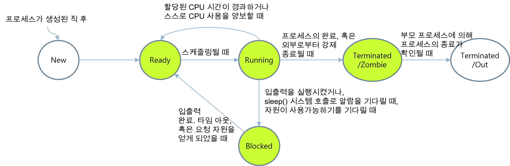
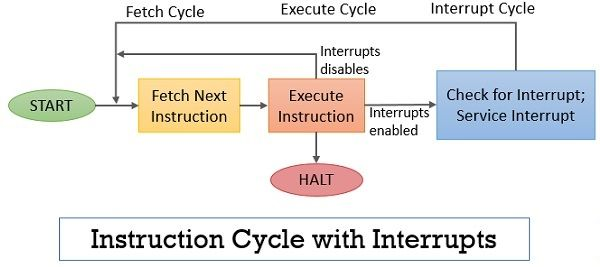
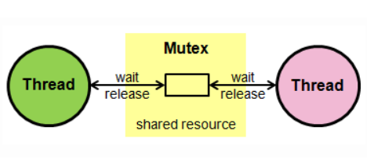
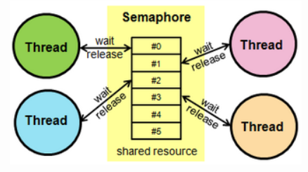
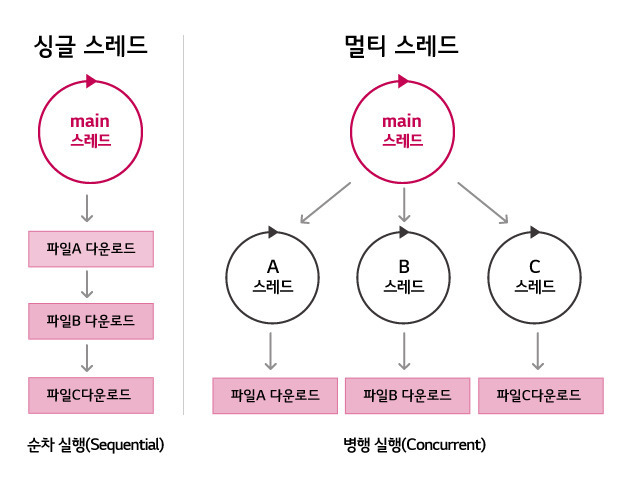
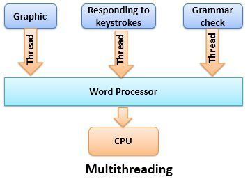
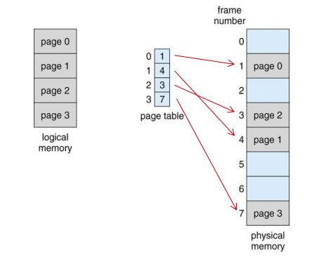
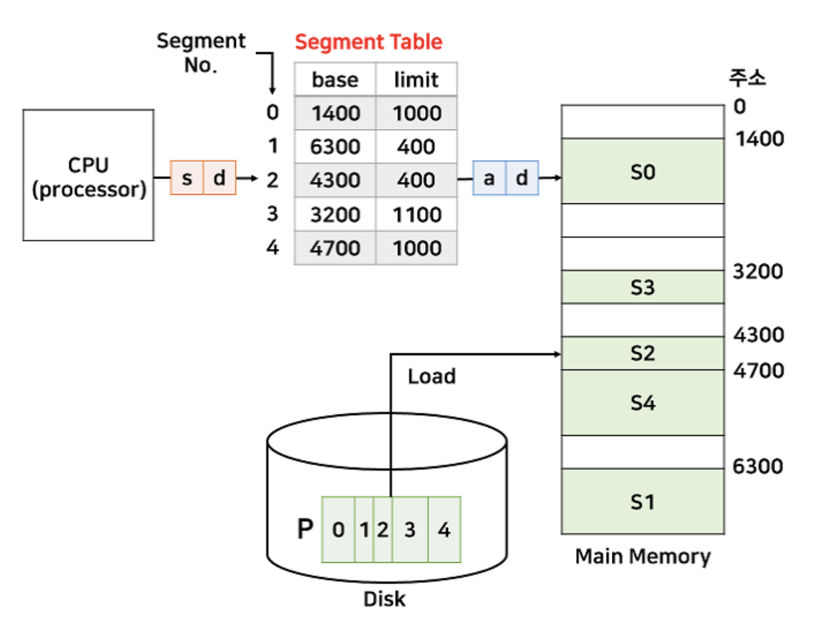

# 운영체제

# 프로세스
## 프로그램과 프로세스 차이
프로그램(prgram)
- 하드디스크 등의 저장 매체에 저장
- 실행 파일의 형태

프로세스(prcess)
- 프로그램이 메모리에 적재되어 실행 중인 상태
  - 필요한 모든 자원을 할당 받는다.
  - 자원이란 코드/데이터/스택/힙 공간을 말한다.

## 프로세스 특징
- 운영체제는 프로그램을 메모리에 적재하고 프로세스로 다룬다.
- 운영체제는 프로세스에게 실행에 필요한 메모리를 할당한다. 이곳에 코드와 데이터 등을 적재한다.
- 프로세스들은 서로 독립적인 메모리 공간을 가진다. 다른 프로세스의 영역에 접근 불가능.

## 프로세스 관리
프로세스 생성에서 종료까지 관리는 모두 커널에 의해 이루어진다. 커널 영역에 프로세스 테이블을 만들고, 프로세스의 목록을 관리한다.

관리 내용
- 프로세스 생성/실행/일시중단/재개/중단
- 프로세스 정보 관리
  - 프로세스의 메모리 위치
  - 크기 
- 프로세스마다 고유한 번호(프로세스 ID)를 할당
- 프로세스 통신
- 프로세스 동기화
- 프로세스 컨텍스트 스위칭

## 프로그램의 다중 인스턴스
한 프로그램을 여러 번 실행시켜 다중 인스턴스를 생성할 수 있다. 운영체제는 프로그램을 실행할 때마다 독립된 프로세스를 생성한다. 각 프로세스는 독립된 메모리 공간이 할당된다. 

## 프로세스를 구성한 4개의 메모리 영역
### 코드(code) 영역
실행될 프로그램 코드가 적재되는 영역
- 사용자가 작성한 모든 함수 코드
- 사용자가 호출한 라이브러리 함수 코드

### 데이터(data) 영역
프로그램에서 고정적으로 만든 변수 공간으로 프로세스 적재 시 할당, 종료 시 소멸된다.
- 전역 변수 공간
- 정적 데이터 공간
- (사용자 프로그램과 라이브러리 포함)

### 힙(heap) 영역
프로세스가 실행 도중 동적으로 사용할 수 있도록 할당된 공간
- malloc() 등으로 할당받은 공간
  
힙 영역에서 아래 번지로 내려가며 할당된다.

### 스택(stack) 영역
함수가 실행될 때 사용될 데이터를 위해 할당된 공간
- 매개변수
- 지역변수
- 리턴값

함수는 호출될 때, 스택 영역에서 위쪽으로 공간을 할당한다. 함수가 return 하면 할당된 공간이 반환된다. 함수 호출 외에 프로세스에서 필요 시 사용가능하다.

## 프로세스 주소 공간
프로세스가 실행 중에 접근할 수 있도록 허용된 주소의 최대 범위이다. 

프로세스 주소 공간은 논리 공간(가상 공간)이다. 0번지에서 시작하여 연속적인 주소를 갖는다.

프로세스 주소 공간은 CPU가 액세스할 수 있는 전체 크기이다. (32 비트 CPU의 경우, 4GB)

### 프로세스 공간과 프로세스 현재 크기
프로세스 주소 공간의 크기는 프로세스의 현재 크기와 다르다.
- 프로세스 주소 공간 크기: 프로세스가 액세스할 수 있는 최대 크기
- 프로세스 현재 크기: 적재된 코드 + 전역 변수 + 힙 영역에서 할당받아 사용중인 동적 메모리 공간 + 현재 스택 영역에 저장된 데이터 크기

### 사용자 공간과 커널 공간
프로세스 주소 공간은 2부분으로 나뉘어진다.

사용자 공간
- 프로세스의 코드, 데이터, 힙, 스택 영역이 할당되는 공간
- 코드와 데이터 영역의 크기는 프로세스 시작 시 결정된다.
- 힙과 스택의 영역 크기는 정해져 있지 않다.
- 힙 영역은 아래로 자라고, 스택은 위로 자란다.
  
커널 공간
- 프로세스가 시스템 호출을 통해 이용하는 커널 공간
- 커널 코드, 커널 데이터, 커널 스택(커널이 실행될 때)
- 커널 공간은 모든 사용자 프로세스에 의해 공유된다.
  
### 가상 공간
프로세스 주소 공간은 사용자나 개발자가 보는 관점이다.
- 자신이 작성한 프로그램이 0번지부터 시작하여
- 연속적인 메모리 공간에 형성되고,
- CPU가 액세스할 수 있는 최대 크기의 메모리가 설치되어 있다고 상상

실제 상황
- 실제 물리 메모리 크기는 프로세스 주소 공간보다 작을 수 있다.
- 프로세스의 코드, 데이터, 힙, 스택 영역은 물리 메모리에 흩어져 저장된다. 연속적인 메모리 공간이 아니다.

# 커널의 프로세스 관리
## 프로세스 테이블과 프로세스 제어 블록
프로세스 테이블(Process Table) : 시스템의 모든 프로세스들을 관리하기 위한 표
- 시스템에 1개만 존재한다.
- 구현 방식은 OS마다 다르다.

프로세스 제어 블록(Process Control Block, PCB) : 프로세스에 관한 정보를 저장하는 구조체
- 프로세스당 1개씩 존재
- 프로세스가 생성될 때 만들어지고 종료되면 삭제된다.
- 커널에 의해 생성되고 저장, 읽혀지는 등 관리된다.

프로세스 테이블과 프로세스 제어 블록의 위치
- 커널 영역, 커널 코드(커널 모드)만이 액세스 가능

# 프로세스 생명 주기와 상태 변이(state change)
## 프로세스의 생명 주기
프로세스는 탄생에서 종료까지 여러 상태로 바뀌면서 실행된다.



## 프로세스의 상태
### New [생성 상태]
- 프로세스가 생성된 상태
- 메모리 할당 및 필요한 자원을 적재한다.

### Ready [준비 상태]
- 프로세스가 스케줄링을 기다리는 준비 상태
- 프로세스는 준비 큐에서 대기한다.
- [dispatch] 스케줄링되면 Running 상태로 바뀌고 CPU에 의해 실행된다.

### Running [실행 상태]
- 프로세스가 CPU에 의해 현재 실행되고 있는 상태
- [timeout] CPU의 시간할당량(타임슬라이스,time slice)가 지나면 다시 Ready 상태로 바뀌고 준비 큐에 삽입된다.
- [block] 프로세스가 입출력을 시행하면 커널은 프로세스를 Blocked 상태로 만들고 대기 큐에 삽입한다.

### Blocked/Wait [블록 상태]
- 프로세스가 자원을 요청하거나, 입출력 요청하고(시스템 호출) 완료를 기다리는 상태
- [wakeup] 입출력이 완료되면 프로세스는 Ready 상태로 바뀌고 준비 큐에 삽입된다.

### Terminated/Zombie 상태
- 프로세스가 종료된 상태
- 프로세스가 차지하고 있던 메모리와 할당받았던 자원을 모두 반환(열어 놓은 파일 닫힘)
- Zombie 상태: 프로세스의 PCB에 남긴 종료코드를 부모 프로세스가 읽어가지 않아 완전히 종료되지 않은 상태
  - 프로세스의 테이블 항목과 PCB가 시스템에 여전히 남아있는 상태

### Terminated/Out 상태
- 프로세스가 종료하면서 남긴 종료코드를 부모 프로세스가 읽어가서 완전히 종료된 상태
- 프로세스 테이블의 항목과 PCB가 시스템에서 완전히 제거된 상태

## 프로세스 스케줄링과 컨텍스트 스위칭 
과거 OS의 실행단위는 프로세스였다. Ready 상태의 프로세스 중 실행 시킬 프로세스를 선택했다.

오늘날 OS의 실행단위는 스레드다. Ready 상태의 스레드 중 실행 시킬 스레드를 선택한다.

프로세스는 스레드들에게 공유 자원을 제공하는 컨테이너(Container)로 역할이 바뀌었다. 

# Process vs Thread


Process
- 실행 중인 프로그램으로, 디스크로부터 메모리에 적재되어 운영체제로부터 주소 공간, 파일, 메모리 등을 할당 받음
- 함수의 매개변수, 복귀 주소, 로컬 변수와 같은 임시 자료를 저장하는 프로세스 스택과 전역 변수들을 저장하는 데이터 섹션, 프로세스 실행 중에 동적으로 할당받는 메모리 힙을 포함
- 특정 프로세스에 대한 중요한 정보를 저장하고 있는 운영체제의 자료구조를 PCB(Process Control Block)라고 하며, 운영체제는 프로세스 생성과 동시에 고유한 PCB를 생성하여 프로세스를 관리

Thread
- 프로세스의 실행 단위. 한 프로세스 내에서 동작되는 여러 실행 흐름으로 프로세스 내의 Heap, Data, Code 영역을 공유
- 각각의 스레드는 독립적인 작업을 수행해야 하기 때문에 각자의 스택과 PC Register 값을 가지고 있음

```
스택을 스레드마다 독립적으로 할당하는 이유

- 스택은 함수 호출 시 전달되는 인자, 되돌아 갈 주소값 및 함수 내에서 선언하는 변수 등을 저장하기 위해 사용되는 메모리 공간이다. 

- 스택 메모리 공간이 독립적이라는 것은 독립적인 함수 호출이 가능하다는 것이다. 스레드의 정의에 따라 독립적인 실행 흐름을 가지기 위한 최소 조건으로 독립된 스택을 할당한다.
```

<hr>

출처
- [프로세스와 스레드 : Process vs. Thread](https://eun-jeong.tistory.com/19)

<hr>

# 인터럽트 
## 인터럽트란
프로세서가 현재 실행을 일시 중단하고 발생한 인터럽트를 서비스하도록 요청하는 신호이다. 인터럽트를 서비스하기 위해, 프로세서는 대응하는 인터럽트 서비스 루틴(ISR)을 실행한다. 인터럽트 서비스 루틴의 실행 후에, 프로세서는 정지된 프로그램의 실행을 재개한다. 

## 인터럽트가 필요한 이유
### 선점형 스케줄러 구현
프로세스를 교체하기 위해 스케줄러가 Running 상태인 프로세스를 중지시켜야 함

### IO Device와의 상호작용
저장 매체에서 데이터 처리 완료 시, 프로세스를 깨워야 함 (wakeup)

### 예외 상황 핸들링 
CPU가 프로그램을 실행하고 있을 때, 입출력 하드웨어 등의 장치나 예외상황이 발생할 경우, CPU가 해당 처리를 할 수 있도록 CPU에게 알려야 함

## 인터럽트 종류
### 하드웨어 인터럽트
장치들이 CPU에게 어떤 상황 발생을 알리는 하드웨어 신호다. 인터럽트가 발생하면 CPU는 인터럽트 서비스 루틴을 실행한다.
- I/O interrupt
- timer interrupt
- Maskable interrupt: 프로세서가 더 높은 우선순위로 프로그램을 실행할 경우 무시되거나 지연될 수 있다.
- Non Maskable interrupt: 무시되거나 지연될 수 없으며 프로세서에 의해 즉시 서비스되어야 한다.

### 소프트웨어 인터럽트
소프트웨어 인터럽트는 조건이 충족되거나 시스템 호출이 발생할 때 발생하는 인터럽트다. 어떤 경우에는 소프트웨어 인터럽트가 설계상이 아닌 프로그램 실행 오류에 의해 예기치 않게 발생할 수 있다. 이러한 인터럽트를 exceptions 또는 traps라고 한다. 

## 인터럽트 발생 처리 과정


일반적인 명령 주기는 명령 가져오기 및 실행으로 시작합니다. 그러나, 명령어의 정상적인 처리 중에 인터럽트가 발생하는 것을 수용하기 위해, 그림과 같이 인터럽트 사이클을 정상적인 명령 사이클에 추가한다.

현재 명령이 실행된 후, 프로세서는 인터럽트 신호를 확인하여 보류 중인 인터럽트가 있는지 확인합니다. 보류 중인 인터럽트가 없으면 프로세서는 시퀀스의 다음 명령을 가져오기 위해 계속한다. 

프로세서가 보류 중인 인터럽트를 발견하면, 실행되어야 하는 다음 명령어의 주소를 저장함으로써 현재 프로그램의 실행을 중단하고 프로그램 카운터(PC)를 인터럽트 서비스 루틴의 시작 주소로 업데이트하여 발생한 인터럽트를 서비스한다. 인터럽트가 완전히 서비스된 후 프로세서는 중단된 프로그램의 실행을 다시 시작합니다.

### 인터럽트 신호 허용
IE 플래그가 1로 설정되면 프로세서는 발생한 인터럽트를 허용합니다. IE 플래그가 0으로 설정된 경우 요청된 인터럽트를 무시합니다.

## 인터럽트 vs 폴링
폴링은 컴퓨터 시스템의 마이크로 컨트롤러가 모든 장치의 상태를 지속적으로 확인하는 지속적인 모니터링 상태이다. 마이크로 컨트롤러가 폴링을 하는 동안 다른 작업을 수행할 수 없기 때문에 낭비가 크다. 인터럽트를 사용하면 컨트롤러가 장치의 상태를 정기적으로 모니터링 할 필요가 없다. 인터럽트가 발생할 때만 응답하면 된다. 

<hr>

출처
- [Interrupts in Computer Architecture](https://binaryterms.com/interrupts-in-computer-architecture.html)
- [interrupt](https://www.techtarget.com/whatis/definition/interrupt)
- [인터럽트(Interrupt)란?](https://whatisthenext.tistory.com/147)

<hr>

# 캐시의 지역성(Locality)
## 캐시 메모리란
캐싱(caching)은 컴퓨터의 처리 성능을 높이기 위한 기법이다. CPU는 데이터를 처리하기 위해 메모리에 끊임없이 액세스 하는데, CPU에 비해 메모리 속도가 느려 CPU가 효율적으로 사용되지 못한다. 이를 해결하기 위해 CPU와 메모리 사이에 캐시를 두어 CPU의 메모리 액세스 횟수를 줄인다.

## 캐시 적중과 실패
캐시 메모리가 있는 컴퓨터 시스템은 CPU는 메모리에 접근하기 전에 캐시 메모리를 먼저 확인한다. 이때 필요한 데이터가 있는 경우 <strong>적중(hit)</strong>, 없는 경우를 <strong>실패(miss)</strong>라고 한다.

캐시에 저장할 데이터는 지역성을 가져야하는데 지역성이란 데이터 접근이 시간적 혹은 공간적으로 가깝게 일어나는 것을 말한다.

요청한 데이터를 캐시 메모리에서 찾을 확률을 <strong>적중률(hit ratio)</strong>라고 한다. 

캐시 메모리의 성능은 적중률에 의해 결정된다.
```
         캐시 메모리의 적중 횟수
적중률 = -----------------------
         전체 메모리의 참조 횟수
```

캐시 메모리의 적중 여부는 <strong>참조의 지역성(Locality of reference)</strong> 원리에 달려있다. 지역성이란 기억장치 내의 정보를 균일하게 접근하는 것이 아닌 어느 한 순간에 특성 부분을 집중적으로 참조하는 특성이다.

## 지역성의 종류
### 시간적 지역성(Temporal Locality)
특정 데이터가 한번 접근되었을 경우, 가까운 미래에 또 한번 데이터에 접근할 가능성이 높은 것.

메모리 상의 같은 주소에 여러 차례 읽기 쓰기를 수행할 경우, 상대적으로 작은 크기의 캐시를 사용해 효율성을 높일 수 있다.


### 공간적 지역성(Spatial Locality)
특정 데이터와 가까운 주소가 순서대로 접근되었을 경우.

CPU 캐시나 디스크 캐시의 경우 한 메모리 주소에 접근할 때 그 주소 뿐 아니라 해당 블록을 전부 캐시에 가져오게 된다. 이때 메모리 주소를 오름차순이나 내림차순으로 접근하면 캐시에 이미 저장된 같은 블록의 데이터를 접근하게 되므로 캐시 효율성이 향상된다.

### 순차적 지역성(Sequential Locality)
분기가 발생하지 않는 한 명령어는 메모리에 저장된 순서대로 인출/실행된다.

<hr>

출처
- [캐시 메모리(cache memory)의 개요 정리](https://zion830.tistory.com/46)
- [Caching Locality와 Cache Hit Ratio에 대해 설명하시오](https://github.com/lunchScreen/Interview_Questions/issues/98)

<hr>

# 뮤텍스와 세마포어 차이
## 임계영역과 상호배제
```
임계영역(Critical Section): 여러 프로세스가 데이터를 공유하며 수행될 때, 각 프로세스에서 공유 데이터를 접근하는 프로그램 코드 블록
```
```
상호 배제(Mutual Exclution): 임계 구역을 어느 시점에서 단지 한 개의 프로세스만이 사용할 수 있도록 하며, 다른 프로세스가 현재 사용 중인 임계 구역에 대하여 접근하려고 할 때 이를 금지하는 행위
```

프로세스 간 메시지를 전송하거나, 공유메모리를 통해 공유된 자원에 여러 개의 프로세스가 동시에 접근하면 임계영역 문제가 발생할 수 있다. 이를 해결하기 위해 <strong>데이터를 한 번에 하나의 프로세스만 접근할 수 있도록 제한을 두는 동기화 방식</strong>을 취해야 한다. 

동기화 도구에는 대표적으로 뮤텍스(Mutex)와 세마포어(Semaphore)가 있다. 이들은 모두 공유된 자원의 데이터를 여러 스레드/프로세스가 접근하는 것을 막는 역할을 한다.

## 뮤텍스 (Mutex)
공유된 자원의 데이터 혹은 임계영역(Critical Section) 등에 <strong>하나의 Process 혹은 Thread</strong>가 접근하는 것을 막아준다. 

-> 즉, 동기화 대상이 하나

임계영역(Critical Section)을 가진 스레드들의 실행시간(Running Time)이 서로 겹치치 않고 각각 단독으로 실행(상호배제)되도록 하는 기술이다. 



한 프로세스에 의해 소유될 수 있는 <strong>key를 기반으로 한 상호배제 기법</strong>이다. key에 해당하는 어떤 객체(object)가 있으며, <strong>이 객체를 소유한 스레드/프로세스만이 공유자원에 접근</strong>할 수 있다. 

다중 프로세스들의 공유 자원에 대한 접근을 조율하기 위해 <strong>동기화(Synchronization) 또는 락(Lock)</strong>을 사용함으로써 <strong>뮤텍스 객체를 두 스레드가 동시에 사용할 수 없다.</strong>

## 세마포어 (Semaphore)
공유된 자원의 데이터 혹은 임계영역(Critical Section) 등에 <strong>여러 Process 혹은 Thread</strong>가 접근하는 것을 막아준다. 

-> 즉, 동기화 대상이 하나 이상



사용하고 있는 스레드/프로세스의 수를 <strong>공통으로 관리하는 하나의 값</strong>을 이용해 상호배제를 달성한다. 공유자원에 접근할 수 있는 <strong>프로세스의 최대 허용치만큼 동시에 사용자가 접근</strong>할 수 있으며, <strong>각 프로세스는 세마포어의 값을 확인하고 변경</strong>할 수 있다. 

자원을 사용하지 않는 상태가 될 때, 대기하던 프로세스가 즉시 자원을 사용한다. 이미 다른 프로세스에 의해 사용 중이라는 사실을 알게 되면, 재시도 전에 일정시간 대기해야 한다.

## 차이점
가장 큰 차이점은 <strong>동기화 대상의 개수</strong>이다.

Mutex
- 동기화 대상이 오직 1개일 때 사용한다.
- 자원을 소유하고 책임을 갖는다.
- 상태가 0, 1 뿐이므로 Lock을 가질 수 있고, 소유하고 있는 스레드만이 Mutex를 해제할 수 있다.
- 프로세스의 범위를 가지며 프로세스 종료될 때 자동으로 Clean up 된다.

Semaphore
- 동기화 대상이 1개 이상일 때 사용한다.
- 자원 소유가 불가하다.
- Semaphore를 소유하지 않는 스레드가 Semaphore를 해제할 수 있다.
- 시스템 범위에 걸쳐 있고, 파일 시스템 상의 파일로 존재한다.


## 결론
뮤텍스와 세마포어 모두 완벽한 기법은 아니므로, 데이터 무결성을 보장할 수 없고 모든 교착상태를 해결하지 못한다. 하지만 상호배제를 위한 기본적인 문법이며 여기에 좀 더 복잡한 매커니즘을 적용해 개선된 성능을 가질 수 있도록 하는 것이 중요하다.

<hr>

출처
- [Mutex 뮤텍스와 Semaphore 세마포어의 차이](https://heeonii.tistory.com/14)

<hr>

# 동기(Sync)와 비동기(Async) 차이
## 동기(Synchronous: 동시에 일어나는)
- 단일 스레드 모델
- 작업이 하나씩 순서대로 수행된다.
- 첫번째 작업이 완료되야지 다음 작업이 수행된다. 
- 블로킹 아키텍처로 반응성 시스템 프로그래밍에 적합하다.
- ex) 전화 

## 비동기(Asynchronous : 동시에 일어나지 않는)
- 멀티 스레드 모델
- 하나 이상의 작업이 진행되는 동안 추가적인 작업을 차단하지 않는다.
- 다른 작업이 완료될 때까지 기다리지 않고 여러 관련 작업을 동시에 실행할 수 있다.
- 함수가 호출될 때부터 함수의 값이 반환될 때까지의 지연 시간을 줄인다. 
  - 사용자는 자신의 앱이 빠르게 실행되기를 원하지만, API에서 데이터를 가져오는 데는 시간이 걸린다. 이러한 경우 비동기식 프로그래밍은 앱 화면이 더 빨리 로드되도록 도와주어 사용자 경험을 향상시킨다. 
- 논블로킹 아키텍처로 네트워킹 및 통신 프로그래밍에 적합하다.
- ex) 문자 메시지


## 차이점
Sync
- 단일 스레드로 한 번에 하나의 작업/프로그램만 실행된다.
- 서버에 한 번에 하나의 요청만 보내고, 해당 요청이 서버에 의해 응답될 때까지 기다린다.
- 속도가 느리지만 체계적이다.

Async
- 멀티 스레드로 여러 작업이나 프로그램이 병렬로 실행된다.
- 서버에 여러 요청을 전송한다.
- 여러 작업을 동시에 실행할 수 있어 처리량이 증가한다.

<hr>

출처
- [Asynchronous vs. Synchronous Programming](https://www.mendix.com/blog/asynchronous-vs-synchronous-programming/)

<hr>

# 멀티 스레드 프로그래밍
## 멀티 스레딩(Multi-threading)이란?


- 하나의 프로세스를 다수의 실행 단위로 구분하여 자원을 공유하고 자원의 생성과 관리의 중복성을 최소화하여 수행 능력을 향상 시키는 것
- 하나의 프로그램에서 동시에 여러 개의 일을 수행할 수 있도록 해줌(사실 분산처리를 통해 동시에 실행되는 것 처럼 보이는 것)
  - ex) 워드 프로세서에서 그림을 표시하고, 키 입력에 응답하며 철자 및 문법 검사를 계속 함
  
    

## 장점
### 1. 응답성
프로그램의 일부분(스레드)이 중단되거나 긴 작업을 수행하더라도, 프로그램의 수행이 계속 되어 사용자에 대한 응답성이 증가한다.

ex) 멀티 스레드가 적용된 웹 브라우저 프로그램에서 하나의 스레드가 이미지 파일을 로드하고 있는 동안, 다른 스레드에서 사용자와 상호작용 가능

### 2. 경제성
프로세스 내 자원들과 메모리를 공유하기 때문에 메모리 공간과 시스템 자원소모가 줄어든다. 스레드 간 통신이 필요한 경우에도 쉽게 데이터를 주고 받을 수 있으며, 프로세스의 context switching과 달리 스레드 간 context switching은 캐시 메모리를 비울 필요가 없기 때문에 더 빠르다.

### 3. 멀티프로세서 활용
다중 CPU 구조에서는 각각의 스레드가 다른 프로세서에서 병렬로 수행될 수 있으므로 병렬성이 증가한다.

## 단점
### 1. 임계 영역
공유하는 자원에 동시 접근하는 경우, 프로세스와 달리 스레드는 데이터와 힙 영역을 공유하기 때문에 어떤 스레드가 다른 스레드에서 사용 중인 변수나 자료구조에 접근하여 엉뚱한 값을 읽어오거나 수정할 수 있다. 따라서 동기화가 필요하다.

### 2. 동기화
동기화를 통해 스레드의 작업 처리 순서와 공유 자원에 대한 접근을 컨트롤 할 수 있다. 그러나 불필요한 부분까지 동기화 하는 경우, 과도한 lock으로 인해 병목 현상을 발생시켜 성능이 저하될 가능성이 높기 때문에 주의해야 한다.
동기화 방법에는 뮤텍스와 세마포어가 있다.

### 3. context switching
동기화 등의 이유로 싱글 코어 멀티 스레딩은 스레드 생성 시간이 오히려 오버헤드로 작용해 단일 스레드보다 느리다. 

<hr>

출처
- [멀티스레드 : Multi-thread (장단점, 멀티프로세스와 차이)](https://eun-jeong.tistory.com/20)

<hr>

# 메모리 단편화 해결
## 메모리 관리 문제
### 배경 키워드
프로세스
- 독립된 메모리 공간을 갖는다
- 독립된 메모리이기 때문에 다른 프로세스의 메모리 공간에 일반적으로 접근할 수 없다.

운영체제
- 메모리의 커널 공간과 사용자 공간의 접근에 제약 받지 않는다.

Swapping
- 메모리 관리를 위해 사용되는 기법이다.
  - 예를 들어 CPU 할당 시간이 끝난 프로세스의 메모리를 HDD 같은 보조 기억장치로 내보내고 다른 프로세스의 메모리를 불러 들일 수 있다.

Swap-in
- 주 기억장치(RAM)로 불러오는 과정

Swap-out
- 보조 기억장치로 내보내는 과정
  
단편화(Fragmentation)
- 메모리 적재&제거가 반복되면서 프로세스들이 차지하는 메모리 틈 사이에 사용하지 못할 만큼의 작은 자유 공간들을 의미한다.
- '외부 단편화'와 '내부 단편화' 두 가지 종류로 나뉜다.

### 외부 단편화
물리 메모리(RAM)에서 할당할 수 없는 작은 공간들이 생기는 것을 말한다.

```
RAM 외부 단편화
|   프로세스A   |free|  프로세스B  |free| 프로세스C |free|    	프로세스D    |
```
free를 하나로 모으면 다른 프로세스를 할당할 수 있지만, 각각 분산되어 있어 프로세스를 불러올 수 없다. 이 분산된 상태를 외부 단편화라 한다.

-> 압축을 통해 해결하기도 한다.

압축이란 프로세스 사용 공간을 한쪽으로 몰아 자유공간을 확보하는 것이다. 하지만 작업 효율이 좋지 않다.

### 내부 단편화
프로세스가 사용하는 메모리 공간 안에 남는 부분을 말한다.
```
프로세스 A의 내부 공간
|       9,999B       |2B|
```
프로세스 내 메모리 공간이 10,000B일 때, 그 안에서 9,999B 사용하면 2B라는 메모리가 남게되고, 이 현상을 내부 단편화라 한다.

## 매모리 단편화 해결 방법
### 1. 페이징 (Paging) - 가상 메모리 사용, 외부 단편화 해결 
프로세스를 일정 크기로 잘게 쪼개어 순서와 상관없이 적재하는 방식이다. 



물리 메모리(Frame)안에 프로세스의 논리 메모리(Page)들이 고정된 크기의 블록으로 적재된다. ( => 프로세스를 일정한 크기인 Page로 잘라서 메모리에 적재하는 방식)

배치 순서는 상관없기 때문에 메모리 공간을 연속된 순서로 차지하지 않아 외부 단편화 문제를 해결한다.

단점은 내부 단편화 문제의 비중이 늘어난다.

### 2. 세그먼테이션 (Segmentation) - 가상 메모리 사용, 내부 단편화 해결
페이징과 다르게 고정된 크기가 아닌 서로 다른 크기의 논리적인 단위인 세그먼트로 분할하는 방식이다.



page 처럼 크기가 동일하지 않기 때문에 세그먼트 번호와 시작 주소(base), 세그먼트 크기(limit)를 갖는다.

단점은 서로 다른 크기의 세그먼트들이 메모리에 적재되고 제거되는 일이 반복되다 보면, 작은 조각의 자유 공간들이 많아지면서 외부 단편화 문제가 발생한다.

### 3. 메모리 풀 (Memory Pool) - 내부 단편화, 외부 단편화 해결
고정된 크기의 블록을 할당하여 메모리 동적 할당을 가능하게 해준다. memory pool이라 불리는 동일한 사이즈의 메모리 블록들을 미리 할당해 놓고 프로세스들이 필요할 때마다 사용하고 반납하는 기법이다. (=> 미리 할당하기 때문에 메모리 누수가 있다.)

미리 공간을 할당해놓고 사용한 다음 반납하기 때문에 이로 인한 외부 단편화 문제는 발생하지 않는다. 또한 필요한 크기만큼 할당하기 때문에 내부 단편화도 존재하지 않는다.

메모리의 할당, 해제가 빈번할 때는 메모리 풀 방식이 효과적이다.

### 4. 압축(Compaction)
메모리 공간들을 재배치 하여, 단편화로 인해 분산되어 있는 메모리 공간들을 하나로 합치는 기법이다.

```
|프로세스|  free  |프로세스|프로세스|프로세스| free | 
⬇️
|프로세스|프로세스|프로세스|프로세스|   free   |    
```

### 5. 통합(Coalescing)
단편화로 인해 분산된 메모리공간들을 인접해 있는 것끼리 통합시켜 큰 메모리 공간으로 합치는 기법이다. 압축은 재배치가 일어나지만 통합은 인접한 공간들끼리 통합된다는 차이가 있다.

```
|프로세스|프로세스|프로세스|프로세스|   free   |    
⬇️
|프로세스|프로세스|프로세스|  free  |   free   |    
⬇️
|프로세스|프로세스|프로세스|     free     |    
```

<hr>

출처
- [메모리 단편화를 해결하는 세 가지 방법](https://daco2020.tistory.com/174)
- [메모리 압축(compaction)과 메모리 통합(coalescing)](https://m.blog.naver.com/qbxlvnf11/221367174686)