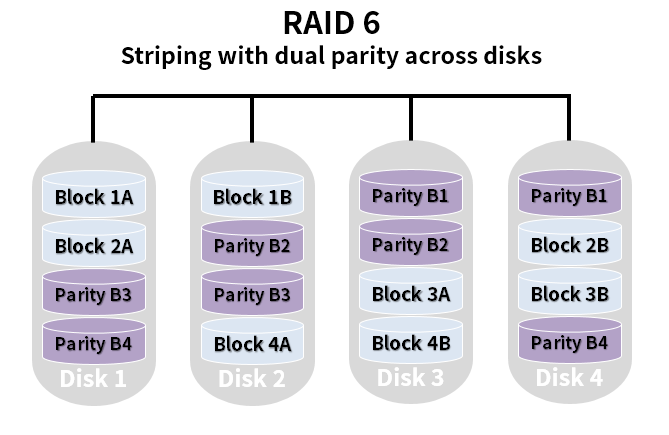
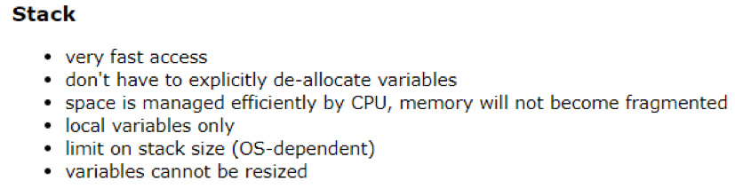
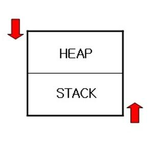

# 운영체제

# 프로그램, 프로세스, 쓰레드
## 프로그램 (Prgram)
- 사전적 의미는 `어떤 작업을 하기 위해 해야할 일들을 순서대로 나열한 것`
- 컴퓨터에서 어떤 작업을 위해 실행할 수 있는 '정적인 상태의' 파일이다.
  - 실행 파일의 형태
    - Ex. Windows의 .exe 파일
- 사용자가 원하는 일을 처리할 수 있도록 프로그래밍 언어를 사용하여 올바른 수행 절차를 표현해 놓은 명령어들의 집합이다.
- 하드디스크 등의 저장 매체에 저장.

## 프로세스 (Prcess)
- 사전적 의미는 `프로그램이 실행되서 돌아가고 있는 상태, 컴퓨터에서 연속적으로 실행되고 있는 '동적인 상태'의 컴퓨터 프로그램이다.`
- 프로세스는 운영체제가 메모리 등의 자원을 할당해준 '실행중인 프로그램'이다.
  - 자원이란
    - 코드/데이터/스택/힙 공간의 독립적인 메모리 영역
    - CPU 시간
    - 운영되기 위해 필요한 주소 공간
- 프로그램을 실행하면 운영체제로부터 실행에 필요한 자원을 할당받아 `프로세스`가 되는 것이다.
- 다른 프로세스의 자원에 접근하려면 프로세스 간의 통신(IPC)을 사용해야 한다.
- 프로세스는 최소 하나 이상의 스레드를 포함한다.

## 쓰레드 (Thread) 
- 사전적 의미는 `프로세스가 할당 받은 자원을 이용하는 실행 단위이자, 프로세스의 특정한 수행 경로이자 프로세스 내에서 실행되는 여러 흐름이다.`
- 스레드는 프로세스 내에서 프로세스의 자원을 이용해서 실제로 작업을 수행하는 일꾼이다.
- 스래드가 소속된 프로세스가 운영체제로부터 자원을 할당받으면 그 자원을 스레드가 사용한다.
- 프로세스는 최소 한 개이상의 스레드를 가지며 이 스레드를 메인 스레드(main thread)라고 한다.
- 각 스레드는 독자적인 스택(stack) 메모리와 레지스터를 갖는다.
- 스레드는 코드/데이터/힙 영역은 공유한다.
  - 동기화, 데드락 문제가 발생할 수 있다.

<hr>

출처
- [프로그램(Program), 프로세스(Process), 쓰레드(Thread)](https://velog.io/@gparkkii/ProgramProcessThread)

<hr>

# 프로세스 (Prcess)
## 프로세스 특징
- 운영체제는 프로그램을 메모리에 적재하고 프로세스로 다룬다.
- 운영체제는 프로세스에게 실행에 필요한 메모리를 할당한다. 이곳에 코드와 데이터 등을 적재한다.
- 프로세스들은 서로 독립적인 메모리 공간을 가진다. 다른 프로세스의 영역에 접근 불가능.

## 프로세스 관리
프로세스 생성에서 종료까지 관리는 모두 커널에 의해 이루어진다. 커널 영역에 프로세스 테이블을 만들고, 프로세스의 목록을 관리한다.

관리 내용
- 프로세스 생성/실행/일시중단/재개/중단
- 프로세스 정보 관리
  - 프로세스의 메모리 위치
  - 크기 
- 프로세스마다 고유한 번호(프로세스 ID)를 할당
- 프로세스 통신
- 프로세스 동기화
- 프로세스 컨텍스트 스위칭

## 프로그램의 다중 인스턴스
한 프로그램을 여러 번 실행시켜 다중 인스턴스를 생성할 수 있다. 운영체제는 프로그램을 실행할 때마다 독립된 프로세스를 생성한다. 각 프로세스는 독립된 메모리 공간이 할당된다. 

## 프로세스를 구성한 4개의 메모리 영역
### 코드(code) 영역
- 실행될 프로그램 코드가 적재되는 영역
- 사용자가 작성한 모든 함수 코드
- 사용자가 호출한 라이브러리 함수 코드

### 데이터(data) 영역
- 프로그램에서 고정적으로 만든 변수 공간으로 프로세스 적재 시 할당, 종료 시 소멸된다.
- 전역 변수 공간
- 정적 데이터 공간
- (사용자 프로그램과 라이브러리 포함)

### 힙(heap) 영역
- 프로세스가 실행 도중 동적으로 사용할 수 있도록 할당된 공간
- malloc() 등으로 할당받은 공간
- 힙 영역에서 아래 번지로 내려가며 할당된다.

### 스택(stack) 영역
- 함수가 실행될 때 사용될 데이터를 위해 할당된 공간
- 매개변수
- 지역변수
- 리턴값
- 함수는 호출될 때, 스택 영역에서 위쪽으로 공간을 할당한다. 함수가 return 하면 할당된 공간이 반환된다. 함수 호출 외에 프로세스에서 필요 시 사용가능하다.

## 프로세스 주소 공간
프로세스가 실행 중에 접근할 수 있도록 허용된 주소의 최대 범위이다. 

프로세스 주소 공간은 논리 공간(가상 공간)이다. 0번지에서 시작하여 연속적인 주소를 갖는다.

프로세스 주소 공간은 CPU가 액세스할 수 있는 전체 크기이다. (32 비트 CPU의 경우, 4GB)

### 프로세스 공간과 프로세스 현재 크기
프로세스 주소 공간의 크기는 프로세스의 현재 크기와 다르다.
- 프로세스 주소 공간 크기: 프로세스가 액세스할 수 있는 최대 크기
- 프로세스 현재 크기: 적재된 코드 + 전역 변수 + 힙 영역에서 할당받아 사용중인 동적 메모리 공간 + 현재 스택 영역에 저장된 데이터 크기

### 사용자 공간과 커널 공간
프로세스 주소 공간은 2부분으로 나뉘어진다.

사용자 공간
- 프로세스의 코드, 데이터, 힙, 스택 영역이 할당되는 공간
- 코드와 데이터 영역의 크기는 프로세스 시작 시 결정된다.
- 힙과 스택의 영역 크기는 정해져 있지 않다.
- 힙 영역은 아래로 자라고, 스택은 위로 자란다.
  
커널 공간
- 프로세스가 시스템 호출을 통해 이용하는 커널 공간
- 커널 코드, 커널 데이터, 커널 스택(커널이 실행될 때)
- 커널 공간은 모든 사용자 프로세스에 의해 공유된다.
  
### 가상 공간
프로세스 주소 공간은 사용자나 개발자가 보는 관점이다.
- 자신이 작성한 프로그램이 0번지부터 시작하여
- 연속적인 메모리 공간에 형성되고,
- CPU가 액세스할 수 있는 최대 크기의 메모리가 설치되어 있다고 상상

실제 상황
- 실제 물리 메모리 크기는 프로세스 주소 공간보다 작을 수 있다.
- 프로세스의 코드, 데이터, 힙, 스택 영역은 물리 메모리에 흩어져 저장된다. 연속적인 메모리 공간이 아니다.

# 커널의 프로세스 관리
## 프로세스 테이블과 프로세스 제어 블록
프로세스 테이블(Process Table) : 시스템의 모든 프로세스들을 관리하기 위한 표
- 시스템에 1개만 존재한다.
- 구현 방식은 OS마다 다르다.

프로세스 제어 블록(Process Control Block, PCB) : 프로세스에 관한 정보를 저장하는 구조체
- 프로세스당 1개씩 존재
- 프로세스가 생성될 때 만들어지고 종료되면 삭제된다.
- 커널에 의해 생성되고 저장, 읽혀지는 등 관리된다.

프로세스 테이블과 프로세스 제어 블록의 위치
- 커널 영역, 커널 코드(커널 모드)만이 액세스 가능

# 프로세스 생명 주기와 상태 변이(state change)
## 프로세스의 생명 주기
프로세스는 탄생에서 종료까지 여러 상태로 바뀌면서 실행된다.


## 프로세스의 상태
### New [생성 상태]
- 프로세스가 생성된 상태
- 메모리 할당 및 필요한 자원을 적재한다.

### Ready [준비 상태]
- 프로세스가 스케줄링을 기다리는 준비 상태
- 프로세스는 준비 큐에서 대기한다.
- [dispatch] 스케줄링되면 Running 상태로 바뀌고 CPU에 의해 실행된다.

### Running [실행 상태]
- 프로세스가 CPU에 의해 현재 실행되고 있는 상태
- [timeout] CPU의 시간할당량(타임슬라이스,time slice)가 지나면 다시 Ready 상태로 바뀌고 준비 큐에 삽입된다.
- [block] 프로세스가 입출력을 시행하면 커널은 프로세스를 Blocked 상태로 만들고 대기 큐에 삽입한다.

### Blocked/Wait [블록 상태]
- 프로세스가 자원을 요청하거나, 입출력 요청하고(시스템 호출) 완료를 기다리는 상태
- [wakeup] 입출력이 완료되면 프로세스는 Ready 상태로 바뀌고 준비 큐에 삽입된다.

### Terminated/Zombie 상태
- 프로세스가 종료된 상태
- 프로세스가 차지하고 있던 메모리와 할당받았던 자원을 모두 반환(열어 놓은 파일 닫힘)
- Zombie 상태: 프로세스의 PCB에 남긴 종료코드를 부모 프로세스가 읽어가지 않아 완전히 종료되지 않은 상태
  - 프로세스의 테이블 항목과 PCB가 시스템에 여전히 남아있는 상태

### Terminated/Out 상태
- 프로세스가 종료하면서 남긴 종료코드를 부모 프로세스가 읽어가서 완전히 종료된 상태
- 프로세스 테이블의 항목과 PCB가 시스템에서 완전히 제거된 상태

## 프로세스 스케줄링과 컨텍스트 스위칭 
과거 OS의 실행단위는 프로세스였다. Ready 상태의 프로세스 중 실행 시킬 프로세스를 선택했다.

오늘날 OS의 실행단위는 스레드다. Ready 상태의 스레드 중 실행 시킬 스레드를 선택한다.

프로세스는 스레드들에게 공유 자원을 제공하는 컨테이너(Container)로 역할이 바뀌었다. 

# Process vs Thread


Process
- 실행 중인 프로그램으로, 디스크로부터 메모리에 적재되어 운영체제로부터 주소 공간, 파일, 메모리 등을 할당 받음
- 함수의 매개변수, 복귀 주소, 로컬 변수와 같은 임시 자료를 저장하는 프로세스 스택과 전역 변수들을 저장하는 데이터 섹션, 프로세스 실행 중에 동적으로 할당받는 메모리 힙을 포함
- 특정 프로세스에 대한 중요한 정보를 저장하고 있는 운영체제의 자료구조를 PCB(Process Control Block)라고 하며, 운영체제는 프로세스 생성과 동시에 고유한 PCB를 생성하여 프로세스를 관리

Thread
- 프로세스의 실행 단위. 한 프로세스 내에서 동작되는 여러 실행 흐름으로 프로세스 내의 Heap, Data, Code 영역을 공유
- 각각의 스레드는 독립적인 작업을 수행해야 하기 때문에 각자의 스택과 PC Register 값을 가지고 있음

```
스택을 스레드마다 독립적으로 할당하는 이유

- 스택은 함수 호출 시 전달되는 인자, 되돌아 갈 주소값 및 함수 내에서 선언하는 변수 등을 저장하기 위해 사용되는 메모리 공간이다. 

- 스택 메모리 공간이 독립적이라는 것은 독립적인 함수 호출이 가능하다는 것이다. 스레드의 정의에 따라 독립적인 실행 흐름을 가지기 위한 최소 조건으로 독립된 스택을 할당한다.
```

<hr>

출처
- [프로세스와 스레드 : Process vs. Thread](https://eun-jeong.tistory.com/19)

<hr>

# 인터럽트 (Interrupt)
## 인터럽트란
프로세서가 현재 실행을 일시 중단하고 발생한 인터럽트를 서비스하도록 요청하는 신호이다. 인터럽트를 서비스하기 위해, 프로세서는 대응하는 인터럽트 서비스 루틴(ISR)을 실행한다. 인터럽트 서비스 루틴의 실행 후에, 프로세서는 정지된 프로그램의 실행을 재개한다. 

## 인터럽트가 필요한 이유
### 선점형 스케줄러 구현
프로세스를 교체하기 위해 스케줄러가 Running 상태인 프로세스를 중지시켜야 함

### IO Device와의 상호작용
저장 매체에서 데이터 처리 완료 시, 프로세스를 깨워야 함 (wakeup)

### 예외 상황 핸들링 
CPU가 프로그램을 실행하고 있을 때, 입출력 하드웨어 등의 장치나 예외상황이 발생할 경우, CPU가 해당 처리를 할 수 있도록 CPU에게 알려야 함

## 인터럽트 종류
### 하드웨어 인터럽트
장치들이 CPU에게 어떤 상황 발생을 알리는 하드웨어 신호다. 인터럽트가 발생하면 CPU는 인터럽트 서비스 루틴을 실행한다.
- I/O interrupt
- timer interrupt
- Maskable interrupt: 프로세서가 더 높은 우선순위로 프로그램을 실행할 경우 무시되거나 지연될 수 있다.
- Non Maskable interrupt: 무시되거나 지연될 수 없으며 프로세서에 의해 즉시 서비스되어야 한다.

### 소프트웨어 인터럽트
소프트웨어 인터럽트는 조건이 충족되거나 시스템 호출이 발생할 때 발생하는 인터럽트다. 어떤 경우에는 소프트웨어 인터럽트가 설계상이 아닌 프로그램 실행 오류에 의해 예기치 않게 발생할 수 있다. 이러한 인터럽트를 exceptions 또는 traps라고 한다. 

## 인터럽트 발생 처리 과정


일반적인 명령 주기는 명령 가져오기 및 실행으로 시작합니다. 그러나, 명령어의 정상적인 처리 중에 인터럽트가 발생하는 것을 수용하기 위해, 그림과 같이 인터럽트 사이클을 정상적인 명령 사이클에 추가한다.

현재 명령이 실행된 후, 프로세서는 인터럽트 신호를 확인하여 보류 중인 인터럽트가 있는지 확인합니다. 보류 중인 인터럽트가 없으면 프로세서는 시퀀스의 다음 명령을 가져오기 위해 계속한다. 

프로세서가 보류 중인 인터럽트를 발견하면, 실행되어야 하는 다음 명령어의 주소를 저장함으로써 현재 프로그램의 실행을 중단하고 프로그램 카운터(PC)를 인터럽트 서비스 루틴의 시작 주소로 업데이트하여 발생한 인터럽트를 서비스한다. 인터럽트가 완전히 서비스된 후 프로세서는 중단된 프로그램의 실행을 다시 시작합니다.

### 인터럽트 신호 허용
IE 플래그가 1로 설정되면 프로세서는 발생한 인터럽트를 허용합니다. IE 플래그가 0으로 설정된 경우 요청된 인터럽트를 무시합니다.

<hr>

출처
- [Interrupts in Computer Architecture](https://binaryterms.com/interrupts-in-computer-architecture.html)
- [interrupt](https://www.techtarget.com/whatis/definition/interrupt)
- [인터럽트(Interrupt)란?](https://whatisthenext.tistory.com/147)

<hr>

# 인터럽트(Interrupt) vs 폴링(Polling)
둘 다 어떤 작업 수행 시 외부에서 들어오는 이벤트에 의해 어떠한 작업을 수행하는 것이다. 
## 인터럽트
- Interrupt (방해, 중단). 즉 계속 동작을 하다가 인터럽트 신호가오면 모든 행동을 일시적으로, 하드웨어적(물리적)으로 중단하고, 해당 신호를 읽고 임무를 수행한 후 다시 기존의 동작을 진행한다.
  - 장점으로는 정확한 타이밍에 빠른 반응속도로 대응할 수 있다. 평소에 체크를 안하다가 신호가 올때만 체크함으로 시스템에게 부하가 적다.
  - 단점으로는 Polling에 비해 구현이 다소 복잡하다.

## 폴링
- polling (투표, 여론조사). 뜻 그대로 계속 입력핀의 상태를 여론조사 하듯이 확인하는 것이다. 반복문(스레드)이 실행될때마다 해당지점에 들려서 계속 상태를 체크한다. 그로 인해 CPU의 점유율이 높아 반응속도가 느리다.
  - 정확한 주기에 맞춰 작동이 불가하다.
  - 구현이 쉽다.

## 인터럽트와 폴링의 차이점
- Interrupt에서는 디바이스가 CPU에게 attention을 요청한다. 반면 Polling에서는 CPU가 디바이스가 attention을 원하는지 지속적으로 체크해야한다.
- Interrupt는 하드웨어 메커니즘이다. 반면에 Polling은 프로토콜이다.
- Interrupt에서는 디바이스가 인터럽트 핸들러에 의해 수행된다. 반면 Polling에서는 디바이스가 CPU에 의해 수행된다.
- Interrupt는 언제든지 발생할 수 있다. 반면 CPU는 일정한 간격으로 device를 poll한다
- Interrupt에서는 interrupt request line이 장치에 서비스가 필요하다는 표시로 사용된다, 반면 Polling에서는 command-ready bit가 서비스가 필요하다는 표시로 사용된다.
- Interrupt에서는 프로세서가 어떤 장치가 인터럽트하면 방해받는다. 반대로 Polling에서 프로세서는 각 장치의 command-ready bit를 반복적으로 확인하여 수많은 프로세서 사이클을 낭비한다.
<hr>

출처
- [MCU의 인터럽트(Interrupt) vs 폴링(Polling) 방식 차이](https://ansan-survivor.tistory.com/1220)
- [폴링방식과 인터럽트 방식의 차이점](https://resetdy.com/4)
- [Difference between Interrupt and Polling](https://www.geeksforgeeks.org/difference-between-interrupt-and-polling/)

<hr>

# 캐시의 지역성(Locality)
## 캐시 메모리란
캐싱(caching)은 컴퓨터의 처리 성능을 높이기 위한 기법이다. CPU는 데이터를 처리하기 위해 메모리에 끊임없이 액세스 하는데, CPU에 비해 메모리 속도가 느려 CPU가 효율적으로 사용되지 못한다. 이를 해결하기 위해 CPU와 메모리 사이에 캐시를 두어 CPU의 메모리 액세스 횟수를 줄인다.

## 캐시 적중과 실패
캐시 메모리가 있는 컴퓨터 시스템은 CPU는 메모리에 접근하기 전에 캐시 메모리를 먼저 확인한다. 이때 필요한 데이터가 있는 경우 <strong>적중(hit)</strong>, 없는 경우를 <strong>실패(miss)</strong>라고 한다.

캐시에 저장할 데이터는 지역성을 가져야하는데 지역성이란 데이터 접근이 시간적 혹은 공간적으로 가깝게 일어나는 것을 말한다.

요청한 데이터를 캐시 메모리에서 찾을 확률을 <strong>적중률(hit ratio)</strong>라고 한다. 

캐시 메모리의 성능은 적중률에 의해 결정된다.
```
         캐시 메모리의 적중 횟수
적중률 = -----------------------
         전체 메모리의 참조 횟수
```

캐시 메모리의 적중 여부는 <strong>참조의 지역성(Locality of reference)</strong> 원리에 달려있다. 지역성이란 기억장치 내의 정보를 균일하게 접근하는 것이 아닌 어느 한 순간에 특성 부분을 집중적으로 참조하는 특성이다.

## 지역성의 종류
### 시간적 지역성(Temporal Locality)
특정 데이터가 한번 접근되었을 경우, 가까운 미래에 또 한번 데이터에 접근할 가능성이 높은 것.

메모리 상의 같은 주소에 여러 차례 읽기 쓰기를 수행할 경우, 상대적으로 작은 크기의 캐시를 사용해 효율성을 높일 수 있다.


### 공간적 지역성(Spatial Locality)
특정 데이터와 가까운 주소가 순서대로 접근되었을 경우.

CPU 캐시나 디스크 캐시의 경우 한 메모리 주소에 접근할 때 그 주소 뿐 아니라 해당 블록을 전부 캐시에 가져오게 된다. 이때 메모리 주소를 오름차순이나 내림차순으로 접근하면 캐시에 이미 저장된 같은 블록의 데이터를 접근하게 되므로 캐시 효율성이 향상된다.

### 순차적 지역성(Sequential Locality)
분기가 발생하지 않는 한 명령어는 메모리에 저장된 순서대로 인출/실행된다.

<hr>

출처
- [캐시 메모리(cache memory)의 개요 정리](https://zion830.tistory.com/46)
- [Caching Locality와 Cache Hit Ratio에 대해 설명하시오](https://github.com/lunchScreen/Interview_Questions/issues/98)

<hr>

# 뮤텍스와 세마포어 차이
## 임계영역과 상호배제
```
임계영역(Critical Section): 여러 프로세스가 데이터를 공유하며 수행될 때, 각 프로세스에서 공유 데이터를 접근하는 프로그램 코드 블록
```
```
상호 배제(Mutual Exclution): 임계 구역을 어느 시점에서 단지 한 개의 프로세스만이 사용할 수 있도록 하며, 다른 프로세스가 현재 사용 중인 임계 구역에 대하여 접근하려고 할 때 이를 금지하는 행위
```

프로세스 간 메시지를 전송하거나, 공유메모리를 통해 공유된 자원에 여러 개의 프로세스가 동시에 접근하면 임계영역 문제가 발생할 수 있다. 이를 해결하기 위해 <strong>데이터를 한 번에 하나의 프로세스만 접근할 수 있도록 제한을 두는 동기화 방식</strong>을 취해야 한다. 

동기화 도구에는 대표적으로 뮤텍스(Mutex)와 세마포어(Semaphore)가 있다. 이들은 모두 공유된 자원의 데이터를 여러 스레드/프로세스가 접근하는 것을 막는 역할을 한다.

## 뮤텍스 (Mutex)
공유된 자원의 데이터 혹은 임계영역(Critical Section) 등에 <strong>하나의 Process 혹은 Thread</strong>가 접근하는 것을 막아준다. 

-> 즉, 동기화 대상이 하나

임계영역(Critical Section)을 가진 스레드들의 실행시간(Running Time)이 서로 겹치치 않고 각각 단독으로 실행(상호배제)되도록 하는 기술이다. 


한 프로세스에 의해 소유될 수 있는 <strong>key를 기반으로 한 상호배제 기법</strong>이다. key에 해당하는 어떤 객체(object)가 있으며, <strong>이 객체를 소유한 스레드/프로세스만이 공유자원에 접근</strong>할 수 있다. 

다중 프로세스들의 공유 자원에 대한 접근을 조율하기 위해 <strong>동기화(Synchronization) 또는 락(Lock)</strong>을 사용함으로써 <strong>뮤텍스 객체를 두 스레드가 동시에 사용할 수 없다.</strong>

## 세마포어 (Semaphore)
공유된 자원의 데이터 혹은 임계영역(Critical Section) 등에 <strong>여러 Process 혹은 Thread</strong>가 접근하는 것을 막아준다. 

-> 즉, 동기화 대상이 하나 이상


사용하고 있는 스레드/프로세스의 수를 <strong>공통으로 관리하는 하나의 값</strong>을 이용해 상호배제를 달성한다. 공유자원에 접근할 수 있는 <strong>프로세스의 최대 허용치만큼 동시에 사용자가 접근</strong>할 수 있으며, <strong>각 프로세스는 세마포어의 값을 확인하고 변경</strong>할 수 있다. 

자원을 사용하지 않는 상태가 될 때, 대기하던 프로세스가 즉시 자원을 사용한다. 이미 다른 프로세스에 의해 사용 중이라는 사실을 알게 되면, 재시도 전에 일정시간 대기해야 한다.

## 차이점
가장 큰 차이점은 <strong>동기화 대상의 개수</strong>이다.

Mutex
- 동기화 대상이 오직 1개일 때 사용한다.
- 자원을 소유하고 책임을 갖는다.
- 상태가 0, 1 뿐이므로 Lock을 가질 수 있고, 소유하고 있는 스레드만이 Mutex를 해제할 수 있다.
- 프로세스의 범위를 가지며 프로세스 종료될 때 자동으로 Clean up 된다.

Semaphore
- 동기화 대상이 1개 이상일 때 사용한다.
- 자원 소유가 불가하다.
- Semaphore를 소유하지 않는 스레드가 Semaphore를 해제할 수 있다.
- 시스템 범위에 걸쳐 있고, 파일 시스템 상의 파일로 존재한다.


## 결론
뮤텍스와 세마포어 모두 완벽한 기법은 아니므로, 데이터 무결성을 보장할 수 없고 모든 교착상태를 해결하지 못한다. 하지만 상호배제를 위한 기본적인 문법이며 여기에 좀 더 복잡한 매커니즘을 적용해 개선된 성능을 가질 수 있도록 하는 것이 중요하다.

<hr>

출처
- [Mutex 뮤텍스와 Semaphore 세마포어의 차이](https://heeonii.tistory.com/14)

<hr>

# 동기(Sync)와 비동기(Async) 차이
## 동기(Synchronous: 동시에 일어나는)
- 단일 스레드 모델
- 작업이 하나씩 순서대로 수행된다.
- 첫번째 작업이 완료되야지 다음 작업이 수행된다. 
- 블로킹 아키텍처로 반응성 시스템 프로그래밍에 적합하다.
- ex) 전화 

## 비동기(Asynchronous : 동시에 일어나지 않는)
- 멀티 스레드 모델
- 하나 이상의 작업이 진행되는 동안 추가적인 작업을 차단하지 않는다.
- 다른 작업이 완료될 때까지 기다리지 않고 여러 관련 작업을 동시에 실행할 수 있다.
- 함수가 호출될 때부터 함수의 값이 반환될 때까지의 지연 시간을 줄인다. 
  - 사용자는 자신의 앱이 빠르게 실행되기를 원하지만, API에서 데이터를 가져오는 데는 시간이 걸린다. 이러한 경우 비동기식 프로그래밍은 앱 화면이 더 빨리 로드되도록 도와주어 사용자 경험을 향상시킨다. 
- 논블로킹 아키텍처로 네트워킹 및 통신 프로그래밍에 적합하다.
- ex) 문자 메시지


## 차이점
Sync
- 단일 스레드로 한 번에 하나의 작업/프로그램만 실행된다.
- 서버에 한 번에 하나의 요청만 보내고, 해당 요청이 서버에 의해 응답될 때까지 기다린다.
- 속도가 느리지만 체계적이다.

Async
- 멀티 스레드로 여러 작업이나 프로그램이 병렬로 실행된다.
- 서버에 여러 요청을 전송한다.
- 여러 작업을 동시에 실행할 수 있어 처리량이 증가한다.

<hr>

출처
- [Asynchronous vs. Synchronous Programming](https://www.mendix.com/blog/asynchronous-vs-synchronous-programming/)

<hr>

# 멀티 스레드 프로그래밍
## 멀티 스레딩(Multi-threading)이란?


- 하나의 프로세스를 다수의 실행 단위로 구분하여 자원을 공유하고 자원의 생성과 관리의 중복성을 최소화하여 수행 능력을 향상 시키는 것
- 하나의 프로그램에서 동시에 여러 개의 일을 수행할 수 있도록 해줌(사실 분산처리를 통해 동시에 실행되는 것 처럼 보이는 것)
  - ex) 워드 프로세서에서 그림을 표시하고, 키 입력에 응답하며 철자 및 문법 검사를 계속 함
  
    

## 장점
### 1. 응답성
프로그램의 일부분(스레드)이 중단되거나 긴 작업을 수행하더라도, 프로그램의 수행이 계속 되어 사용자에 대한 응답성이 증가한다.

ex) 멀티 스레드가 적용된 웹 브라우저 프로그램에서 하나의 스레드가 이미지 파일을 로드하고 있는 동안, 다른 스레드에서 사용자와 상호작용 가능

### 2. 경제성
프로세스 내 자원들과 메모리를 공유하기 때문에 메모리 공간과 시스템 자원소모가 줄어든다. 스레드 간 통신이 필요한 경우에도 쉽게 데이터를 주고 받을 수 있으며, 프로세스의 context switching과 달리 스레드 간 context switching은 캐시 메모리를 비울 필요가 없기 때문에 더 빠르다.

### 3. 멀티프로세서 활용
다중 CPU 구조에서는 각각의 스레드가 다른 프로세서에서 병렬로 수행될 수 있으므로 병렬성이 증가한다.

## 단점
### 1. 임계 영역
공유하는 자원에 동시 접근하는 경우, 프로세스와 달리 스레드는 데이터와 힙 영역을 공유하기 때문에 어떤 스레드가 다른 스레드에서 사용 중인 변수나 자료구조에 접근하여 엉뚱한 값을 읽어오거나 수정할 수 있다. 따라서 동기화가 필요하다.

### 2. 동기화
동기화를 통해 스레드의 작업 처리 순서와 공유 자원에 대한 접근을 컨트롤 할 수 있다. 그러나 불필요한 부분까지 동기화 하는 경우, 과도한 lock으로 인해 병목 현상을 발생시켜 성능이 저하될 가능성이 높기 때문에 주의해야 한다.
동기화 방법에는 뮤텍스와 세마포어가 있다.

### 3. context switching
동기화 등의 이유로 싱글 코어 멀티 스레딩은 스레드 생성 시간이 오히려 오버헤드로 작용해 단일 스레드보다 느리다. 

<hr>

출처
- [멀티스레드 : Multi-thread (장단점, 멀티프로세스와 차이)](https://eun-jeong.tistory.com/20)

<hr>

# 메모리 단편화 해결
## 메모리 관리 문제
### 배경 키워드
프로세스
- 독립된 메모리 공간을 갖는다
- 독립된 메모리이기 때문에 다른 프로세스의 메모리 공간에 일반적으로 접근할 수 없다.

운영체제
- 메모리의 커널 공간과 사용자 공간의 접근에 제약 받지 않는다.

Swapping
- 메모리 관리를 위해 사용되는 기법이다.
  - 예를 들어 CPU 할당 시간이 끝난 프로세스의 메모리를 HDD 같은 보조 기억장치로 내보내고 다른 프로세스의 메모리를 불러 들일 수 있다.

Swap-in
- 주 기억장치(RAM)로 불러오는 과정

Swap-out
- 보조 기억장치로 내보내는 과정
  
단편화(Fragmentation)
- 메모리 적재&제거가 반복되면서 프로세스들이 차지하는 메모리 틈 사이에 사용하지 못할 만큼의 작은 자유 공간들을 의미한다.
- '외부 단편화'와 '내부 단편화' 두 가지 종류로 나뉜다.

### 외부 단편화
물리 메모리(RAM)에서 할당할 수 없는 작은 공간들이 생기는 것을 말한다.

```
RAM 외부 단편화
|   프로세스A   |free|  프로세스B  |free| 프로세스C |free|    	프로세스D    |
```
free를 하나로 모으면 다른 프로세스를 할당할 수 있지만, 각각 분산되어 있어 프로세스를 불러올 수 없다. 이 분산된 상태를 외부 단편화라 한다.

-> 압축을 통해 해결하기도 한다.

압축이란 프로세스 사용 공간을 한쪽으로 몰아 자유공간을 확보하는 것이다. 하지만 작업 효율이 좋지 않다.

### 내부 단편화
프로세스가 사용하는 메모리 공간 안에 남는 부분을 말한다.
```
프로세스 A의 내부 공간
|       9,999B       |2B|
```
프로세스 내 메모리 공간이 10,000B일 때, 그 안에서 9,999B 사용하면 2B라는 메모리가 남게되고, 이 현상을 내부 단편화라 한다.

## 매모리 단편화 해결 방법
### 1. 페이징 (Paging) - 가상 메모리 사용, 외부 단편화 해결 
프로세스를 일정 크기로 잘게 쪼개어 순서와 상관없이 적재하는 방식이다. 


물리 메모리(Frame)안에 프로세스의 논리 메모리(Page)들이 고정된 크기의 블록으로 적재된다. ( => 프로세스를 일정한 크기인 Page로 잘라서 메모리에 적재하는 방식)

배치 순서는 상관없기 때문에 메모리 공간을 연속된 순서로 차지하지 않아 외부 단편화 문제를 해결한다.

단점은 내부 단편화 문제의 비중이 늘어난다.

### 2. 세그먼테이션 (Segmentation) - 가상 메모리 사용, 내부 단편화 해결
페이징과 다르게 고정된 크기가 아닌 서로 다른 크기의 논리적인 단위인 세그먼트로 분할하는 방식이다.


page 처럼 크기가 동일하지 않기 때문에 세그먼트 번호와 시작 주소(base), 세그먼트 크기(limit)를 갖는다.

단점은 서로 다른 크기의 세그먼트들이 메모리에 적재되고 제거되는 일이 반복되다 보면, 작은 조각의 자유 공간들이 많아지면서 외부 단편화 문제가 발생한다.

### 3. 메모리 풀 (Memory Pool) - 내부 단편화, 외부 단편화 해결
고정된 크기의 블록을 할당하여 메모리 동적 할당을 가능하게 해준다. memory pool이라 불리는 동일한 사이즈의 메모리 블록들을 미리 할당해 놓고 프로세스들이 필요할 때마다 사용하고 반납하는 기법이다. (=> 미리 할당하기 때문에 메모리 누수가 있다.)

미리 공간을 할당해놓고 사용한 다음 반납하기 때문에 이로 인한 외부 단편화 문제는 발생하지 않는다. 또한 필요한 크기만큼 할당하기 때문에 내부 단편화도 존재하지 않는다.

메모리의 할당, 해제가 빈번할 때는 메모리 풀 방식이 효과적이다.

### 4. 압축(Compaction)
메모리 공간들을 재배치 하여, 단편화로 인해 분산되어 있는 메모리 공간들을 하나로 합치는 기법이다.

```
|프로세스|  free  |프로세스|프로세스|프로세스| free | 
⬇️
|프로세스|프로세스|프로세스|프로세스|   free   |    
```

### 5. 통합(Coalescing)
단편화로 인해 분산된 메모리공간들을 인접해 있는 것끼리 통합시켜 큰 메모리 공간으로 합치는 기법이다. 압축은 재배치가 일어나지만 통합은 인접한 공간들끼리 통합된다는 차이가 있다.

```
|프로세스|프로세스|프로세스|프로세스|   free   |    
⬇️
|프로세스|프로세스|프로세스|  free  |   free   |    
⬇️
|프로세스|프로세스|프로세스|     free     |    
```

<hr>

출처
- [메모리 단편화를 해결하는 세 가지 방법](https://daco2020.tistory.com/174)
- [메모리 압축(compaction)과 메모리 통합(coalescing)](https://m.blog.naver.com/qbxlvnf11/221367174686)

<hr>

# 가상 메모리 
가상 메모리는 메모리 관리 기법 중 하나로, 기계에 실제로 이용 가능한 자원을 추상화하여 사용자들에게 매우 큰 메모리인 것 처럼 보이게 만든다. 즉, 프로그램에 실제 메모리 주소가 아닌 가상 메모리 주소를 주는 방식이다.


- 논리 주소(가상 주소): 가상적으로 주어진 주소
- 물리 주소: 실제 메모리 상에서 유효한 주소

논리 주소는 <strong>주소 변환을 담당하는 하드웨어인 MMU</strong>(메모리 관리 장치: Memory Management Unit)에 의해 물리 주소로 변환된다.

### 가상 메모리 장점 
- 사용자 프로그램이 물리 메모리보다 커져도 된다. 즉, 물리적 메모리의 제약을 벗어나게 해준다.
- 시스템이 더 많은 프로세스를 수용할 수 있게 해준다.
- CPU 이용률과 처리율이 높아진다.
- 프로그램을 메모리에 올리고 스왑 하는 필요한 입출력 횟수가 줄어든다.

## 요구 페이징
요구 페이징은 프로그램 실행 시 프로세스를 구성하는 모든 페이지를 한꺼번에 메모리에 올리는 것이 아니라, 당장 사용될 페이지만을 올리는 방식이다. 따라서 요구 페이징 기법에서는 특정 페이지에 대해 CPU의 요청이 들어온 뒤 해당 페이지를 메모리에 적재한다.

## 페이지 부재 (Page Fault)
가상 메모리 기법(요구 페이징)은 일부 페이지만 메모리에 적재되어 있고 나머지는 디스크의 swap 영역에 존재한다. 이러한 이유로 메모리에 페이지가 존재하는지 구별하기 위해 valid-invalid bit를 두어 각 페이지가 존재하는지 표시한다.

이때, <strong>페이지가 메모리에 적재되지 않아</strong> valid-invalid bit에 invalid로 세팅되어 있는 경우를 <strong>페이지 폴트</strong>가 일어났다고 한다. 

### 페이지 부재 (Page Fault) 처리 과정


CPU가 invalid 페이지에 접근하면 주소 변환을 담당하는 하드웨어인 MMU(Memory Management Unit)가 페이지 부재 트랩(Page Fault Trap)을 발생시킨다. (=> 인터럽트 발생)

다음으로 CPU의 제어권이 커널모드로 변경되고, 운영체제의 페이지 폴트 인터럽트 서비스 루틴이 호출된다.

1. 운영체제가 해당 페이지에 접근하기 위해 주소가 유효한지 확인한다.
2. 범위가 벗어나는 영역에 속한 페이지 접근이나 접근 권한을 위반할 경우 프로세스를 종료시킨다.
3. 접근이 가능한 경우 물리 메모리에 비어있는 프레임을 할당받는다.
4. 비어 있는 프레임이 없다면 기존에 메모리에 올라와 있는 페이지 중 하나를 디스크로 보낸다.(swap-out)
5. 디스크로부터 메모리 적재는 오랜 시간이 걸린다. 따라서 페이지 폴트가 발생한 프로세스는 CPU를 반납하고 PCB에 현재 상태를 저장한 후 block 상태가 된다.
6. 디스크 입출력이 완료되어 인터럽트가 발생되면, 해당 페이지의 valid-invalid bit를 valid로 수정한다.
7. block 된 프로세스를 준비 큐로 이동시킨다.
8. CPU를 할당받고 PCB로부터 저장된 값을 복원시켜 중단되었던 명령부터 실행을 이어간다.

<hr>

출처
- [요구 페이징(가상메모리)](https://zangzangs.tistory.com/142)
- [가상메모리(Virtual Memory)와 요구 페이징(Demand Paging), Valid-Invalid Bit, 페이지 부재(Page Fault)과정](https://code-lab1.tistory.com/59)

<hr>

# 임계구역과 상호배제
스레드 동기화는 공유 데이터를 사용하려고 다수의 스레드가 경쟁하는 경우, 먼저 접근한 스레드가 공유 데이터를 배타적으로 사용하도록 다른 스레드가 접근하지 못하게 상호 협력(coordination)하는 것이다. 여기서, 스레드 동기화와 관련하여 반드시 알아야 할 중요한 다음 2개의 용어가 있다.
```
임계 구역과 상호배제
```
<strong>사용자가 작성한 프로그램 중 공유 데이터에 접근하는 일부의 코드들</strong>을 임계구역(critical section)이라고 부른다. 그리고 <strong>다수의 스레드로부터 공유 데이터의 훼손을 막기 위해 임계구역은 반드시 한 스레드만 배타적 독점적으로 실행하도록 관리</strong>되어야 한다. 이를 상호배제(mutual exclusion)라고 부른다. 상호배제의 핵심은 임계구역에 먼저 진입한 스레드가 임계구역의 실행을 끝낼 때까지 다른 스레드가 진입하지 못하도록 보장하는 것이다. 상호배제의 장치가 없는 임계구역은 있을 수 없다. 임계구역 설정은 멀티스레드 응용프로그램 개발자의 판단에 따라 이루어진다. 개발자 스스로 공유 데이터를 액세스하는 코드 블록을 임계구역으로 묶고, 임계구역에 대한 상호배제가 이루어지도록 작성해야 한다. 이러한 작업들은 일반적으로 멀티스레드 라이브러리나 시스템 호출을 이용하여 작성한다.
```
thread-safe와 thread-unsafe
공유 데이터가 여러 스레드에 의한 동시 접근에도 훼손되지 않게 유지될 때 'thread-safe'라고 한다. 공유 데이터에 대한 스레드의 동기화가 잘 구현되어 있다는 뜻이다. 예를 들어 자바에서 Vector 클래스는 thread-safe하다. 여러 자바 스레드들이 하나의 Vector 객체를 동시에 사용해도 스레드 동기화가 이루어지도록 Vector 클래스가 작성되어 있다는 뜻이다. 반면 자바의 ArrayList 클래스는 thread-unsafe하여 멀티 스레드에 의해 사용되면 문제가 발생할 수 있다. 한편, ArrayList는 데이터를 넣고 뺄 때마다 동기화 기능을 수행하는 긴 코드를 가진 Vector보다 속도가 빨라 단일 스레드 응용 프로그램에게는 유리하다.
```

## 임계구역 문제
### 해결 조건
임계 구역 문제를 해결하기 위해서는 다음 3가지 조건을 충족해야 한다.
1. 상호배제(mutual exclusion)
   - 하나의 프로세스가 임계 구역에 들어가 있다면 다른 프로세스는 들어갈 수 없어야 한다.
2. 진행(progress)
   - 임계 구역에 들어간 프로세스가 없는 상태에서, 들어가려고 하는 프로세스가 여러 개 있다면 어느 것이 들어갈지를 적절히 결정해주어야 한다.
3. 한정 대기(bounded waiting)
   - 다른 프로세스의 기아(Starvation)를 방지하기 위해, 한 번 임계 구역에 들어간 프로세스는 다음 번 임계 구역에 들어갈 때 제한을 두어야 한다.

### 해결 방법
- 소프트웨어적 방법 - Peterson's 알고리즘 등
- 하드웨어적 방법 - 인터럽트 서비스 금지, 원자 명령 활용

소프트웨어적 방법과 하드웨어적 방법으로 나눌 수 있다. 소프트웨어적인 방법(Peterson's 알고리즘 등)은 알고리즘 수준에서 제시된 것들로 실제 구현에 있어 여러 문제를 노출하기 때문에, 오늘 날에는 하드웨어적 방법(원자명령)을 사용한다. 임계구역의 상호배제는 '임계구역의 진입코드(entry 코드)와 진출코드(exit 코드)'를 어떻게 구현하느냐가 관건이다.

## 상호배제 구현 방법 - 원자명령(atomic instruction)
원자명령이란 두 명령 사이에 컨텍스트 스위칭이 일어나지 않도록 두 명령을 하나의 명령으로 만드는 것이다. 원자명령은 TSL(Test and Set Lock)라고도 부른다. 개발자는 다양한 동기화 라이브러리를 통해 구현할 수 있다. 

```
모든 CPU 명령은 원자적인데 TSL을 특별히 원자명령이라고 부르는 이유
모든 기계 명령은 원자적이어서 CPU가 기계 명령을 실행하는 도중 중단하는 일은 없다. CPU는 명령을 실행 중일 때 인터럽트가 발생한다고 하더라도, 현재 실행 중인 기계 명령을 실행한 후 인터럽트를 서비스한다. 하나의 기계 명령을 실행되는 도중에는 컨텍스트 스위칭이 결코 일어날 수 없다. 이렇듯 모든 기계 명령은 원자적이다. 그럼에도 불구하고 TSL을 원자명령이라고 명명한 것은, 2개의 명령을 합쳐 1개의 명령으로 만들고 TSL 명령 실행 중간에 인터럽트 서비스나 컨텍스트 스위칭이 발생하지 못하도록 하였다는 것이다.
```

<hr>

출처
- [임계 구역 문제](https://ko.wikipedia.org/wiki/%EC%9E%84%EA%B3%84_%EA%B5%AC%EC%97%AD_%EB%AC%B8%EC%A0%9C)

<hr>

# 멀티스레드 동기화 기법
동기화 기법들은 겉으로 드러나지는 않지만, 임계구역에 진입할 때 상호배제를 위해 원자명령을 사용한다.
- 락(lock) 방식: 뮤텍스(mutex), 스핀락(spinlock)
- wait-signal 방식: 세마포(semaphore)

락 방식은 하나의 락 변수를 두고, 락을 잠근 스레드만이 임계구역에 진입하는 기법이다. 뮤텍스 기법은 락을 소유하지 않은 스레드를 대기 큐에서 재우고 락이 풀리기를 기다리게 하는 방식이고, 스핀락 기법은 락이 잠겨 있으면 락이 풀릴 때까지 무한 루프를 돌면서 락을 검사하는 코드를 실행하는 기법이다. 세마포는 여러 개의 공유 자원을 여러 스레드가 사용할 수 있도록 관리하는 기법이다.

## 뮤텍스
뮤텍스는 잠김/열림(locked/unlocked) 중 한 상태를 가지는 락 변수를 이용하여, 한 스레드만 임계구역에 진입시키고 다른 스레드들은 큐에 대기시키는 기법이다.
- 변수 - 락 변수
- 연산 - lock 연산과 unlock 연산
- 큐 - 대기 큐(wait queue)

뮤택스는, 락이 걸려 있는 경우 임계구역에 들어가려고 하는 스레드가 락이 풀릴 때까지 블록 상태로 대기 큐에서 잠을 자기 때문에 블록킹 락(blocking lock) 기법이라고도 하고, sleep-waiting lock 기법이라고도 한다.

### 락 변수
락 변수는 true와 false 중 한 값을 가지는 변수이다. 락 변수에 true를 저장하는 것을 '락을 잠근다', '락을 소유한다', 또는 '자원을 소유한다'고 표현한다. 락을 false로 만드는 것을 '락을 연다', '락을 푼다', 혹은 '락을 해제한다' 등으로 표현한다. <strong>락 변수를 true로 만든 스레드만 임계구역을 실행할 수 있다. </strong>

### lock 연산
lock 연산은 임계구역의 entry 코드로서, 락이 잠금(lock=true) 상태이면 현재 스레드를 블록 상태로 만들어 대기 큐에 삽입한다. 락이 잠금 상태가 아니면, 락을 잠그고 임계구역으로 진입한다. lock 연산의 구현에는 원자명령이 사용된다.

### unlock 연산
unlock 연산은 임계구역을 나올 때 실행하는 exit 코드로서, 락을 열림 상태(lock=false)로 변경하고 대기 큐에 있는 스레드 중 하나를 깨워 준비 상태로 만든다.

### 뮤텍스의 특징
임계구역의 실행시간이 짧은 경우, 뮤텍스는 비효율적이다. 락이 잠겨 있는 경우, 스레드는 CPU를 내놓고(컨텍스트 스위칭) 대기 큐로 들어가서 락이 풀리면 다시 CPU를 얻어(컨텍스트 스위칭) 실행된다. 임계구역의 실행시간이 짧으면, 락이 잠겨 있는 시간보다 스레드가 잠자고 깨는데 걸리는 시간 낭비(2번의 컨텍스트 스위칭)가 더 크기 때문에 비효율적이다.

## 스핀락(spinlock)
스핀락도 뮤텍스와 같이 락을 기반으로 하는 동기화 기법이지만, 뮤텍스와 달리 대기 큐가 없다. 
- 변수 - 락 변수
- 연산 - lock 연산과 unlock 연산

스핀락 기법에서, 스레드는 임계구역에 진입하기 위해 lock 연산을 실행한다. lock 연산은 락이 잠겨 있으면 뮤텍스와 달리 무한 루프를 돌며 락이 풀릴 때까지 락을 검사한다. 스레드는 타임 슬라이스가 다하게 되면 컨텍스트 스위칭 되고, 다시 스케줄되면 또 다시 lock 변수가 열림 상태가 될 때까지 루프를 돈다. 그래서 스핀락을 공격적인 뮤텍스(aggressive mutex)라고 한다. 스핀(spin) 용어 역시 락이 풀릴 때까지(자원을 얻을 때까지) 계속 락 변수를 감시하기 때문에 붙여졌다. 뮤텍스 기법을 sleep-waiting lock 기법이라고 하고, 스핀락을 busy-waiting lock 기법이라고 한다.

### 락 변수
스핀락 기법에서 락 변수를 스핀락이라고 한다. 스핀락을 소유한 스레드만 임계구역에 진입할 수 있다.

### lock 연산
lock 연산은 임계구역의 entry 코드로서, 락 변수가 열림 상태이면 락을 잠구고 임계구역에 들어선다. 만일 락이 잠금 상태이면 열릴 때까지 무한 루프를 돈다. 락이 열리면 락을 잠그고 임계구역에 들어간다. lock 연산의 구현에는 원자명령이 사용된다.

### unlock 연산 
unlock 연산은 임계구역을 나올 때 실행하는 exit 코드로서, 락을 열림으로 변경한다.

### 스핀락의 특징
- busy-waiting 모형
- 단일 CPU를 가진 운영체제에서 스핀락은 매우 비효율적이다. T1 스레드가 락을 잠구고 임계구역을 실행한다. CPU가 하나뿐이므로 운영체제는 T1 스레드를 중단시키고 T2를 스케줄링하여 실행시킨다. T2 스레드가 실행되었지만 락이 잠겨 있어, lock 연산은 락이 열림 상태가 될 때까지 락을 검사하는 코드를 실행하므로 계속 CPU를 사용한다. 결국 T2는 타임 슬라이스 내내 의미 없는 기다림에 CPU를 사용하기 때문에, CPU의 낭비가 심하고 다른 스레드의 실행 기회마저 뺐게 된다. 이런 이유로 스핀락은 단일 CPU를 가진 시스템에서 비효율적이다. 이와 대조적으로, 멀티코어 CPU 시스템의 경우, 락을 경쟁하는 스레드들은 서로 다른 코어에서 실행시키면 상당히 효과적이다.
- 스핀락은 임계구역 코드가 짧아서 락이 빨리 풀리는 경우에 매우 효과적이다. 스핀락을 이용하면 2번의 컨텍스트 스위칭(락을 얻지 못한 스레드를 블록시키는 컨텍스트 스위칭과 대기 큐에서 다시 실행시키는 컨텍스트 스위칭)이 필요없고, 이 사이에서 벌어지는 스케줄링 또한 필요없다.
- 스핀락은 스레드들이 락을 얻기 위해 무한 경쟁하기 때문에, 어떤 스레드가 불행하게도 무한 경쟁에서 오랜 동안 락을 얻지 못할 수도 있다. 즉 기아(starvation)를 발생할 수 있다. 또한 락을 소유한 스레드가 락을 풀어놓지 않고 종료하거나 코딩이 잘못되어 무한 루프를 도는 경우, 스핀락이 열리기를 기다리는 다른 스레드들은 무한정 CPU를 사용하면서 영원히 기다리게 될 수도 있다.
```
현대 컴퓨터는 대부분 멀티 코어 CPU를 장착하고 있으므로 리눅스 커널은 스레드 동기화의 기본 기법으로 스핀락을 사용하고 있다.
```

## 뮤텍스와 스핀락의 차이
- 대기큐: 뮤텍스는 있음 / 스핀락은 없음
- 블록 가능 여부: 뮤텍스는 락이 잠겨 있으면 블록됨(blocking) / 스핀락은 락이 잠겨 있어도 블록되지 않고 계속 락 검사(non-blocking)
- lock/unlock 연산 비용: 뮤텍스는 저비용 / 스핀락은 CPU를 계속 사용하므로 고비용
- 하드웨어 관련: 뮤텍스는 단일 CPU에 적합 / 스핀락은 멀티코어 CPU에 적합
- 주 사용처: 뮤텍스는 사용자 모드, 사용자 응용 프로그램 / 스핀락은 커널 모드, 커널 코드, 인터럽트 서비스 루틴

## 세마포(Semaphore)
세마포는 n개의 자원을 다수의 스레드가 공유하여 사용하도록 돕는 자원 관리 기법이다.
- 자원: n개
- 대기 큐: 자원을 할당받지 못한 스레드가 잠자는 곳
- counter 변수: 사용가능한 자원의 개수를 나타내는 정수형 변수로 자원의 개수 n으로 초기화된다. counter 변수가 음수이면 자원을 기다리는 스레드의 개수를 나타낸다. counter 변수를 구현하는 방법에 따라 사용가능한 자원이 없을 때 counter 변수를 계속 0으로 유지하기도 한다.
- P/V 연산: P 연산은 자원 요청 시, V 연산은 자원 반환 시 실행되는 연산

스레드가 자원의 개수보다 작으면 아무 문제가 없지만, 자원의 개수보다 클 때 스레드들 사이에서 자원을 할당하고 해제하는 등 자원 관리가 필요하며 이때 세마포가 유용하다. 

뮤텍스나 스핀락은 여러 스레드가 임계구역을 진입하기 위해 경쟁할 때, 한 스레드에게 임계구역을 배타적으로 사용하도록 하는데 목적이 있지만, 세마포는 n개의 자원이 있고 여러 스레드들이 자원을 사용하고자 할 때 원활하게 관리하는 것이 목적이다.

### P 연산과 V 연산
P/V 연산은 wait/signal 연산으로도 불린다. P 연산은 스레드의 자원 사용을 허가하는 과정이다. P 연산은 counter 변수를 1 감소시키고, V 연산은 counter 변수를 1 증가시킨다. 세마포는 자원을 할당받지 못하는 스레드를 다루는 방법에 따라 다음 2가지 종류로 나뉘며 P/V 연산 역시 다르게 작동한다.
- sleep-wait 세마포
- busy-waiting 세마포

sleep-wait 세마포는 P 연산 중 자원 사용을 허가받지 못한 스레드는 가용 자원이 생길 때까지 대기 큐에서 잠을 자고(sleep-wait), V 연산에 의해 사용가능한 자원이 생기게 되면 깨어나 자원을 획득하는 형태이다.

busy-waiting 세마포는 P 연산에서 가용 자원이 생길 때까지 무한 루프를 돌면서 검사(busy-waiting)하는 방식이다. 그러다가 V 연산에 의해 가용 자원이 생기면, P 연산에서 자원을 획득하는 방식이다. busy-waiting 세마포에는 대기 큐가 필요 없다.

P/V 연산이 wait-signal 연산이라고 불리는 이유는, 자원을 사용하려는 스레드는 대기 큐에 있든 무한루프를 돌든 자원을 얻을 때까지 대기(wait)하고, 자원 사용을 끝낸 스레드는 대기하는 스레드에게 이를 알려(signal) 자원에 대한 스레드 동기화를 이루기 때문이다.

```
P/V 연산과 원자 명령
counter 변수는 P/V 연산에 의해 동시에 접근되므로 상호배제가 필요하다. 사실상 P/V 연산에서 counter 변수에 대한 접근 코드가 임계구역이 되며 원자명령으로 구현된다. counter 변수를 세마포 변수라고 부른다.
```

## 이진 세마포
세마포는 관리하는 자원이 여러 개인 경우와 1개인 경우에 따라 다음과 같이 구분된다.
- 카운터 세마포(counter semaphore) - 자원이 여러 개인 경우
- 이진 세마포(binary semaphore) - 자원이 1개인 경우

이진 세마포를 구성하는 요소는 다음과 같다.
- 세마포 변수 S - 0과 1 중 하나를 가지는 변수. 1로 초기화됨
- 대기 큐 - 자원이 사용가능하게 될 대까지 스레드들이 대기하는 큐
- P 연산 - 자원 사용의 허가를 얻는 과정으로 S를 1 감소시키고 0보다 작으면 스레드를 대기 큐에서 잠들게 한다. 만일 S가 0보다 크거나 같으면 스레드는 자원을 사용하는 코드를 실행한다.
- V 연산 - 자원 사용이 끝났음을 알리는 과정으로, S를 1 증가시키고 0보다 크면 그냥 리턴하고, 0보다 작거나 같으면 대기 큐에 있는 스레드 중 하나를 깨운다.

이진 세마포는 하나의 자원에 대해 여러 스레드가 사용하고자 할 때 관리하는 기법으로 뮤텍스와 매우 유사하다.

<hr>

# RAID 
## RAID는 왜 사용되는가?
저장 장치의 성능과 신뢰성은 컴퓨터 시스템의 성능과 신뢰성에 직접 영향을 미치기 때문에 운영체제는 저장 장치를 효율적으로 제어할 필요가 있다.
- 저장 장치의 성능 - 입출력 병목(I/O bottleneck) 문제
- 저장 장치의 신뢰성 - 데이터의 신뢰성(data reliability) 문제
- 저장 장치의 입출력 병목

저장 장치의 입출력 병목은 입출력에 과부하가 걸려 있는 상태를 뜻한다. 여러 프로세스가 유발한 입출력 요청들로 인해, 저장 장치가 쉼 없이 작동하고 사용자나 프로세스는 입출력이 끝나기를 오래 대기하는 현상이다. 지난 몇 십년동안 CPU와 메모리의 처리 속도는 엄청난 발전을 거듭했지만 저장 장치의 속도 향상은 이에 미치지 못하여, 처리 능력 차이가 커지게 된 것이 저장 장치 병목의 원인이 되었다.

입출력 방목 현상이 나타나면, CPU의 유휴시간이 늘어나고 시스템 전체를 느리게 만든다. 입출력 병목을 줄이기 위해 다양한 방법들이 있다.
- 주기억장치 메모리 늘리기 -> 저장 장치 입출력 횟수 줄이기
- 디스크 캐시 늘리기 -> 입출력 응답 속도 높이기
- 디스크 스케줄링 -> 디스크의 물리적인 입출력 시간 줄이기
- SSD와 같은 빠른 저장 장치 사용
- RAID와 같은 병렬 저장 장치 사용
  
## RAID란 
Redudant Array of Inexpensive Disks의 약자로, 여러 개의 값싼 디스크를 병렬로 동작시키는 저장 장치다. 

여러 개의 하드 디스크에 일부 중복된 데이터를 나눠서 저장하는 기술이다. 중복된 데이터를 나눠서 저장하는 제일 큰 이유는 데이터를 안전하게 보호하기 위함에 있다. 데이터를 나누는 다양한 방법이 존재하며, 이 방법들을 레벨이라 하는데 레벨에 따라 저장장치의 신뢰성을 높이거나 전체적인 성능을 향상 시키는 등의 다양한 목적을 만족 시킬 수 있다.

### RAID의 목적
- 여러 개의 디스크 모듈을 하나의 대용량 디스크처럼 사용할 수 있게 하는 것
- 여러 개의 디스크 모듈에 데이터를 나누어서 한꺼번에 쓰고 한꺼번에 읽는 식으로 입출력 속도를 높이는 것
- 여러 개의 디스크를 모아서 하나의 디스크로 만들고 그 중 하나 혹은 그 이상의 디스크에 장애가 나더라도 최소한 데이터가 사라지는 것은 방지하자는 것

RAID에는 여러 종류에 RAID 레벨이 있는데 대표적인 RAID 구성 조합은 다음과 같다.

## RAID 0


- 데이터를 블록 단위로 분할해, 복수의 디스크에 분산하고 배치한다.
- 패리티(parity)에 대한 오버헤드가 없어 읽기·저장 속도가 높아진다.
- 단 어느 한 디스크에서 장애가 발생하면 데이터는 모두 손실 된다는 단점이 있다.

## RAID 1


- Mirror 구성 또는 Shadowing 이라고 불린다.
- 빠른 기록 속도와 함께 장애 복구 능력이 요구되는 경우에 많이 사용된다.
- 최소 2개의 디스크로 구성한다. 이것은 디스크 장애를 대비하여 백업용으로 다른 하나의 디스크를 동일하게 구성하는 것이다.
- 한 디스크에 기록되는 모든 데이터를 다른 디스크에 복사해 놓는 방법으로 복구 능력을 제공한다. 
- 하나의 디스크를 사용하는 것보다 약간 나은 정도의 성능을 제공한다. 단, 읽을 때는 조금 빠른 속도를 제공하지만 저장할 때는 속도가 약간 느려지기도 한다.
- 두 개의 디스크에 데이터가 동일하게 기록되므로 데이터의 복구 능력은 높지만 전체 용량의 절반이 여분의 데이터를 기록하기 위해 사용되기 때문에 저장 용량 당 단가가 비싸다는 단점이 있다.

## RAID 5


- Parity 정보를 모든 디스크에 나눠 기록한다.
- 여기서 말하는 Parity (패리티) 란? 디스크 장애 시 데이터를 재 구축하는데 사용할 수 있는 사전에 계산된 값으로 디스크의 4개 블록 중 3개는 데이터를 저장하는데 쓰고 나머지 하나는 Parity 영역으로 두는 것이다.
- 디스크 하나가 장애가 날 경우 Parity 영역을 이용해서 장애 난 디스크의 데이터를 복구해낸다.
- 따라서 문제가 발생할 경우, 컨트롤러가 정상적으로 운영되고 있는 다른 디스크로부터 손실된 데이터를 가져와 복구/재생 한다.
- Parity 를 담당하는 디스크가 병목 현상을 일으키지 않기 때문에 RAID 5는 멀티 프로세스 시스템과 같이 작은 데이터 기록이 수시로 발생할 경우 속도가 더 빠르다.
- 하지만 읽기 작업일 경우 각 드라이브에서 Parity 정보를 건너뛰어야 하기 때문에 조금 느릴 수 있다.
- 작고 Random한 입출력이 많은 경우 더 나은 성능을 제공하며 빠른 기록 속도가 필수적이지 않다면 일반적인 다중 사용자 환경을 위해 가장 좋은 선택이라고 볼 수 있다.
- Disk는 최소 3개, 일반적으로 5개 이상 필요하다.

## RAID 6


- RAID 5와 비슷하지만 다른 디스크들 값에 분포되어 있는 2차 Parity 구성을 포함함으로써 매우 높은 장애 대비 능력을 제공한다.
- 디스크가 최대 2개까지 장애가 나더라도 데이터의 손실이 발생하지 않는다.
- 하지만 Parity가 2개이다 보니 장애가 난 디스크와의 동기화가 RAID 5보다는 느리다.
- Disk는 최소 4개가 필요하다.

## RAID 0 + 1 (Striping & Mirroring)


- RAID 0+1 은 RAID 0의 빠른 속도와 RAID 1의 안정적인 복구 기능을 합쳐 놓은 방식이다.
- Disk는 최소 4개가 필요하다.
- 데이터가 입력되면 Striping 방식으로 두 개 이상의 Disk에 나눠서 저장하며 동시에 같은 형태로 다른 Disk에도 동일하게 저장된다.
- 여기서 Striping이란? 쉽게 말해 디스크 하나가 Block으로 이루어져 있는데, 이러한 Block들을 Strips라고 하며 이러한 Strips의 집합을 Stripe라고 한다. Striping이란 데이터를 물리적으로 넓게 퍼뜨리며 읽기/쓰기가 가능하게 하는 것을 말한다.
- 4개의 디스크로 RAID 0+1을 구성하면 2개의 디스크로 Striping 할 때의 쓰기 속도가 나오며 읽기 속도는 4개의 디스크에서 나눠서 읽어오기 때문에 보다 빠른 속도를 갖게 된다.
- Mirroring으로 똑같은 디스크 복사본(Hot spare)을 갖고 있기 때문에 장애가 발생하더라도 완벽한 복구가 가능하다. (전체 용량의 50%만 사용이 가능하다.)


<hr>

출처
- [RAID가 뭐에요?](https://www.dknyou.com/blog/?q=YToxOntzOjEyOiJrZXl3b3JkX3R5cGUiO3M6MzoiYWxsIjt9&bmode=view&idx=7342927&t=board)

<hr>

# Thrashing
## Thrashing이란
페이지 폴트를 처리하는데 대부분의 시간을 소비하는 상태 또는 상황이다. 

## Thrashing의 원인
- Thrashing은 운영체제 실행 성능에 영향을 미친다.
- Thrashing은 운영채재애소 심각한 성능 문제를 야기한다.
- CPU의 사용량이 적을 때, 프로세스 스케줄링 메커니즘은 여러 프로세스를 동시에 메모리에 적재하려고 시도하여 멀티 프로그래밍의 정도를 증가시킨다.
- 이 경우 메모리의 프로세스 수가 메모리에서 사용 가능한 프레임 수를 초과한다. 각 프로세스에는 작업할 프레임 수가 지정된다.
- 우선순위가 높은 프로세스가 메모리에 도착하고 현재 메모리 프레임이 비어있지 않으면, 프레임을 차지하고 있던 다른 프로세스가 보조 저장소로 이동하고 비어있는 프레임에 우선순위가 높은 프로세스가 할당된다.
- 메모리가 가득 차자마자 필요한 페이지를 교환하는 데 오랜 시간이 걸린다. 대부분의 프로세스가 페이지를 기다리고 있기 때문에 CPU 사용률이 떨어진다. 
- 결과적으로 높은 수준의 멀티 프로그래밍과 프레임 부족은 운영체제에서 스레싱이 발생되는 가장 일반적인 두 가지 이유다.


- 프로세스에 너무 적은 프레임이 할당되면, page fault가 너무 많고 자주 발생한다. 
- 결과적으로 CPU에 의해 유용한 작업이 수행되지 않을 것이고 CPU 활용률은 급격하게 떨어질 것이다. 
- 그러면 장기 스케줄러는 메모리에 더 많은 프로세스를 로드하여 멀티 프로그래밍의 정도를 증가시킴으로써 CPU 활용률을 높이려 할 것이다.
- 이것은 CPU 사용률의 추가적인 감소를 초래하여 더 높은 page fault를 발생시키고 Thrashing을 발생시킨다.
  
## Locality Model
- 지역성(locality)는 함께 활발히 사용되는 페이지들의 집합이다. 한 프로세스가 실행될 때, 한 지역성에서 다른 지역성으로 이동한다. 
- 예를 들어 함수가 호출되면, 함수 호출 명령(지역 변수, 로컬 변수 등)에 대한 메모리 참조가 이루어지는 새로운 지역성을 정의한다. 마찬가지로 함수가 종료되면 프로세스는 이 지역성을 벗어난다.

## Techniques to handle: 
### 1. Working Set Model
- Working Set Model은 Locality Model 개념을 기반으로 한다. 
- 기본 원칙은 프로세스에 현재 지역성을 수용할 수 있는 충분한 프레임을 할당하면 프로세스가 새로운 지역성으로 이동할 때만 page fault가 발생한다는 것이다. 그러나 할당된 프레임이 현재 지역성의 크기보다 작으면 프로세스가 thrash 하게 될 수 있다.
- 이 모델에 따르면 매개 변수 A를 기준으로 working set은 가장 최근의 'A' 페이지 참조에서의 페이지 집합으로 정의된다. 그러므로 현재 사용 중인 모든 페이지는 항상 working set의 일부가 된다.
- working set의 정확도는 매개 변수 A의 값에 달라진다. A가 너무 크면 workings set들이 겹칠 수도 있다. 반면에 A의 값이 너무 작으면 지역성이 전체적으로 포함되지 않을 수 있다.

D가 프레임에 대한 총 수요이고, WSS가 프로세스 i에 대한 working set 크기라면


'm'이 메모리에 사용 가능한 프레임 수이라면 두 가지 가능성이 있다.
- (i) D > m : 총 수요가 프레임 수를 초과하면 일부 프로세스가 충분한 프레임을 얻지 못해 Thrashing이 발생한다.
- (ii) D <= m : Thrashing이 발생하지 않는다.

### 2. Page Fault Frequency


- Thrashing 처리에 보다 직접적인 접근 방식은 Page-Fault Frequency 개념을 사용하는 것이다.
- Page-Fault Rate를 제어하는 방식이다.
- 어떻게 제어하느냐, 하면 Page-Fault Rate에서 일정 기준 이상 올라가거나 내려갔을 때 어떤 조치를 취한다. 즉 상한선과 하한선을 정한다는 말이다.
- Page-Fault Rate가 너무 높으면 프로세스에 할당된 프레임 수가 너무 적다는 것을 나타낸다. 반면 Page-Fault Rate이 낮으면 프로세스에 프레임이 너무 많다는 것을 나타낸다.
- 만약 Page-Fault Rate가 하한선보다 낮게 되면, 프로세스에서 프레임을 제거할 수 있다. 마찬가지로 상한선 보다 높게 되면 프로세스에 더 많은 프레임을 할당할 수 있다.
- 비어있는 프레임이 없는데 Page-Fault Rate가 높다면, 일부 프로세스를 일시 중단하고 그들의 프레임을 다른 프로세스에게 재할당할 수 있다. 

<hr>

출처
- [Techniques to handle Thrashing
](https://www.geeksforgeeks.org/techniques-to-handle-thrashing/)

<hr>

# 프로세스 스케줄러
프로세스 스케줄링은 CPU에서 실행중인 프로세스를 제거하고 특정 전략을 기반으로 다른 프로세스를 선택하는 프로세스 관리자의 활동이다. 

프로세스 스케줄링은 멀티프로그래밍 운영체제에 필수적인 부분이다. 이러한 운영체제는 한 번에 하나 이상의 프로세스를 실행 가능한 메모리에 적재할 수 있으며 적재된 프로세스들은 시분할 다중화를 사용해 CPU를 공유한다.

프로세스 스케줄러에 3가지 종류가 있다. 
- 장기 스케줄러(Long Term or job scheduler)
- 단기 스케줄러(Short term or CPU scheduler)
- 중기 스케줄러(Medium-term scheduler)

## 프로세스 스케줄링하기 위한 Queue
프로세스를 스케줄링하기 위한 Queue에도 세 가지 종류가 존재한다.
- Job Queue: 현재 시스템 내에 있는 모든 프로세스의 집합
- Ready Queue: 현재 메모리 내에 있으면서 CPU를 잡아서 실행되기를 기다리는 프로세스의 집합
- Device Queue: Device I/O 작업을 대기하고 있는 프로세스의 집합

## 장기 스케줄러
- Ready Queue에 적재하는 메모리와 디스크 사이의 스케줄링을 담당하는 스케줄러
- 수행할 job이 10개, 메모리에는 6개 밖에 올릴 수 없는 상황. job 10개 중 6개를 골라서 올려야 하는데 이때 job을 고르는 역할을 하는 것이 장기 스케줄러. 따라서 job 스케줄러라고 불리기도 한다.
- 멀티프로그래밍의 정도를 제어한다, 즉 임의의 시점에서 준비 상태에 있는 프로세스의 수를 제어한다. == 메모리에 동시에 올라가 있는 프로세스의 수를 조절한다. 
- I/O bound 중심의 프로세스들과 CPU bound 프로세스들의 적절한 비율을 조절해 올린다. I/O 바인딩 작업은 입출력 작업에 많은 시간을 사용하는 반면, CPU 바인딩 프로세스는 CPU에 시간을 소비한다. 작업(job) 스케줄러는 둘 사이의 균형을 유지하여 효율성을 높인다.
- 프로세스의 상태를 New 에서 Ready 상태로 전환한다. 
- 가상 메모리가 나오면서 수행할 job 10개 중 6개 밖에 올릴 수 없는 상황은 나오지 않는다. 10개 중 10개를 다 올릴 수 있다. 

## 단기 스케줄러
- 장기 스케줄러를 통해서 job을 6개를 고른 상태. 실제 CPU가 수행하는 것은 하나. Ready Queue에 있는 job 중 하나를 골라야하는데 이걸 골라주는 스케줄러. 따라서 CPU 스케줄러라고 불리기도 한다.
- Running 상태에서 스케줄링하기 위해 Ready 상태에서 하나의 프로세스를 선택하는 역할을 한다. 
- 단기 스케줄러는 실행 중에 프로세스를 로드하지 않고 스케줄링할 프로세스만 선택한다. CPU 스케줄러는 높은 burst 시간 프로세스로 인해 기아가 발생하지 않도록 보장한다.
- Dispathcer는 단기 스케줄러에 의해 선택된 프로세스를 CPU에 로드하는 책임이 있다. Context Switching은 dispathcer에 의해서만 수행된다. 

Dispathcer는 다음을 수행한다.
1. Switching context.
2. Switching to user mode.
3. Jumping to the proper location in the newly loaded program.

## 중기 스케줄러
- 장기 스케줄러에 의해 10개 중 6개의 job을 올려서 수행중인 상태. CPU가 수행하려고 보니 감당하기엔 너무 많아 문제가 생겨 6개 중 2개를 내려보내면 상황이 해결될 것. 6개 중 뭘 내려보낼지 결정하는 것이 중기 스케줄러의 역할 
Swapper라고도 불린다.
- 프로세스를 중단하고 재개할 책임이 있다. 주로 swapping(프로세스를 메모리에서 디스크로 이동하거나 그 반대)을 한다.
- I/O 바운드와 CPU 바운드 간의 완벽한 균형을 유지하는데 도움을 준다. 그것은 멀티프로그래밍의 정도를 줄여준다. 

## 결론
가상 메모리 발달로 현재는 단기 스케줄러만 남아있다. 

<hr>

출처
- [Process Schedulers in Operating System](https://www.geeksforgeeks.org/process-schedulers-in-operating-system/)
- [장기스케줄러 vs 중기스케줄러 vs 단기스케줄러](https://jhnyang.tistory.com/372)

<hr>

# x86 과 x64의 차이
- 윈도우에서 32비트는 x86, 64비트는 x64라고 표시한다. 
- 32비트 컴퓨터, 32비트 CPU, 32비트 운영체제 속에 담긴 32비트는 어떤 의미인가? 32비트 CPU란 32개의 주소선을 가진 CPU라는 뜻이다. 그리고 이 32개의 주소선은 주소 버스에 연결되고, CPU는 32개의 주소선을 통해 주소를 출력하면 32비트의 주소가 주소 버스를 통해 메모리에게 전달된다.
- 주소선 한 가닥에는 하나의 비트가 전달된다. 메모리 읽기의 경우, CPU가 어떤 주소를 발생시키면 메모리는 주소 버스를 통해 주소를 전달받고 일정 시간 후에 해당 주소의 데이터를 데이터 버스에 내놓는다. 
- 32개의 주소선을 가진 CPU가 액세스할 수 있는 주소의 범위는 다음과 같다. `2^32개의 서로 다른 주소, 0 ~ 2^32 - 1 번지`
- 컴퓨터에서 한 번지의 크기는 1바이트이므로, 32비트가 액세스할 수 있는 메모리의 최대 크기는 다음과 같다. `2^32 바이트 = 4GB`
- IA-32 (Intel Architecture, 32-bit)는 모든 레지스터와 명령, I/O 공간 및 메모리가 32비트이다. 4GB의 메모리만 접근할 수 있다.
- IA-32의 64비트 확장이 여럿 제안되었는데, 보통 이들을 통칭하여 x64라 부른다. 대표적으로 완전히 새로운 설계를 사용하며 하위 호환성이 보장되지 않는 인텔의 IA-64와, IA-32와 호환되면서 64비트 명령을 추가한 AMD의 AMD64(x64)가 있다.


```
워드(word)
하나의 기계어 명령이나 연산을 통해 저장된 장치로부터 레지스터에 옮겨 놓을 수 있는 데이터 단위이다.

메모리에서 레지스터로 데이터를 옮기거나, ALU를 통해 데이터를 조작하거나 할 때, 하나의 명령어로 실행될 수 있는 데이터 처리 단위이다. 흔히 사용하는 32비트 CPU 라면 워드는 32비트가 된다.

```

<hr>

출처
- [x86](https://ko.wikipedia.org/wiki/X86)
- [워드](https://ko.wikipedia.org/wiki/%EC%9B%8C%EB%93%9C_(%EC%BB%B4%ED%93%A8%ED%8C%85))

<hr>

# Interprocess Communication (IPC)
## IPC이란
- Interprocess Communication (IPC)는 프로그램이 서로 데이터를 통신하고 활동을 동기화하는데 사용된다. 
- 세마포어, 공유 메모리 및 내부 메시지 큐 등이 있다.
- IPC는 두 개 이상의 개별 프로그램 또는 프로세스가 서로 통신하는 방법이다.
- 따라서 실제 Disk 기반 파일을 사용하는 것과 정보를 전달하기 위한 I/O 오버헤드를 피할 수 있다. 
- 자원을 create 또는 open 해서 사용하고 닫아야 한다. 자원은 소유자, 그룹, 사용 권한을 가진다. 자원을 제거할 때까지 자원은 계속 존재한다. 실제 Disk 기반 파일과 달리 세마포어, 메시지 큐, 공유메모리는 재부팅 후에도 유지되지 않는다.
  
## IPC를 사용하는 이유
- 프로그램 간에 대화가 필요할 때, 프로세스 간 저수준의 통신 세부사항을 관리하는 코드를 짜고 싶지 않을 때 IPC를 사용한다.
- 저수준의 통신 세부사항은 커널 루틴이기 때문에, 커널이 처리한다.

## 주요 IPC 방식
- 파일 - 디스크에 저장된 레코드 또는 파일 서버가 요청 시 합성한 레코드로, 여러 프로세스에서 액세스할 수 있다. 
- Signal - 한 프로세스에서 다른 프로세스로 전송되는 시스템 메시지로, 일반적으로 데이터를 전송하는 데 사용되지 않고 다른 프로세스를 원격으로 명령하는 데 사용된다.
- Socket - 네트워크 인터페이스를 통해 동일한 컴퓨터의 다른 프로세스 또는 네트워크의 다른 컴퓨터로 전송되는 데이터이다. Stream 기반(TCP) 또는 드물게 Message 기반(UDP, SCTP)이다. 
- Message queue - 소켓과 유사하지만 일반적으로 메시지 경계를 유지하는 데이터 스트림이다. 일반적으로 운영체제에 의해 구현되고 여러 프로세스가 직접 연결되지 않고 메시지 큐를 읽고 쓸 수 있게 한다.
- Pipe - 표준 입력 및 출력을 사용하는 단방향 데이터 채널이다. 프로세스 간의 양방향 통신은 두 개의 파이프를 사용한다. 프로세스가 여러 개이면 파이프 낭비가 심하다.
  - Anonymous pipe(익명파이프) - 외부 프로세스에서 사용할 수 없다. 부모 프로세스가 자식 프로세스를 생성하는 경우에 파일 지정 번호를 상속받아 익명파이프로 통신할 수 있다.
  - Named pipe(네임드파이프) - 외부 프로세스와 통신할 수 있다. 각 파이프에 이름과 권한을 부여해 파이프를 생성해준다. 읽기와 쓰기 모두 가능하지만 한 번에 한 방향으로만 통신이 가능한 반이중통신이다. 전이중통신을 위해서는 읽기파이프와 쓰기파이프 총 2개의 파이프를 생성해주어야 한다. 
- Shared memory - 여러개의 프로세스들이 동일한 메모리 블록에 대한 액세스 권한이 부여되어 프로세스가 서로 통신할 수 있는 공유 버퍼가 생성된다. 커널 의존성이 낮아 속도가 빠르다. 동일한 자원을 공유하기 때문에 동기화 이슈가 있다. 
- Message passing - 여러 프로그램이 메시지 큐 또는 non-OS 관리 채널을 사용하여 통신할 수 있다. 일반적으로 동시성 모델에 사용된다.
- Memory-mapped file - RAM에 매핑된 파일이며 스트림으로 출력하는 대신 메모리 주소를 직접 변경하여 수정할 수 있다.  


<hr>

출처
- [Inter Process Communication (IPC)](https://www.geeksforgeeks.org/inter-process-communication-ipc/)
- [프로세스 간 통신 방법(IPC)](https://dar0m.tistory.com/233)

<hr>

# 시스템콜 (System Call)
## 시스템콜이란
- 사용자 프로그램은 사용자 모드에서만 실행되고, 커널 코드는 커널 모드에서만 실행된다.
- 사용자 프로그램이 커널 코드를 실행하려면, 시스템콜 라이브러리에 작성된 시스템콜 함수를 통해 간접적으로 커널 함수를 호출해야한다. 
- 즉 시스템콜은 사용자 프로그램이 운영체제의 서비스를 받기 위해 커널 함수를 호출하는 것이다.

## 시스템콜 호출
- 시스템콜이 호출되면, 자동으로 CPU는 사용자 모드에서 커널 모드로 바뀐다.
  - 시스템콜이 SW 인터럽트(Trap)이기 때문이다.
- 시스템콜이 끝나고 사용자 프로그램으로 돌아갈 때 시스템콜을 종료하는 CPU 기계 명령에 의해 사용자 모드로 바뀐다.
- 시스템콜 라이브러리에 있는 시스템콜 함수는 정해진 고유 번호(커널 함수의 고유 ID)로 커널 함수를 구분한다.
- 시스템콜은 CPU 모드를 커널 모드로 바꾸고 커널 공간 내에 미리 정해진 주소에 있는 <strong>시스템콜 핸들러(system call handler)</strong> 코드를 실행하는 과정이다.
- 시스템콜 라이브러리를 통해 커널 함수의 고유 ID를 전달하여 시스템콜 핸들러를 실행시키고, 시스테콜 핸들러가 시스템콜 번호를 분석하여 해당 커널 함수를 실행시킨다. 

### 시스템콜을 일으키는 기계 명령 (trap 명령)
- int 0x80 - 인텔의 x86계열의 CPU의 명령, 32비트에서 사용
- syscall/sysret - AMD에서 최초 구현, 64비트에서만 작동
- sysenter/sysexit - 인텔에서 최초 구현, x86/64 CPU, AMD에서 사용

## 시스템 콜이, 운영체제에서 어떤 과정으로 실행되는지 설명해 주세요.
- (1) 사용자가 작성하는 코드는 파일을 읽기 위해 read() 함수를 호출한다. 
- (2) 시스템콜에 의해 실행될 커널 함수들은 각각 번호가 매개져 있으며, 이 번호를 '시스템콜 번호' 혹은 '시스템콜 ID'라고 부른다. 커널 내에 '시스템콜 표'가 있다. 이 표에 '시스템콜 번호'를 인덱스로 하여 커널 함수의 주소가 저장되어 있다. 시스템콜 함수들은 시스템콜을 일으킬 때, CPU의 특정 레지스터에 실행시키고자하는 커널 함수의 '시스템콜 번호'를 넘겨준다. 
  - 파일 읽기를 담당하는 커널 함수가 sys_read()이고 이 함수의 '시스템콜 번호'가 7이라고 하자. 그러면 커널 내 시스템콜 표의 인덱스 7에는 커널 함수 sys_read()의 주소가 저장되어 있다. read() 함수는 '시스템콜 번호'와 함께 '디스크 블록 번호', '읽을 바이트 수' 등 sys_read()에게 전달할 값들을 미리 정해진 레지스터에 저장한다.
- (3) 그러고 나서 read() 함수는 syscall, sysenter, int 0x80 등 시스템콜 CPU 명령을 실행한다.
- (4) 시스템콜 CPU  명령이 실행되면 바로 시스템콜 과정이 진행된다. CPU는 사용자 모드에서 커널 모드로 바꾸고, 미리 약속된 커널 내의 '시스템콜 핸들러'로 점프한다. 
- (5) 시스템콜 핸들러는 현재 응용프로그램(사용자 프로세스)에게 커널 내에 스택으로 사용할 메모리를 할당하고 현재 CPU의 모든 레지스터의 값을 이곳에 저장한다. 이 스택을 '커널 스택'이라고 부른다. 응용프로그램은 2개의 스택을 소유하게 되는데, 사용자 공간에서 사용자 코드를 실행될 때 사용되는 사용자 스택(user stack)과, 커널에 진입하여 커널 내에서 실행될 때 사용되는 커널 스택(kernel stack)이다. 응용프로그램이 소유한 커널 스택은 시스템콜을 끝내고 돌아갈 떄 사라진다. 다시 정리하자면 커널 스택은 응용프로그램이 커널에 진입하여 커널 코드를 실행할 때 사용하는 응용프로그램 소유의 스택이다.
- (6) 시스템콜 핸들러는 read()함수가 CPU의 특정 레지스터에 저장된 시스템콜 ID 7을 알아내고 시스템 콜 표에서 sys_read() 함수의 주소를 알아내어 sys_read()를 호출한다. 여기서 한 가지 점검하자. 현재 어떤 프로그램(혹은 프로세스)이 실행되고 있는가? 응용프로그램이라고 답하는 것이 옳으며, 응용프로그램이 시스템콜을 통해 커널 모드로 진입하여 커널 코드를 실행하고 있다는 것이 정확하다.
- (7) sys_read()는 디스크로부터 파일을 읽는 작업을 수행한다.
- (8) 시스템콜 핸들러는 작업을 끝낸 후 응용프로그램으로 돌아가기 전에, 커널 스택에 저장해둔 레지스터 값들을 CPU 레지스터에 복귀시칸다.
- (9) 시스템콜 핸들러 함수에서 sysret 기계 명령을 실행하고 CPU는 커널 모드에서 사용자 모드로 바꾸고 read()함수로 돌아간다.
- (10) read()함수는 자신을 호출한 응용프로그램으로 리턴한다.

<hr>

# CPU 스케줄링
## 스케줄링이란 
- 스케줄링은 자원에 대한 경쟁이 있을 때 경쟁자들 중 하나를 선택하는 과정으로 컴퓨터 시스템 여러 곳에서 일어난다. 대표적인 자원으로 CPU, 파일, 데이터베이스 등이 있다.
- CPU 스케줄링은 준비 상태(Ready)에 있는 프로세스들이나 스레드들 중 하나를 선택하여 CPU를 할당하는 과정이며, 디스크 스케줄링은 디스크 입출력 요청 중 하나를 선택하여 디스크 장치를 사용하도록 하는 과정이다.
- 오늘날 CPU 스케줄링은 준비 상태의 스레드 중 하나를 선택하는 스레드 스케줄링이다.

## CPU 스케줄링이 실행되는 4가지 상황 
- (1) 스레드가 I/O 요청하는 시스템호출을 실행하여 블록 상태(Blocked)가 되거나, 자원을 기다리는 상태가 될 때, 다른 스레드에게 CPU를 할당하는 경우이다. 
  - → CPU의 유휴 시간을 줄이는 목적
- (2) 스레드가 자발적으로 CPU를 반환하는 경우이다. 스레드가 yield() 시스템 호출을 통해 스스로 실행을 중단하고 CPU를 자발적으로 내놓을 때, 현재 스레드를 준비 상태(Ready)로 만들어 준비 큐에 넣고 CPU 스케줄링을 시행한다. 
  - → 자발적 CPU 양보
- (3) 스레드에게 할당된 time slice가 모두 소진되어 타이머 인터럽트가 발생할 때, 인터럽트 서비스 루틴 내에서 CPU 스케줄링이 실행된다. 
  - → 균등한 CPU 분배 목적
- (4) 현재 실행중인 스레드보다 더 높은 순위의 스레드가 요청한 입출력 작업이 완료되어 I/O 인터럽트가 발생한 경우, 인터럽트 서비스 루틴에서 현재 스레드를 강제로 중단시켜 준비 상태로 만들고 I/O를 기다렸던 더 높은 스레드를 스케줄링하여 실행시킨다. 
  - → 우선순위를 지키기 위한 목적

# CPU 스케줄링 알고리즘
```
Starvation(기아현상): 자신보다 우선순위 높은 프로세스 때문에 오랫동안 CPU 할당을 받지 못하는것 (결국 실행되거나 소멸)
```

```
Aging(노화): 오랫동안 ready 상태인 프로세스의 우선순위를 주기적으로 올려주는 것을 의미
```
## 1. FCFS (First Come First Served)
- <strong>설계의도</strong>
  - 큐에 도착한 순서대로 스레드를 선택하므로 단순하고 구현이 용이
- <strong>큐: 준비 리스트</strong>
- <strong>알고리즘</strong>
  - 가장 단순한 알고리즘으로 큐에 도착한 스레드를 먼저 스케줄링
- <strong>스케줄링 파라미터: 스레드 별 큐 도착 시간</strong>
- <strong>스케줄링 타입: 비선점 스케줄링</strong>
- <strong>스레드 우선순위: 없음</strong>
- <strong>기아: 발생하지 않음</strong>
  - 정상적인 경우라면 발생하지 않는다. 하지만 앞서 도착한 스레드가 무한 루프를 실행하는 오류가 있는 경우 이를 멈출 수 있는 방법이 없어 뒤 스레드들이 기아에 빠질 수 있다.
- <strong>성능 이슈</strong>
  - FCFS 알고리즘이 사용되면, 긴 CPU burst를 실행하는 스레드가 CPU를 양도할 때까지 뒤에서 대기하거나 늦게 도착한 짧은 스레드들이 오래 대기하여 시스템 전체가 느려지는 `호위효과(Convoy Effect)`가 나타나는 단점이 있다. 따라서 처리율이 낮다.

## 2. SJF (Shortest Job First)
- <strong>설계의도</strong>
  - 예상 실행 시간이 가장 짧은 스레드를 먼저 실행시켜 스레드들의 평균 
- <strong>큐: 준비 리스트</strong>
- <strong>알고리즘</strong>
  - SJF는 예상 실행 시간이 가장 짧은 스레드를 우선 선택한다. SJF의 이름에서 작업(Job)은 CPU burst 작업을 뜻한다. SJF은 큐의 모든 스레드들을 순회하여 실행 시간이 가장 짧은 스레드를 선택하도록 구현할 수 있지만, 스레드가 큐에 도착할 때 예상 실행 시간이 가장 짧은 스레드를 큐 맨 앞에 배치하도록 정렬하여 삽입할 수 있다. 이렇게 하면 SJF 스케줄러는 큐의 맨 앞에 있는 스레드를 선택하기만 하면 된다.
- <strong>스케줄링 파라미터: 스레드 별 예상 실행 시간</strong>
  - 이 시간을 정확히 예측하는 것은 현실적으로 불가능하다.
- <strong>스케줄링 타입: 비선점 스케줄링</strong>
- <strong>스레드 우선순위: 없음</strong>
- <strong>기아: 발생 가능</strong>
  - 짧은 실행 시간을 가진 스레드가 계속 큐에 도착하면 긴 스레드는 언제 실행 기회를 얻을지 예측할 수 없어 기아 발생 가능
- <strong>성능 이슈</strong>
  - 짧은 스레드를 먼저 실행하면 대기 중인 모든 스레드의 대기 시간이 짧아지므로 평균대기시간 최소화
- <strong>문제점</strong>
  - SJF는 현실에서 사용할 수 없다. 스레드의 실행 시간을 예측할 수 없기 때문이다. 스레드의 실행 시간을 예측하는 알고리즘이 있지만 이론에 그치고 실효성은 없다.

## 3. SRTF (Shortest Reamaining Time First)
- <strong>설계의도</strong>
  - SRTF는 SJF의 선점 스케줄링 버전을 만들려는 시도
- <strong>큐: 준비 리스트</strong>
- <strong>알고리즘</strong>
  - SRTF는 SJF와 달리, 실행 중인 스레드의 남은 실행 시간보다 더 짧은 실행 시간을 가진 스레드가 큐에 도착하면 현재 스레드의 실행을 중단시키고 도착한 스레드를 실행시킨다.
- <strong>스케줄링 파라미터: 스레드 별 예상 실행 시간</strong>
  - SRTF를 사용하기 위해서는 스레드 별로 예상 실행 시간과 남은 실행 시간에 대한 정보가 필요하다. 스레드의 실행 시간을 예측하는 것은 현실적으로 불가능하다.
- <strong>스케줄링 타입: 선점 스케줄링</strong>
- <strong>스레드 우선순위: 없음</strong>
- <strong>기아: 발생 가능</strong>
  - SJF와 동일
- <strong>성능 이슈</strong>
  - SJF와 동일
- <strong>문제점</strong>
  - SJF와 동일

## 4. RR (Round-Robin)
- <strong>설계의도</strong>
  - 스레드들에게 공평한 실행 기회를 주기 위해 일정 시간 간격으로 번갈아 실행
- <strong>큐: 준비 리스트를 원형 큐 모양으로 구축</strong>
- <strong>알고리즘</strong>
  - RR은 큐에 대기중인 스레드들을 타임 슬라이스 주기로 돌아가면서 선택한다. 도착하는 스레드들은 큐 끝에 삽입되며, RR은 준비 리스트의 맨 앞에 있는 스레드를 선택한다. 스레드는 실행이 시작된 후 time slice가 지나면 커널에 의해 강제 중단되어 큐 끝에 다시 삽입된다. 커널은 한 번에 한 스레드에게 time slice의 시간만큼만 CPU를 사용하도록 한다.
- <strong>스케줄링 파라미터: 스레드 별 예상 실행 시간</strong>
- <strong>스케줄링 타입: 선점 스케줄링</strong>
  - RR은 스레드 실행 후 time slice가 지나면 강제로 중단시켜 큐 끝에 다시 삽입하고, 새 스레드를 선택하므로 선점 스케줄링
- <strong>스레드 우선순위: 없음</strong>
- <strong>기아: 없음</strong>
- <strong>성능 이슈</strong>
  - RR은 공정하고 기아가 없고 구현이 쉬운 장점이 있다. 하지만 잦은 스케줄링으로 인해 스케줄링과 컨텍스트 스위칭에 소요되는 시간이 큰 단점이 있다. time slice가 작을수록 스케줄링 횟수도 증가하므로 성능 저하도 심해진다.
  - RR은 time slice를 조절하면 FCFS와 SJF의 중도를 취하는 알고리즘이 된다. time slice가 클수록 time slice 내에 단번에 완료되는 스레드의 비율이 높아져 RR은 FCFS에 가까운 알고리즘이 되며, time slice가 작을수록 거의 모든 스레드들이 여러 번에 걸쳐 실행되므로 처리시간이 짧은 스레드가 먼저 종료할 가능성이 높아져 RR은 SJF나 SRTF에 가깝다.

## 5. Priority 스케줄링
- <strong>설계의도</strong>
  - 철저히 우선순위에 따라 스레드를 실행시키기 위한 목적
- <strong>큐: 준비 리스트를 원형 큐 모양으로 구축</strong>
- <strong>알고리즘</strong>
  - Priority 스케줄링은, 스레드마다 우선순위가 정해져 있고 종료할 때까지 바뀌지 않는 상황에서, 큐에서 가장 높은 우선순위 스레드를 선택한다. 스레드가 도착할 때 우선순위에 따라 정렬하여 가장 높은 순위의 스레드가 큐의 맨 앞에 오도록 구현하면, 스케줄러는 큐의 맨 앞에 있는 스레드를 선택하기만 하면 된다.
- <strong>스케줄링 파라미터: 스레드들의 우선순위 값</strong>
- <strong>스케줄링 타입: 선점/비선점 모두 가능</strong>
  - 선점, 비선점 스케줄링 모두 구현 가능하다. 더 높은 순위의 스레드가 도착할 때 현재 스레드를 중단하고 도착한 스레드를 실행시키면 선점 스케줄링(Preemptive Fixed Priority)이 되고, 현재 실행 중인 스레드가 종료한 후 스케줄링 하게 되면 비선점 스케줄링(Non Preemptive Fixed Priority)이 된다.
- <strong>스레드 우선순위: 스레드마다 고정 우선순위</strong>
- <strong>기아: 발생 가능</strong>
  - 지속적으로 높은 순위의 스레드가 큐에 도착하는 경우, 스레드는 언제 실행될 지 예측할 수 없어 기아가 발생할 수 있다. 큐의 대기 시간에 비례하여 일시적으로 우선순위를 높이는 Aging 기법을 결합하면 기아를 해결할 수 있다.
- <strong>성능 이슈</strong>
  - Priority 스케줄링의 목적은 높은 순위의 스레드를 먼저 실행하는 데 가장 큰 목적이 있다. 그러므로 당연히 순위가 높은 스레드일수록 대기시간이나 응답시간이 짧다. Priority 스케줄링은 스레드마다 고정된 우선순위를 가지는 실시간 시스템(real-time system)에서 주로 사용된다.

## 7. MLQ(Multi-level Queue) 스케줄링
- <strong>설계의도</strong>
  - 스레드들을 n개의 우선순위 레벨로 구분하고 레벨이 높은 스레드를 우선적으로 처리하는 목적으로 설계되었다.
- <strong>큐: n개의 레벨 큐</strong>
- <strong>알고리즘</strong>
  - MLQ 알고리즘은 n개의 우선순위 큐를 두고, 스레드를 우선순위 별로 큐에 삽입한다. 스레드는 일단 큐에 들어가면 다른 큐로 이동할 수 없다. 큐에는 도착한 순서대로 스레드가 삽입된다. MLQ 스케줄러는 가장 높은 레벨의 큐에서 맨 앞에 있는 스레드를 선택하며, 높은 레벨의 큐가 비어 있을 때 그 아래 레벨의 큐에서 스레드를 선택한다. 
  - 큐마다 별도의 큐 스케줄러를 둘 수 있는데, 큐 앞에 배치하거나 MLQ 스케줄러가 큐에서 하나를 선택할 때 호출되도록 배치하여, CPU 사용 시간 등 다른 지표를 이용하여 큐 내 스레드를 스케줄링할 수도 있다.
- <strong>스케줄링 파라미터: 스레드 우선순위</strong>
- <strong>스케줄링 타입: 선점/비선점 모두 가능</strong>
  - 스레드가 종료할 때 스케줄링 하도록 구현하면 비선점 스케줄링이 되고, 실행 중 더 높은 레벨의 큐에 스레드가 도착하면 현재 스레드의 실행을 중단하고 새로 도착한 스레드를 스케줄하면 선점 스케줄링이 된다.
- <strong>스레드 우선순위: 고정 우선순위(n 레벨 중 하나)</strong>
- <strong>기아: 발생 가능</strong>
- <strong>활용 사례 및 성능 이슈</strong>
  - MLQ는 스레드 별로 고정 우선순위를 두고 높은 순위의 스레드를 먼저 실행시키는 시스템에 사용된다. 
    - Ex. 시스템 전체 스레드를 백그라운드 스레드와 포그라운드 스레드로 나누고 포그라운드 스레드를 높은 순위로 스케줄링하는 경우나, 시스템 스레드, 대화식 스레드, 배치 스레드 등 3개의 레벨로 나누고 시스템 스레드를 우선적으로 스케줄링하는 경우이다.
    - Ex. 대학에서 교수, 교직원, 대학원생, 학부생 등 사용자를 4개의 레벨로 나누고 사용자에 따라 실행시킨 스레드의 순위를 다르게 매기는 경우도 이에 해당한다.

## 8. MLFQ (Multi-level Feedback Queue) 스케줄링
- <strong>설계의도</strong>
  - MLQ의 기아 문제를 해결하기 위해 스레드가 대기 상태로 큐에 오래 있을 때 높은 레벨의 큐로 이동시켜 기아의 발생을 막는다.
  - 짧은 스레드나 I/O 작업이 적은 스레드를 우선 실행시켜 스레드의 평균대기시간을 줄인다. (Aging 기법)
- <strong>큐: n개의 레벨 큐</strong>
  - 스레드에는 우선순위가 없으며, 시스템에는 n개의 우선순위 레벨 큐를 둔다. 큐마다 큐제한시간(queue quantum)을 정하는데, 이 시간은 스레드가 큐에 머무를 수 있는 제한 시간이다. 큐제한시간은 높은 레벨의 큐에는 낮게, 낮은 레벨의 큐에는 크게 주어, 긴 스레드가 높은 레벨의 큐에 오래 머물지 못하게 한다. 
  - 보통 큐에 먼저 들어온 스레드를 큐 앞에 배치하는 방식을 사용하지만, 큐마다 다른 스케줄링을 사용할 수 있다.
- <strong>알고리즘</strong>
  - MLFQ 알고리즘은 MLQ와 달리, 스레드들에게 주어지는 우선순위는 없고 우선순위는 큐에만 주어진다. 각 큐마다 스케줄러가 존재하며, 스레드가 큐에 도착하면 큐 스케줄러에 따라 큐 내에 정렬된다. 알고리즘이 복잡하므로 하나씩 나누어 알아보자.
    - 새로 도착하는 스레드는 가장 높은 레벨의 큐에 삽입된다. 이것은 짧은 스레드를 빨리 끝내기 위함이다.
    - MLFQ 스케줄러는 가장 높은 레벨의 큐의 맨 앞에 있는 스레드를 선택하여 실행시킨다. 만일 큐가 비어있으면 아래 레벨의 큐에서 선택하는 식으로 내려간다.
    - 스레드가 큐에 도착한 이후 CPU를 사용한 총 시간이 큐제한시간을 넘어서게 되면, 아래 레벨의 큐로 이동시킨다. CPU의 타임슬라이스가 큐제한시간보다 작으면 여러번 동일한 큐에 삽입되다가, CPU 사용 총 시간이 큐제한시간을 넘어서면 아래 레벨의 큐로 이동된다.
    - 스레드가 실행 중 자발적으로 중단하면 동일 큐에 다시 삽입된다.
    - 스레드가 I/O 요청하여 실행이 중단된 이후 입출력 작업이 끝나 실행이 준비되면 하나 위 레벨의 큐로 이동시킨다. 이것은 CPU를 사용하지 못한 것에 대한 보상이며 I/O 집중 스레드를 선호하는 정책 때문이다.
    - 큐에서 대기하는 시간이 오래되면 기아를 막기 위해 한 레벨 위의 큐로 이동시킨다.
    - 스레드가 최하위 레벨의 큐에 들어가면 완료될 때까지 RR 알고리즘에 따라 스케줄된다.
- <strong>스케줄링 파라미터: 각 큐의 큐제한시간</strong>
- <strong>스케줄링 타입: 선점/비선점 스케줄링 모두 가능</strong>
- <strong>스레드 우선순위: 없음</strong>
- <strong>기아: 없음</strong>
- <strong>성능 이슈</strong>
  - MLFQ에서는 짧은 스레드가 높은 레벨의 큐에서 빨리 실행되도록 하고, 입출력이 빈번한 I/O 집중 스레드도 잠깐 CPU를 사용하므로 높은 레벨의 큐에 두고 입출력이 발생하면 바로 다른 스레드를 실행시키므로, CPU 활용률이 높다.

<hr>

# 프로그램 빌드 과정
## 빌드란
- Build의 사전적 의미는 `무언가를 짓다`이다.
  - Ex. 설계도를 기반으로 기초공사를 하고 철근을 세우고, 벽을 세우고, 도색하고... 이러한 과정을 거쳐 집이 완성되는 과정을 짓는다고 한다.
  - Ex. 해외판 책을 우리나라 말로 번역하는 과정
- 프로그래밍에서도 마찬가지이다. 컴퓨터는 근본적으로 0과 1밖에 모른다. 우리가 작성하는 코드들은 거의 대부분 고급언어를 사용하기 때문에 결국에는 컴퓨터(CPU)가 이해할 수 있도록 번역을 해주어야 한다.
- 컴퓨터가 이해하는 언어를 기계어라고 하는데, 우리가 만든 소스 코드가 컴퓨터 입장에서는 해외판 책이 되는 것이고, 이 책을 기계어로 번역하여 컴퓨터가 이해할 수 있는, 즉 실행할 수 있는 파일로 만드는 과정을 빌드(Build)라고 한다.

## 빌드 과정(Build Procss)
빌드 과정은 크게 3가지 방식으로 분류할 수 있다.
- <strong>Compile: 소스코드 전체를 기계어로 번역함</strong>
- <strong>Interpreted: 소스코드를 한 줄씩 번역하면서 실행함</strong>
- <strong>Hybrid: 소스코드 전체를 중간코드(바이트 코드)로 번역한 뒤 가상머신(VM)에서 한 줄씩 실행함</strong>

## Compile Type
- 우리가 작성한 소스코드를 한꺼번에 번역해서 실행파일로 만들어준다.
- 이렇게 한 번에 번역하는 언어들을 보통 Compile Language 라고 한다.
- 대표적으로 C, C++, Go 언어가 있다.

대부분 컴파일 언어는 4단계를 거친다.
#### 1. preprocessing(전처리기)
- 사전 처리 과정이다. 전처리 과정은 전처리기(preprocessor)에 의해 소스코드에 포함된 매크로나 지시자 같은 것을 포함시켜준다.
  - Ex. `#include`, `#define`

#### 2. compiliation(컴파일)
- 컴파일은 말그대로 번역하는 것이다. 컴파일 하는 프로그램은 컴파일러(compiler)라고 한다.
  - Ex. gcc, g++, Visul C++
- 컴파일러가 컴파일 하면 바로 기계어로 번역되지 않는다. 흔히 증간언어 또는 저수준 언어라는 어셈블리어로 번역된다.

#### 3. assemble(어셈블)
- 저수준 언어(어셈블리어)를 최종적으로 기계어로 번역하는 것이다. 어셈블리어를 기계어로 번역해주는 프로그램은 어셈블러(Assembler)라고 한다.
- CPU가 이해할 수 있는 언어로 번역된 파일을 보통 `Object File`이라고 한다. 
#### 4. linking(링크)
- 3단계 과정을 통해 각 파일들이 기계어로 번역되었다면 이제 하나로 연결해주어야 한다. 책을 번역할 때도 각 낱장별로 번역된 종이들을 모아 묶어야 책이듯, 각각의 Object File은 기계가 이해할 수 있는 번역본일 뿐 실행할 수 있는 파일은 아니다.
- 즉 Object File들과 필요한 라이브러리들을 연결 시켜주고 최종적으로 하나의 `executable file(실행가능한파일)`로 만들어준다.

### 컴파일 언어 장점과 단점
장점
- 빌드가 완료된 실행가능한 파일은 실행속도가 빠르다.
- 매번 번역할 필요 없이 실행 파일만 실행하면 되기 때문에 전체적인 시간면에서 효율적이다.

단점
- 프로그램을 수정해야 할 경우 처음부터 빌드과정을 다시 거쳐야하기 때문에 특히나 대규모 프로그램에서는 생산성이 떨어진다.
- 플랫폼에 매우 의존적이다.

## Interpreted Type
- 소스코드를 통번역 하는 것이 아닌 한 명령 단위로 해석하면서 즉시실행하는 방법이다. 
  - Ex. 통역사
- 컴파일 언어와 인터프리터 언어의 가장 큰 차이점은 Object File을 생성하지 않고 바로 실행된다는 점이다.
- 대표적으로 JavaScript, Python, Ruby가 있다. (정확히 말하자면 절반은 맞고 절반은 틀리다. 이유는 하이브리드 언어에서 설명하겠다.)

### 인터프리터 언어의 장점과 단점
장점
- 컴파일 과정없이 바로 실행하기 때문에 수정, 디버깅에 유리하다.
- 각 플랫폼에 지원하는 인터프리터만 있다면 실행 가능하기 때문에 플랫폼에 독립적이다.

단점
- 빌드 되어있는 컴파일 언어 프로그램보다 실행시간이 느리다.
  - 하지만 요즘 하드웨어의 스펙이 좋아져 컴파일 언어와 인터프리터 언어의 실행 차이를 체감하기 힘들정도로 실행 속도가 빨라졌다.
- 코드를 열면 다 보이기 때문에 보안에 좋지 않다.

## Hybrid Type
- 컴파일 방식과 인터프리터 방식을 혼합한 방법이다.
- 컴파일 언어 단점(실행 가능한 파일이 플랫폼에 의존적)와 인터프리터 언어 단점(실행 속도가 느리다)을 상호 보완하여 만들어졌다.
  - Ex. 세계적으로 가장 많이 쓰이는 언어는 영어. 영어가 모국어가 아니더라도 영어를 할 줄 아는 사람은 많다. 그래서 프랑스어, 힌두어 등등 다른 국가의 언어로 번역된 것을 1차적으로 영어로 번역해준다. 그런 다음 영어로 번역된 것을 한국어로 번역하면 번역 가능한 사람이 많은 만큼 쉽고 빠르게 번역할 수 있다.

### 과정
- 고급 언어로 작성된 소스코드를 바이트 코드로 변환한다. 그리고 VM(Virtual Machine)이라는 프로그램에 의해 바이트코드를 기계어로 바꿔준다.
- 바이트코드는 VM이 이해할 수 있는 중간언어 (Ex. 영어)
- 각 플랫폼에 맞는 VM들이 만들어져 있다.
  - VM 안에는 인터프리터 같은 해석기가 있어 이들이 바이트코드를 해석하여 각 OS에 맞게 명령어를 해석하고 작동하는 하나의 프로그램으로 보면 된다.
- 가장 대표적인 VM은 Java Virtual Machine (JVM)이 있다. 

### 하이브리드 언어의 장점과 단점
장점
- 각 플랫폼에 지원하는 가상머신만 있다면 실행 가능하기 때문에 플랫폼에 독립적이다.


단점
- 컴파일 언어처럼 하드웨어를 직접 제어하는 것은 불가능하다.


<hr>

출처
- [프로그래밍 언어와 빌드 과정](https://st-lab.tistory.com/176)

<hr>

# 메모리 구조
- 프로그램이 실행되기 위해서는 먼저 프로그램이 메모리에 **로드(load)** 되어야 한다. 또한 프로그램에서 사용되는 변수들을 저장할 **메모리**도 필요하다.
- 따라서 컴퓨터의 운영체제는 **프로그램의 실행**을 위해 **다양한 메모리 공간을 제공하고 있다.** 프로그램이 운영체제로부터 할당받는 대표적인 메모리 공간(RAM)은 다음과 같다.
  1. 코드(code) 영역
  2. 데이터(data) 영역
  3. 힙(Heap) 영역
  4. 스택(Stack) 영역


## 코드 영역
- 메모리의 **코드(code) 영역**은 **실행할 프로그램의 코드가 저장되는 영역**으로 **텍스트 영역**이라고도 부른다.
- 실행할 프로그램의 코드는 프로그래머가 작성한 소스이다.
- 프로그램이 시작하고 끝날 때까지 메모리에 계속 남아있는다.
- 또한 **상수**도 여기에 들어간다. 물론 컴파일 된 **기계어**가 들어간다.
- CPU는 코드 영역에 저장된 명령어를 하나씩 가져가서 처리하게 된다.

## 데이터 영역
- 메모리의 **데이터(data) 영역**은 프로그램의 **전역 변수**와 **정적(static) 변수**가 저장되는 영역이다. 
- 프로그램이 시작하고 끝날 때까지 메모리에 계속 남아있는다.

## 스택 영역
- 메모리의 **스택(stack) 영역**은 **함수의 호출**과 관계되는 **지역 변수**와 **매개변수**가 저장되는 영역이다.
- 스택 영역은 **함수의 호출**과 함께 할당되며 함수의 호출이 완료되면 **소멸**된다.
- 이렇게 스택 영역에 저장되는 **함수의 호출 정보**를 **스택 프레임(Stack frame)** 이라고 한다.
- 스택 영역은 메모리의 **높은 주소**에서 **낮은 주소**의 방향으로 할당된다.
- Stack 영역이 클 수록 Heap 영역이 작아지고 
- Heap 영역이 클 수록 Stack 영역이 작아진다.
- 스택 영역은 **컴파일 시**에 **크기**가 **결정**된다.

### 스택 할당 속도 vs 힙 할당 속도
- **스택**이 **훨씬 더 빠르다.**
- **스택**은 이미 할당되어 있는 공간을 사용하는 것이고 **힙**은 따로 할당해서 사용하는 공간이다. 
- 다만 스택은 공간이 매우 적기 때문에 모든 응용 프로그램에서 스택을 사용할 수는 없다.
- **스택**에서 **할당**의 의미는 이미 생성되어 있는 스택에 대해 포인터의 위치만 바꿔주는 단순한 **CPU Instruction(단순히 덧셈과 뺄셈 연산, 일반적으로 단일 Instruction)**이다.
- 반면 **힙**에서의 **할당**은 요청된 chunk의 크기, 현재 메모리의 fragmentation 상황 등 **다양한 요소**를 고려하기 때문에 더 많은 **CPU Instruction**이 필요하다.

### 장점
- 낭비되는 공간이 없다.
- 하나의 명령만으로 **메모리 조작**과 **어드레스 조작**이 가능하다.



### 단점
- 한계가 있어 한계를 초과하도록 삽입할 수 없다.
- 유연성이 부족하다.

## 힙 영역
- 메모리의 **힙(Heap) 영역**은 **사용자**가 **직접 관리**할 수 있고 **해야만** 하는 영역이다.
- 힙 영역은 **사용자**에 의해 메모리 공간이 **동적**으로 **할당**되고 **해제**된다.
- 힙 영역은 메모리의 **낮은 주소**에서 **높은 주소**의 방향으로 할당된다.
- malloc() 또는 new 연산자를 통해 **할당**되고 
- free() 또는 delete 연산자를 통해서 **해제**가 가능하다.
- Java에서는 **가비지 컬렉터**가 **자동**으로 **해제**하는 곳이다. 
- Stack 영역이 클 수록 Heap 영역이 작아지고
- Heap 영역이 클 수록 Stack 영역이 작아진다.
- **런타임 시**에 **크기**가 **결정**된다.

### 장점
- 프로그램에 필요한 **개체의 개수**나 **크기**를 미리 알 수 없는 경우 사용 가능하다.
- 개체가 너무 커서 스택 할당자에 맞지 않는 경우 사용 가능하다.

### 단점
- 할당 작업으로 인한 속도 저하
  - 단지 할당하는 데 시간이 많이 소요될 수 있다.
- 힙 손상으로 인한 속도 저하
  - 응용 프로그램에서 힙 블록을 적절하게 사용하지 않을 경우 힙이 손상된다.
  - 가장 많이 발생할 수 있는 **힙 손상 문제**로는 **이중 해제, 해제 후 블록 사용, 블록 경계**를 벗어나 **덮어쓰기** 등이 있다.
- 힙 경합으로 인한 속도 저하
  - 두 개 이상의 쓰레드에서 동시에 데이터에 액세스하려고 하면 경합이 발생하여 한 쪽 쓰레드의 작업이 완료되어야 다른 쪽 쓰레드의 작업이 진행될 수 있다.
  - 경합으로 인해 항상 문제가 발생하며 이 문제는 현재 **다중 프로세서 시스템**에서 일어나는 문제 중 가장 큰 문제다.
  - 이 문제를 해결하는 일반적인 방법은 해당 힙을 사용하는 모든 작업을 **Serialize** 한다. 이러한 Serialization으로 인해 쓰레드에서는 잠금을 기다리는 동안 컨텍스트를 스위칭할 수 있다.


### 그럼 Heap 영역, 동적 할당은 왜 필요한 것일까?
- **메모리**를 **효율적**으로 **관리**할 수 있기 때문이다.
- 임베디드 시스템을 개발하다보면 하드웨어 크기가 매우 작은 경우가 많다.
- 하드웨어 크기가 작다는 것은 메모리의 용량도 작음을 의미한다.
- 그렇게 작은 메모리 공간을 컴파일러가 자동으로 관리해주는 것보다 프로그래머가 관리한다면 더 효율적인 관리가 가능하다. 

## Overflow
### Heap Overflow
- Heap이 위에서부터 주소값을 채워져 내려오다가 Stack 영역을 침범하는 경우

### Stack Overflow
- Stack 영역이 Heap을 침범하는 경우



- Stack의 지역변수는 사용되고 소멸하므로 **데이터 용량**의 **불확실성**을 가지므로 밑에서부터 채워 올리고 Heap은 위에서부터 채워 내려진다.
- **Stack 영역**에서의 **주소값**은 **밑에서부터(먼저 선언된 순서)** 정해지며 그 다음 주소는 순서대로 정해진다.

<hr>

출처
- [메모리 구조(Memory Structure)](https://goodgid.github.io/Memory-Structure/)

<hr>